authors: Jonathan Leclavier
id: Building_An_Automated_ELT_Workflow_On_Snowflake_With_Openflow
summary: Build an automated ELT workflow on Snowflake with Openflow
categories: getting-started,data-engineering,partner-integrations,demos
environments: web
status: Published 
feedback link: https://github.com/Snowflake-Labs/sfguides/issues
tags: Getting Started, Data Engineering, Openflow, Data, ELT

# Building an Automated ELT Workflow in Snowflake with Openflow
<!-- ------------------------ -->
## Overview

This guide will show you how to use **Openflow** to fetch external data into Snowflake.  
In this tutorial, we will call a **REST API** to retrieve Formula 1 race results.

What is **Openflow** ?
Openflow is **Snowflake’s new built-in ELT** (Extract, Load, Transform) tool. It allows you to visually design workflows that integrate with Snowflake, orchestrating data ingestion and transformation directly within your account.

### What You Will Build
- A standalone Openflow workflow that interacts with your Snowflake account.
- Required DDL objects that will be populated in the workflow (Stage, Tables).

### What You Will Learn
- How to build a complete ELT flow with Openflow without delay using components and SQL instructions.
- How to fetch JSON data from an API, send it to a stage, and transform it into tables.
- How to run a workflow manually or set up an automatic schedule.

### Prerequisites
- An AWS account.
- Openflow configured with:
  - A **Deployment** is where your data flows execute.
  - A **Runtime** is where you build your flows.

<!-- ------------------------ -->
## Extract API Data into a Stage

We will be working with race results linked to drivers, teams, and the circuits where the races took place.

Let's have a look at the data :

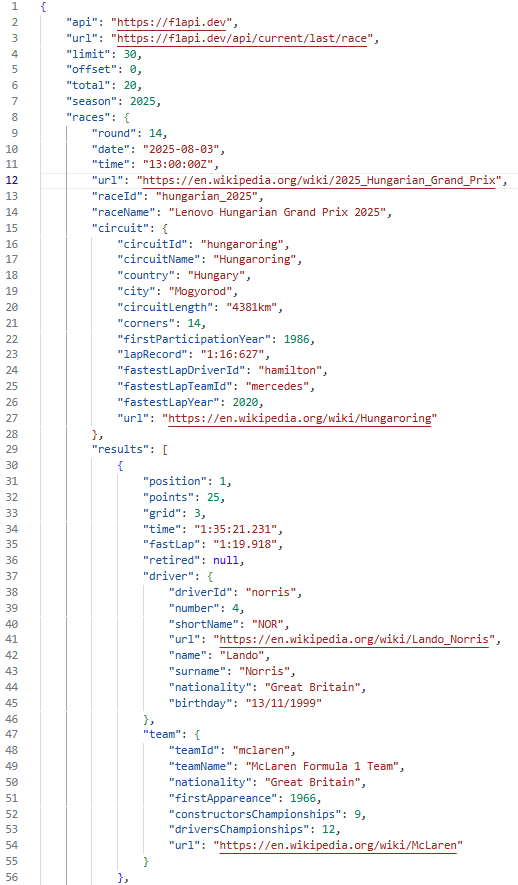

How to understand it ?

**Example:**  
In 2025, the 14th race of the season was the Hungarian Grand Prix.
It took place at the Hungaroring circuit.
As for the results, the driver Lando Norris from the McLaren team won the Grand Prix, finishing in first position.

The goal, for now, is to retrieve data through an API and store it in a stage.

To do this, we'll need to navigate between OpenFLow (to manage our workflow) and a worksheet (to create the snowflake objects that will help us store and organize the data).


### Step 1: Create the Stage in Snowflake

Open a Snowflake worksheet.  

You could set the default database and schema to the one on which the `OPENFLOW` role has admin rights.  
In our case, it's `OPENFLOW.OPENFLOW_TEST`.

We will then run the code that creates a stage to retrieve the file from the API :

```sql
CREATE OR REPLACE STAGE F1_API 
    DIRECTORY = ( ENABLE = true );
```


### Step 2: Launch Openflow

1. Launch Openflow from Snowflake.

   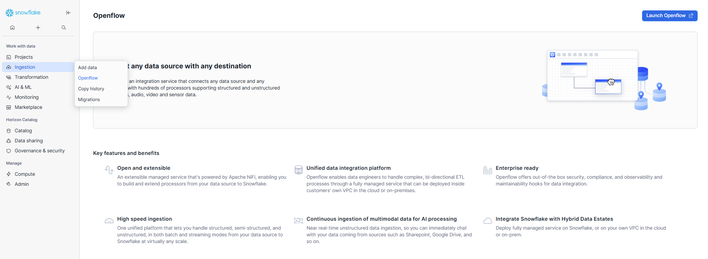

2. Connect to Openflow.

   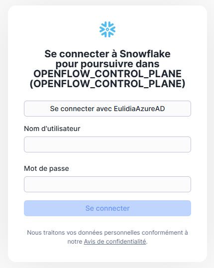

3. Navigate to the **Runtimes** tab next to Overview, and open the runtime dedicated to this tutorial.

   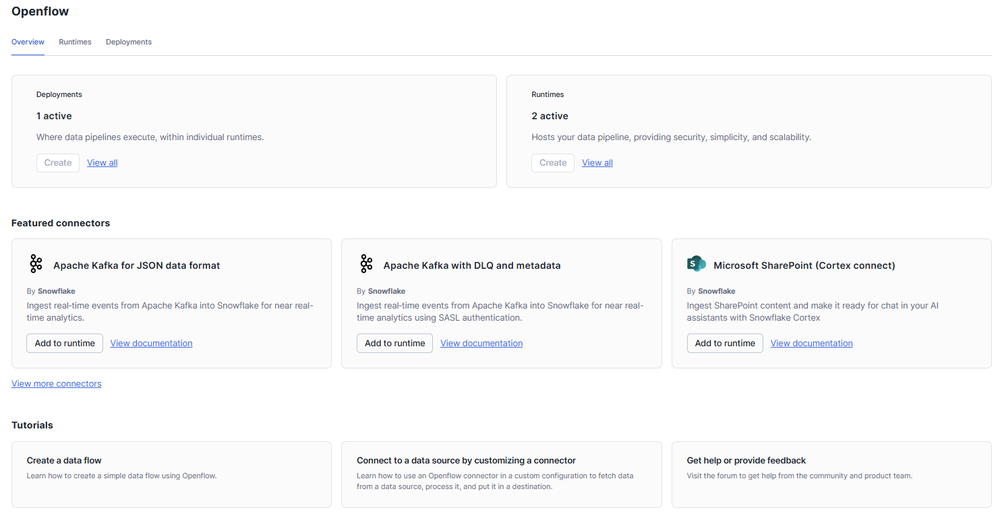

You should be on a white page like this one :

   


### Step 3: Fetch data from API

To build the workflow, we'll need Processors and Controller Services.

- **Processors**: The main components in Openflow for reading, transforming, and loading data.
- **Controller Services**: Shared services that that will be used by processors in our case (e.g., Snowflake connection settings). We'll configure it once and reuse it whenever needed.

Drag and drop a processor from the toolbar. It's the first icon.


Search for `InvokeHTTP` and click **Add**.


> **Tips:**
> You could also find it by using tags. For example, typing "https" or "client".
> Snowflake processors are prefixed with a snowflake icon.

The yellow warning triangle means the processor is invalid, not runnable.
The status of your components is visible on the status bar under the toolbar.
In addition to invalid status, a processor could be running (green triangle), stopped (red square) or disabled (crossed-out lightning bolt).

We need to configure the processor we just added :

1. Double-click on it or Right-Click and select **Configure**
2. On the **Settings** tab, you can **Rename** the processor to `Call_JSON_F1_API_Race` for flow readability
3. On the **Properties** tab, set **HTTP URL** to `https://f1api.dev/api/current/last/race`
    
    The only field we need to configure is the HTTP URL since the API doesn't require authentication.

    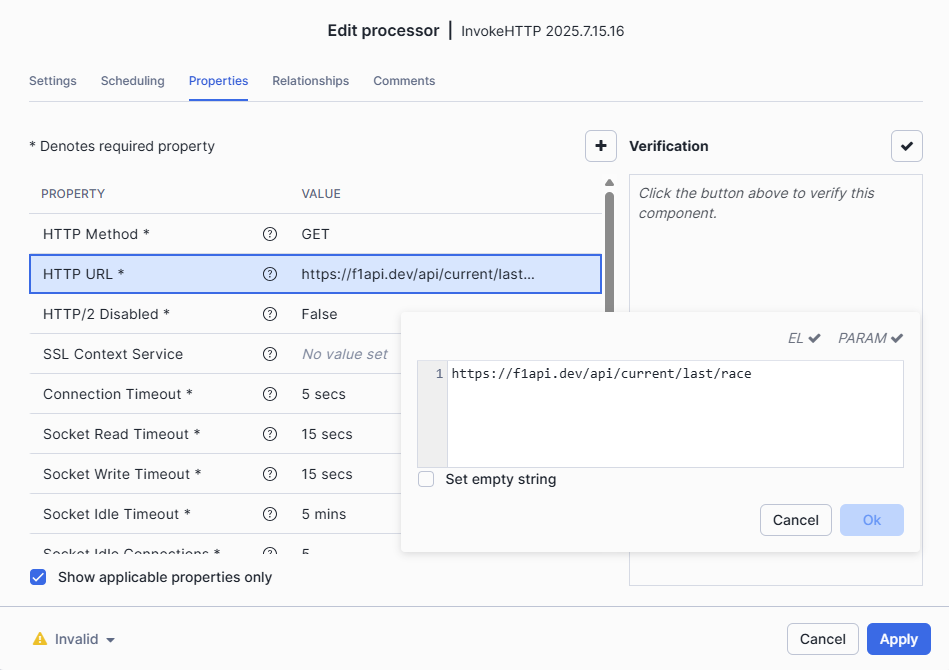

4. On the **Relationships** tab, select **Terminate for all except Response**

    Relationships determine what to do with the data output from a component. Since we’re calling an API, several relationship options are available.
    In our case, we only want to keep the Response. We'll transfer it to another processor and ignore the rest.

    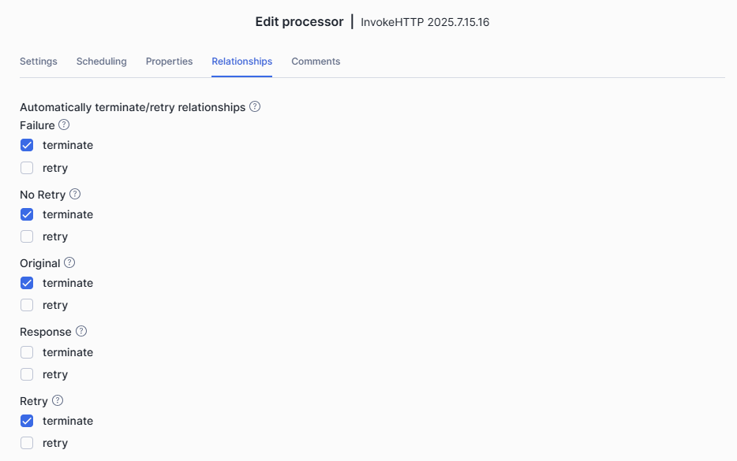

5. Apply

On the **scheduling** tab, you can define a scheduling strategy. That means, you can configure when the processor should be triggered, either using a fixed time interval or a CRON expression.
Here, we'll keep the default configuration and run the processor manually.

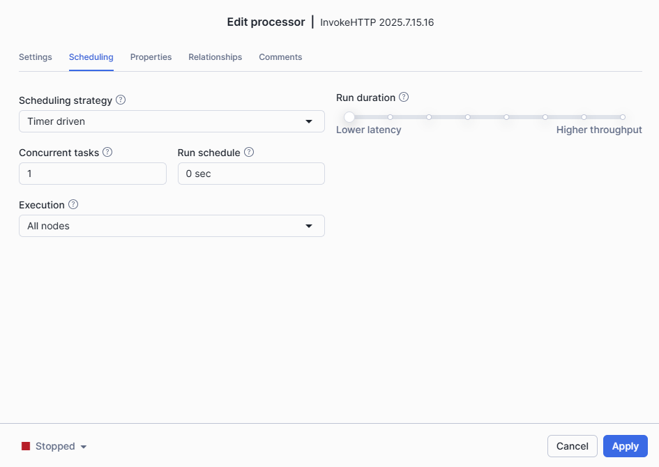


### Step 4: Staging Processor

The component is now ready to call the API.
The next steps are to add a processor that will save the response into a snowflake stage and configure it.


**Add a Staging processor and Link it to the `Call_JSON_F1_API_Race` processor :**

1. Add a `PutSnowflakeInternalStageFile` processor the same way we add the `Call_JSON_F1_API_Race` processor

2. Link it to `Call_JSON_F1_API_Race` once the second processor is on the canvas

    1. Hover over the `Call_JSON_F1_API_Race` processor until a blue arrow appears
    
        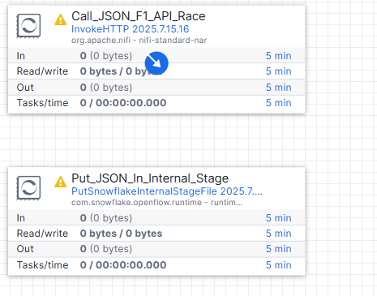
    
    2. Click and drag a connection from `Call_JSON_F1_API_Race` to the `PutSnowflakeInternalStageFile` processor
    
        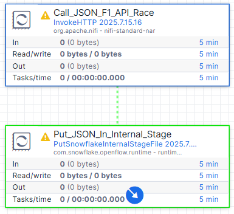
        
    3. A create connection window appears. Transfer the http response to the `PutSnowflakeInternalStageFile` processor by selecting the **Response under relationship** and click **Add**
    
        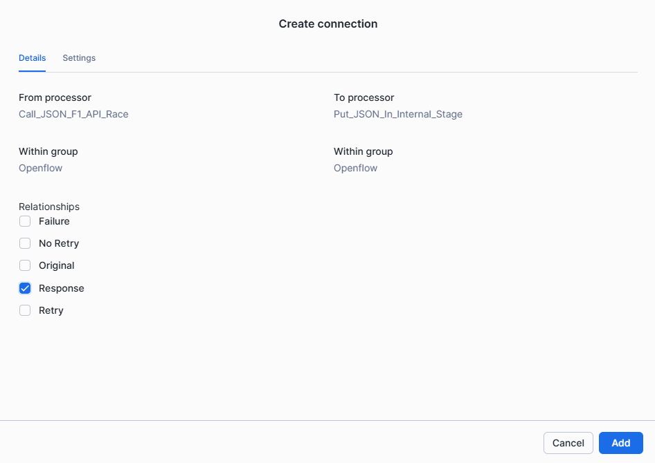  

        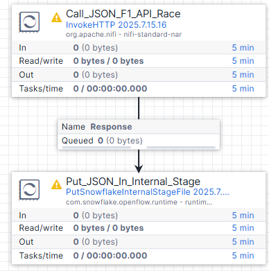


**Configure the Connection to Snowflake through a controller service :**

1. On the **Properties** tab, Configure the **Snowflake Connection Service** > Click on the three dots > **Create new service**

    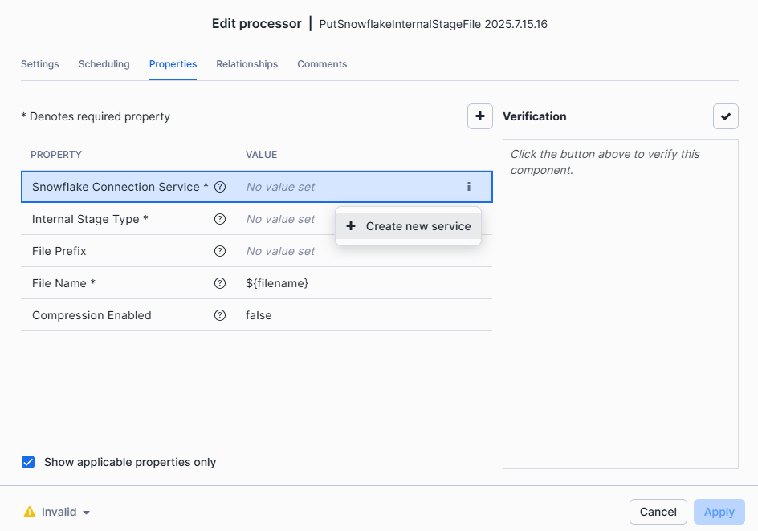

2. On the Add Controller service window, search for **SnowflakeConnectionService** and Add

    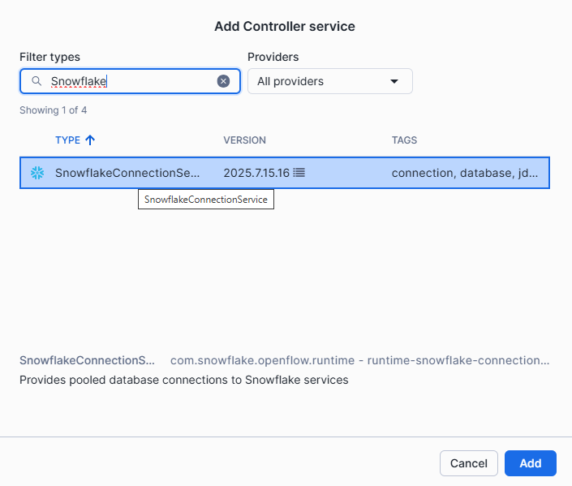

    > To remember, a Controller Service is a shared service that will provide information to processors. This way, we configure the connection to Snowflake once.

3. Select the three dots next to Snowflake Connection Service again but then choose **Go to service**
  
    This is the Controller Services tab for this group of processors.
    Since we're working on the main canvas and not inside a process group (a named collection of processors), the controller services displayed here apply to the main canvas only.
    
    You can see the current context under Controller Services. In this case, we're working on the OpenFlow sheet.
    
    

4. Select the three dots next to the service > Edit
    - select **Password** for the **Authentication Strategy**.
    - Fill in Account with your **Account Identifier** that you can find on your Snowflake Homepage > User Profile >Account > View account details > Account > Account Identifier
    - For User, Password > Openflow User & Password

    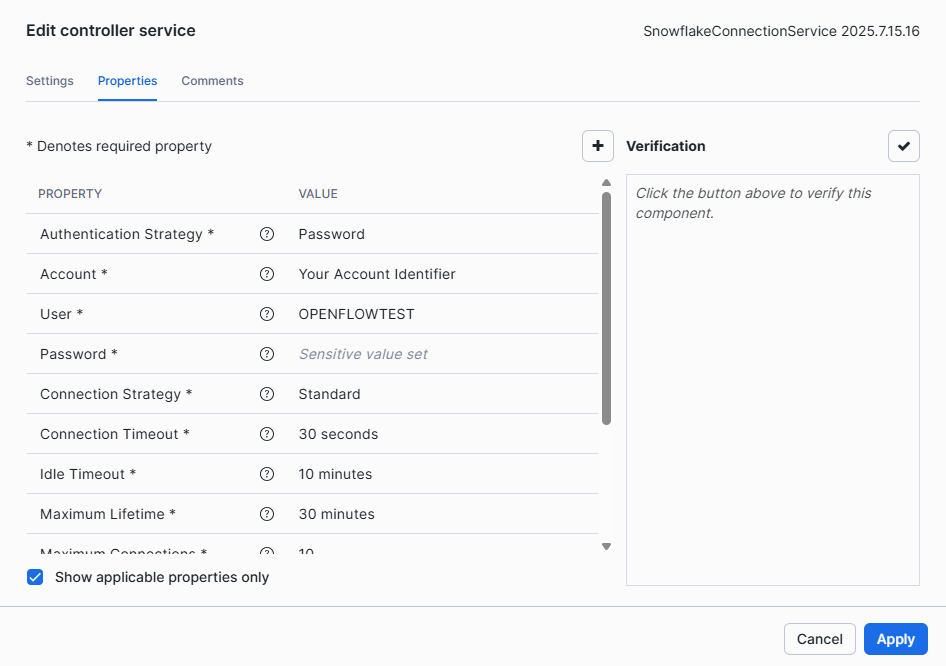

    - Fill in the following fields with information that Openflow have access to :
    
    

    - Apply

5. Select the three dots next to the service > **Enable** to change the service state from **disabled** to **enable**

    

    > On the right, under Referencing Components, you can see Processors and Controller services referencing to the Snowflake Connection
  
    1. Under Scope > Select Service Only
    2. Enable
    
        

6. Click on  **Back to processor** on the upper left to finish the configuration.


**Configure the rest of the staging processor :**

1. On the **Settings** tab, you can **Rename** the processor to `Put_JSON_In_Internal_Stage`.

2. On the **Properties** tab, set :
    -  **Named** : **Internal Stage Type**
    -  **Stage Property** : reuse the stage `F1_API` we created in the first part
    -  **File Name** : we choose to prefix the current timestamp with `RACE` to recognize our files in the stage :
    ```java
    RACE_${now():toNumber():formatInstant("yyyy_MM_dd_HH_mm_ss", "CET")}
    ```

    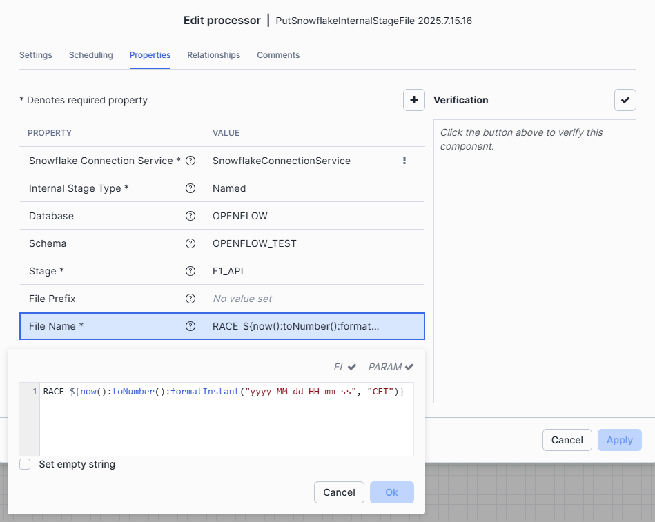

3. On the **Relationships** tab, select **Terminate** under **Failure** and **Success**.

### Step 5: Run and Check

The processors are now configured !  
For this tutorial, we recommend keeping the `Call_JSON_F1_API_Race` processor in a Stopped state and triggering it manually when needed. The other processors should be set to Run.

- Right-Click on the `Put_JSON_In_Internal_Stage` component and select **Start**.

We are ready to trigger the workflow.  

- Right-Click on the `Call_JSON_F1_API_Race` processor and select **Run once**.

See how it works.  
One flowfile (piece of data) entered the `Call_JSON_F1_API_Race`. It was processed, and the response was sent to the `Put_JSON_In_Internal_Stage` processor.  
The whole operation completed in just a second once the code was compiled.


Now let's check on snowsight if our file is in the stage.

Run this on your worksheet :

```sql
-- LIST the STAGE FILES to check if our race file is there
LIST @OPENFLOW.OPENFLOW_TEST.F1_API pattern ='.*RACE.*';
```


When everithing works fine, Go back on the **Relationships** tab, select unselect the box under **Success** so it can be forwarded to the next processor.

<!-- ------------------------ -->
## Load Data with COPY INTO

The goal of this step is to transfer data from the internal stage into a Snowflake table called **RAW_RACE**.


### Step 1: Create the Table and File Format

This table will include a VARIANT column, which is ideal for handling semi-structured formats like JSON.
The entire file will be stored in a single row.

In addition, we'll also need to define a file_format so that the COPY INTO can correctly interpret JSON data.

```sql
CREATE OR REPLACE TABLE OPENFLOW.OPENFLOW_TEST.RAW_RACE (
    v variant
);

CREATE OR REPLACE FILE FORMAT json_format
  TYPE = JSON
  STRIP_OUTER_ARRAY = TRUE;
```


### Step 2: Add the COPY INTO Processor

Once these objects are created in Snowflake, **go back to OpenFlow** and add a new processor to the canvas.

We’ll use the **ExecuteSQLStatement** processor to run a **COPY INTO** command that loads the data from the stage into the RAW_RACE table.

1. Add an `ExecuteSQLStatement` processor to the canvas

2. Connect from `Put_JSON_In_Internal_Stage` with **success** relationship > Add

    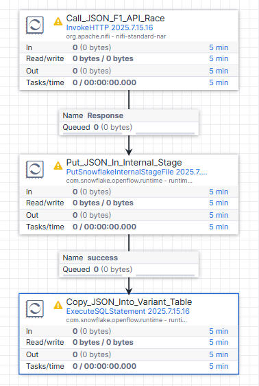

3. On the **Settings** tab, rename the `ExecuteSQLStatement` processor to `Copy_JSON_Into_Variant_Table`

4. On the **Properties** tab :
    1. Reused the **SnowflakeConnectionService** we created earlier as the value for **Connection Pooling Service property**
  
    2. In SQL, copy this :
    
        ```sql
        COPY INTO OPENFLOW.OPENFLOW_TEST.RAW_RACE (v, insert_date)
        FROM (
            SELECT 
                PARSE_JSON($1),
                CURRENT_TIMESTAMP(0)
            FROM @F1_API
        )
        FILE_FORMAT = (FORMAT_NAME = 'json_format')
        PATTERN = '.*RACE.*';
        ```
  
        > We add the current_timestamp to have the time of the insert.
        >
        > Option PATTERN will select every files that contains "RACE".

        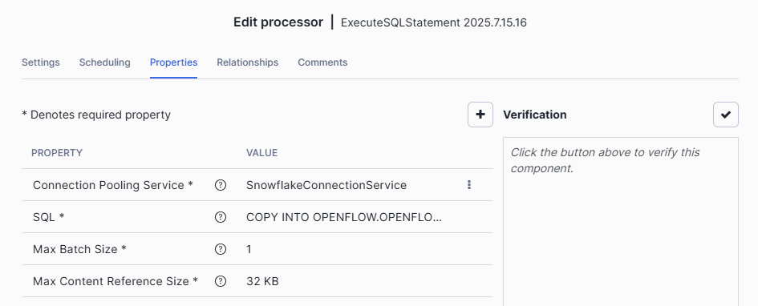

5. On the **Relationships** tab, Select **Terminate** for **failure** and leave success unselected so it can be passed to the next component and **apply**


### Step 3: Run and Check

Time to test !

- Right click on `Copy_JSON_Into_Variant_Table` and select **Start**.
- Right click on `Call_JSON_F1_API_Race` and select **Run once**.

Go back to Snowsight and check whether the rows were successfully inserted after running the COPY INTO command.

```sql
SELECT * FROM OPENFLOW.OPENFLOW_TEST.RAW_RACE;
```

You should see something like this :


At this stage of the tutorial, we’ve successfully ingested JSON data from the API and stored it in a Snowflake table.

<!-- ------------------------ -->
## Transformation

Last but not least, we'll add components to our flow to be able to split the JSON data stored in a variant into multiple tables.

Based on the JSON file content we explored on Step 1, we'll build a star model of this four tables :
  - `Race_Results`
  - `Drivers`
  - `Teams`
  - `Circuits`

We have three dimensions (drivers, teams, circuits) and a fact (race_results).


### Step 1: Table Creation

To **create tables** and **identify the fields** contained in the JSON file, we can run the following code:

```sql
SELECT REGEXP_REPLACE(f.path, '\\[[0-9]+\\]', '[]') AS "Path",
  TYPEOF(f.value) AS "Type",
  COUNT(*) AS "Count"
FROM OPENFLOW.OPENFLOW_TEST.RAW_RACE,
LATERAL FLATTEN(v, RECURSIVE=>true) f
GROUP BY 1, 2 ORDER BY 1, 2;
```

Below is an extract from the results:


Here is a proposed model to build.

**Run it in your worksheet** to create the associated tables :

```sql
-- CIRCUIT

CREATE OR REPLACE TABLE OPENFLOW.OPENFLOW_TEST.CIRCUITS (
      circuit_Id string
    , name string
    , city string
    , country string
    , length string
    , corners number
    , first_Participation_Year number
    , lap_Record string
    , fastest_Lap_Driver_Id string
    , fastest_Lap_Team_Id string
    , fastest_Lap_Year number
    , insert_date timestampltz(0)
    , update_date timestampltz(0)
);

-- RACE_RESULTS

CREATE OR REPLACE TABLE OPENFLOW.OPENFLOW_TEST.RACE_RESULTS (
      race_Id string
    , driver_Id string
    , team_Id string
    , circuit_Id string
    , race_Name string
    , race_Round integer
    , race_Date date
    , race_Time string
    , driver_Race_Grid_Position string
    , driver_Race_Final_Position string
    , driver_Race_Points string
    , driver_Race_Fast_Lap string
    , driver_Race_Gap_With_Win_Time string
    , insert_date timestampltz(0)
    , update_date timestampltz(0)
);

-- DRIVERS

CREATE OR REPLACE TABLE OPENFLOW.OPENFLOW_TEST.DRIVERS (
      driver_Id string
    , name string
    , surname string
    , shortName string
    , nationality string
    , birthday string
    , number integer
    , insert_date timestampltz(0)
    , update_date timestampltz(0)
);

-- TEAMS

CREATE OR REPLACE TABLE OPENFLOW.OPENFLOW_TEST.TEAMS (
      team_Id string
    , name string
    , nationality string
    , first_Appareance integer
    , constructors_Championships integer
    , drivers_Championships integer
    , insert_date timestampltz(0)
    , update_date timestampltz(0)
);
```

Check in your database that the objects are created :

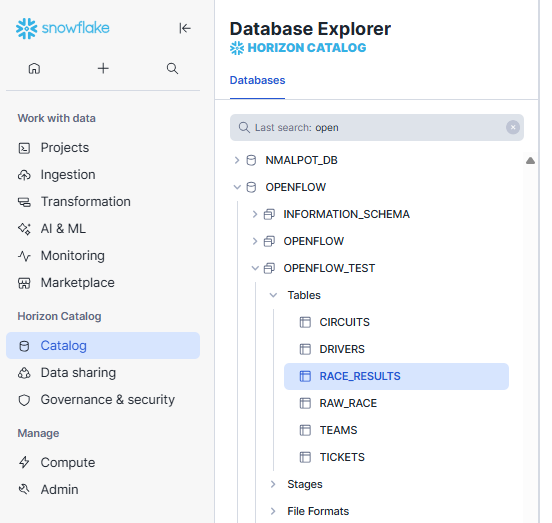


### Step 2: Workflow processors

Then we'll add components in OpenFlow to manage the data in these tables.

1. **Add four ExecuteSQLStatement processors** to the canvas
2. Connect from `Copy_JSON_Into_Variant_Table` to each new ExecuteSQLStatement processor with **success** as the relactionship > Add
3. Right-click on each new ExecuteSQLStatement > Configure :
    1. Under the **Settings** tab, name each processor as follows (one at a time):
        - Extract_And_Transform_Race
        - Extract_And_Transform_Drivers
        - Extract_And_Transform_Teams
        - Extract_And_Transform_Circuits
    2. Under **Relationships**, Select **Terminate** for both failure and **success**, as these are our final components
    
        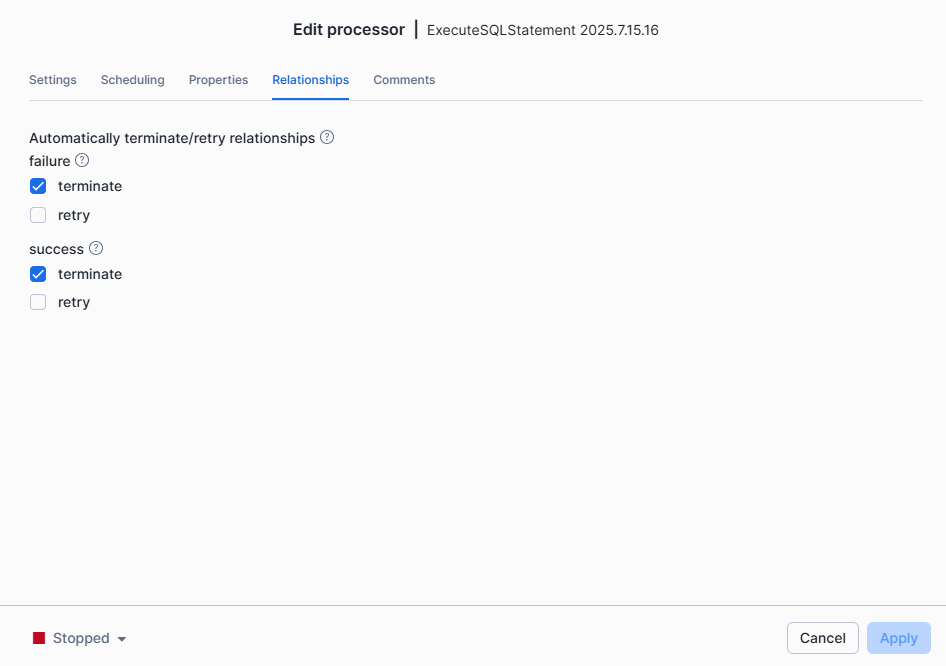
    
    3. Under **properties** :
        - Reused the **SnowflakeConnectionService** we created as the value for **Connection Pooling Service property**
        - **In SQL, complete with the code provided below** > OK
    4. Apply

Here is the code you need to paste in the SQL value for the right appropriate target table :

  >
  > It performs to an insert or update operation with the latest version of the data inserted into the RAW_RACE table .
  > 
  > This way, the flow is autonomous, up to date ,and contains no duplicates.
  >

RACE_RESULTS :

```sql
MERGE INTO OPENFLOW.OPENFLOW_TEST.RACE_RESULTS AS target
USING (
    SELECT 
        v:races:raceId::string AS race_Id,
        value:driver:driverId::string AS driver_Id,
        value:team:teamId::string AS team_Id,
        v:races:circuit:circuitId::string AS circuit_Id,
        v:races:raceName::string AS race_Name,
        v:races:round::integer AS race_Round,
        v:races:date::date AS race_Date,
        v:races:time::string AS race_Time,
        value:grid::string AS driver_Race_Grid_Position,
        value:position::string AS driver_Race_Final_Position,
        value:points::number AS driver_Race_Points,
        value:fastLap::string AS driver_Race_Fast_Lap,
        value:time::string AS driver_Race_Gap_With_Win_Time,
        insert_date
    FROM OPENFLOW.OPENFLOW_TEST.RAW_RACE r,
         LATERAL FLATTEN(input => r.V, path => 'races:results')
    qualify row_number() over(partition by v:races:raceId::string, value:driver:driverId::string order by insert_date desc) = 1
) AS source
ON target.race_Id = source.race_Id AND target.driver_Id = source.driver_Id

WHEN MATCHED THEN
    UPDATE SET
        target.team_Id = source.team_Id,
        target.circuit_Id = source.circuit_Id,
        target.race_Name = source.race_Name,
        target.race_Round = source.race_Round,
        target.race_Date = source.race_Date,
        target.race_Time = source.race_Time,
        target.driver_Race_Grid_Position = source.driver_Race_Grid_Position,
        target.driver_Race_Final_Position = source.driver_Race_Final_Position,
        target.driver_Race_Points = source.driver_Race_Points,
        target.driver_Race_Fast_Lap = source.driver_Race_Fast_Lap,
        target.driver_Race_Gap_With_Win_Time = source.driver_Race_Gap_With_Win_Time,
        target.update_date = current_timestamp

WHEN NOT MATCHED THEN
    INSERT (
        race_Id,
        driver_Id,
        team_Id,
        circuit_Id,
        race_Name,
        race_Round,
        race_Date,
        race_Time,
        driver_Race_Grid_Position,
        driver_Race_Final_Position,
        driver_Race_Points,
        driver_Race_Fast_Lap,
        driver_Race_Gap_With_Win_Time,
        insert_date
    )
    VALUES (
        source.race_Id,
        source.driver_Id,
        source.team_Id,
        source.circuit_Id,
        source.race_Name,
        source.race_Round,
        source.race_Date,
        source.race_Time,
        source.driver_Race_Grid_Position,
        source.driver_Race_Final_Position,
        source.driver_Race_Points,
        source.driver_Race_Fast_Lap,
        source.driver_Race_Gap_With_Win_Time,
        current_timestamp
    );
```

DRIVERS :

```sql
MERGE INTO OPENFLOW.OPENFLOW_TEST.DRIVERS AS target
USING (
    SELECT 
        value:driver:driverId::string       AS driver_Id,
        value:driver:name::string           AS name,
        value:driver:surname::string        AS surname,
        value:driver:shortName::string      AS shortName,
        value:driver:nationality::string    AS nationality,
        value:driver:birthday::string       AS birthday,
        value:driver:number::number         AS number,
        insert_date
    FROM OPENFLOW.OPENFLOW_TEST.RAW_RACE r,
         LATERAL FLATTEN(input => r.V, PATH => 'races:results')
    QUALIFY ROW_NUMBER() OVER (PARTITION BY value:driver:driverId::string ORDER BY insert_date DESC) = 1
) AS source
ON target.driver_Id = source.driver_Id

WHEN MATCHED THEN
    UPDATE SET
        target.name         = source.name,
        target.surname      = source.surname,
        target.shortName   = source.shortName,
        target.nationality  = source.nationality,
        target.birthday     = source.birthday,
        target.number       = source.number,
        target.update_date  = CURRENT_TIMESTAMP

WHEN NOT MATCHED THEN
    INSERT (
        driver_Id,
        name,
        surname,
        shortName,
        nationality,
        birthday,
        number,
        insert_date
    )
    VALUES (
        source.driver_Id,
        source.name,
        source.surname,
        source.shortName,
        source.nationality,
        source.birthday,
        source.number,
        CURRENT_TIMESTAMP
    );
```

TEAMS :

```sql
MERGE INTO OPENFLOW.OPENFLOW_TEST.TEAMS AS target
USING (
    SELECT 
        value:team:teamId::string                     AS team_id,
        value:team:teamName::string                  AS name,
        value:team:nationality::string               AS nationality,
        value:team:firstAppareance::number           AS first_appareance,
        value:team:constructorsChampionships::number AS constructors_championships,
        value:team:driversChampionships::number      AS drivers_championships,
        insert_date
    FROM OPENFLOW.OPENFLOW_TEST.RAW_RACE r,
         LATERAL FLATTEN(input => r.V, PATH => 'races:results')
    QUALIFY ROW_NUMBER() OVER (
        PARTITION BY value:team:teamId::string 
        ORDER BY insert_date DESC
    ) = 1
) AS source
ON target.team_id = source.team_id

WHEN MATCHED THEN
    UPDATE SET
        target.name                      = source.name,
        target.nationality               = source.nationality,
        target.first_appareance          = source.first_appareance,
        target.constructors_championships = source.constructors_championships,
        target.drivers_championships     = source.drivers_championships,
        target.update_date               = CURRENT_TIMESTAMP

WHEN NOT MATCHED THEN
    INSERT (
        team_id,
        name,
        nationality,
        first_appareance,
        constructors_championships,
        drivers_championships,
        insert_date
    )
    VALUES (
        source.team_id,
        source.name,
        source.nationality,
        source.first_appareance,
        source.constructors_championships,
        source.drivers_championships,
        CURRENT_TIMESTAMP
    );
```

CIRCUITS :

```sql
MERGE INTO OPENFLOW.OPENFLOW_TEST.CIRCUITS AS target
USING (
    SELECT 
        V:races:circuit:circuitId::string                         AS circuit_Id,
        V:races:circuit:circuitName::string                       AS name,
        V:races:circuit:city::string                              AS city,
        V:races:circuit:country::string                           AS country,
        V:races:circuit:circuitLength::string                     AS length,
        V:races:circuit:corners::number                           AS corners,
        V:races:circuit:firstParticipationYear::number            AS first_Participation_Year,
        V:races:circuit:lapRecord::string                         AS lap_Record,
        V:races:circuit:fastestLapDriverId::string                AS fastest_Lap_Driver_Id,
        V:races:circuit:fastestLapTeamId::string                  AS fastest_Lap_Team_Id,
        V:races:circuit:fastestLapYear::number                    AS fastest_Lap_Year,
        insert_date
    FROM OPENFLOW.OPENFLOW_TEST.RAW_RACE r
    QUALIFY ROW_NUMBER() OVER (PARTITION BY V:races:circuit:circuitId::string ORDER BY insert_date DESC) = 1
) AS source
ON target.circuit_Id = source.circuit_Id

WHEN MATCHED THEN
    UPDATE SET
        target.name                      = source.name,
        target.city                      = source.city,
        target.country                   = source.country,
        target.length                    = source.length,
        target.corners                   = source.corners,
        target.first_Participation_Year  = source.first_Participation_Year,
        target.lap_Record                = source.lap_Record,
        target.fastest_Lap_Driver_Id     = source.fastest_Lap_Driver_Id,
        target.fastest_Lap_Team_Id       = source.fastest_Lap_Team_Id,
        target.fastest_Lap_Year          = source.fastest_Lap_Year,
        target.update_date               = CURRENT_TIMESTAMP

WHEN NOT MATCHED THEN
    INSERT (
        circuit_Id,
        name,
        city,
        country,
        length,
        corners,
        first_Participation_Year,
        lap_Record,
        fastest_Lap_Driver_Id,
        fastest_Lap_Team_Id,
        fastest_Lap_Year,
        insert_date
    )
    VALUES (
        source.circuit_Id,
        source.name,
        source.city,
        source.country,
        source.length,
        source.corners,
        source.first_Participation_Year,
        source.lap_Record,
        source.fastest_Lap_Driver_Id,
        source.fastest_Lap_Team_Id,
        source.fastest_Lap_Year,
        CURRENT_TIMESTAMP
    );
```

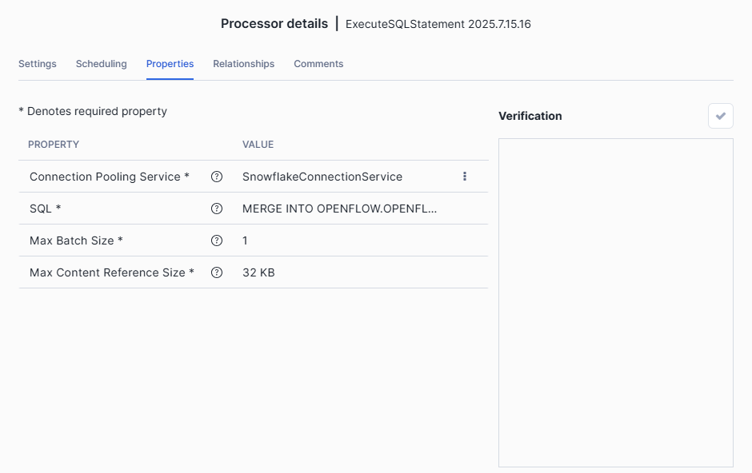


### Step 3: Run and check

Once it's all set up, right-click on each of the four processors and set them to **Start**.

You should get something similar to that :

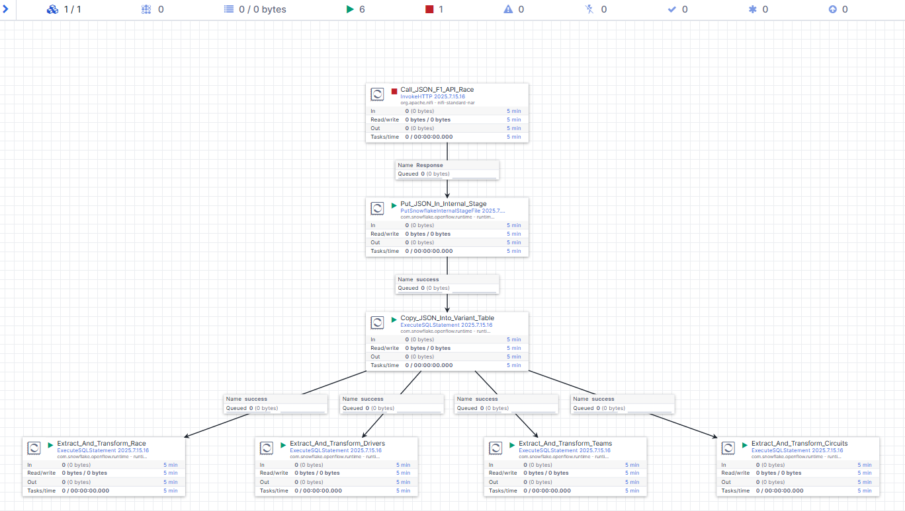

Let's perform the final run. Right-Click on the `Call_JSON_F1_API_Race` processor and select **Run Once**.

Go back to your worksheet. We'll verify that the tables have been successfully populated.

Check your databases and/or run this select :

```sql
-- Check if the tables are filled
select * from OPENFLOW.OPENFLOW_TEST.CIRCUITS;
select * from OPENFLOW.OPENFLOW_TEST.RACE_RESULTS;
select * from OPENFLOW.OPENFLOW_TEST.DRIVERS;
select * from OPENFLOW.OPENFLOW_TEST.TEAMS;
```

<!-- ------------------------ -->
## Scheduling

Until now, we have chosen to handle scheduling manually but there are other options.  The purpose of this is to retrieve race_results automatically, without any actions from us.

In Openflow, if we right-click on the `Call_JSON_F1_API_Race` processor, select configure, and then go to the scheduling tab, we should see two types of scheduling strategies :
  - **Timer-driven** - Requires a number of seconds.
    For example, if we choose 604 800 seconds, the processor will run every week from the moment the processor is started.
  
  - **CRON-driven** - Can be more precise and is based on CRON expressions.
    Races happen on Sundays, but not every Sunday. For instance, we could configure the schedule to 0 10 * * 1 if we want the processor to be triggered every Monday at 10 AM.


<!-- ------------------------ -->
## Conclusion and Resources

### Conclusion

Congratulations ! You’ve successfully completed this quickstart on retrieving JSON data from an API and loading it into Snowflake.
We used Openflow, snowflake's ELT tool, to run an automated workflow that retrieves data from the latest F1 race every week through an F1 API.
After calling the API endpoint, we staged the file in snowflake, loaded it in a table and finally transformed it into its final dimension and fact tables.

### What You Learned

  - How to build a complete ELT flow with Openflow without delay using components and SQL instructions
  - How to Fetch JSON data from an API, send it to a stage and transform it into tables
  - How to run a workflow manually or manage an automatic scheduling

### Resources

**Openflow Documentation**:
  - [About Openflow](https://docs.snowflake.com/en/user-guide/data-integration/openflow/about)
  - [Setting up Openflow](https://docs.snowflake.com/en/user-guide/data-integration/openflow/setup-openflow)
  - [List of Processors](https://docs.snowflake.com/en/user-guide/data-integration/openflow/processors/index)
  - [List of Controller Services](https://docs.snowflake.com/en/user-guide/data-integration/openflow/controllers/index)

[NiFi Documentation](https://nifi.apache.org/docs/nifi-docs/html/user-guide.html)

[F1 API website](https://f1api.dev/fr/docs) 🏎️
