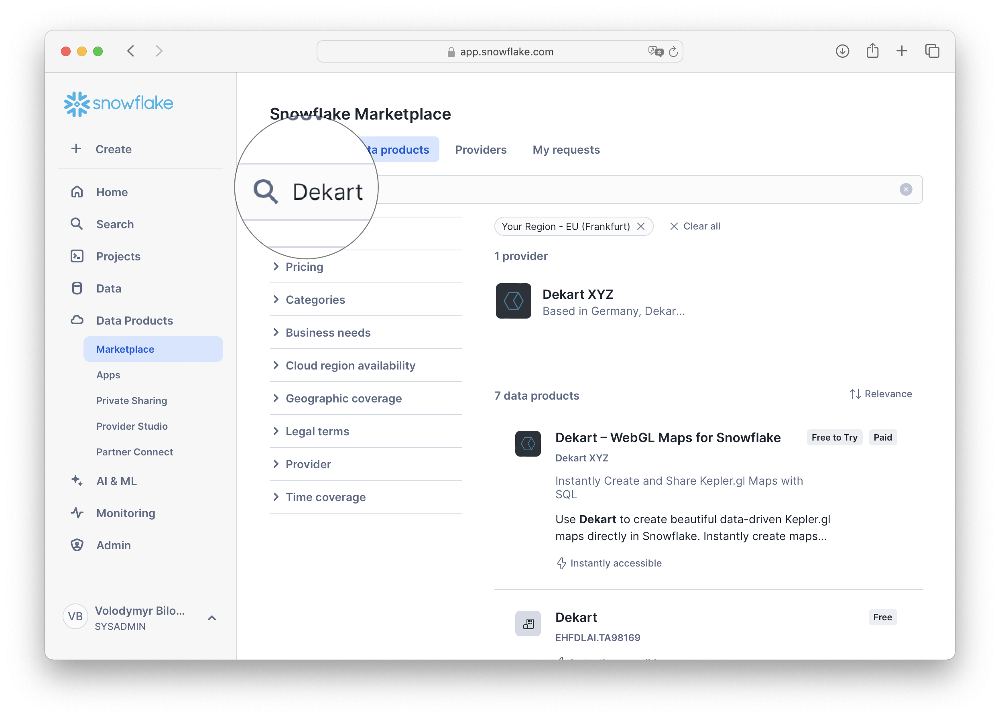
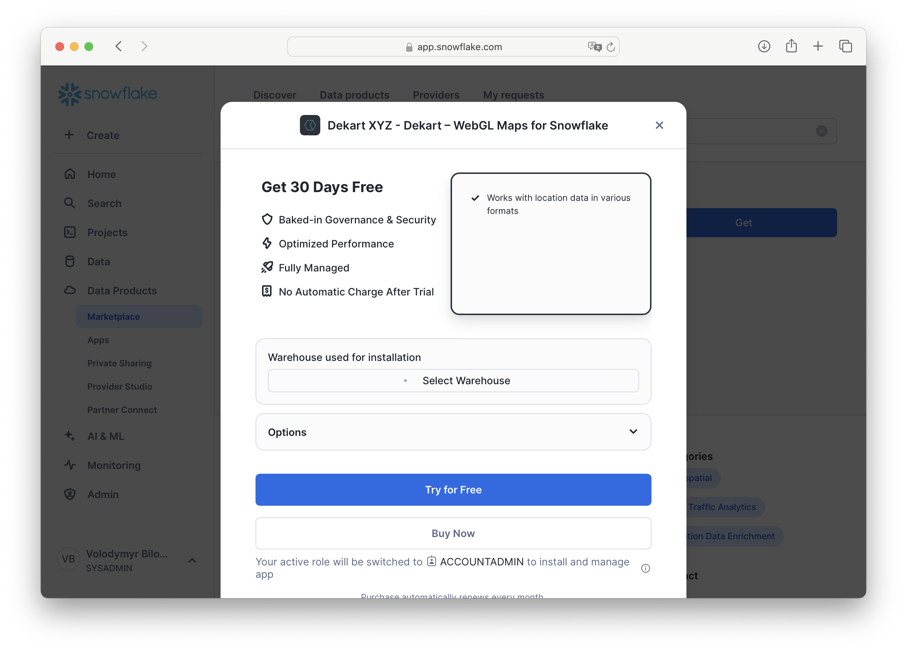
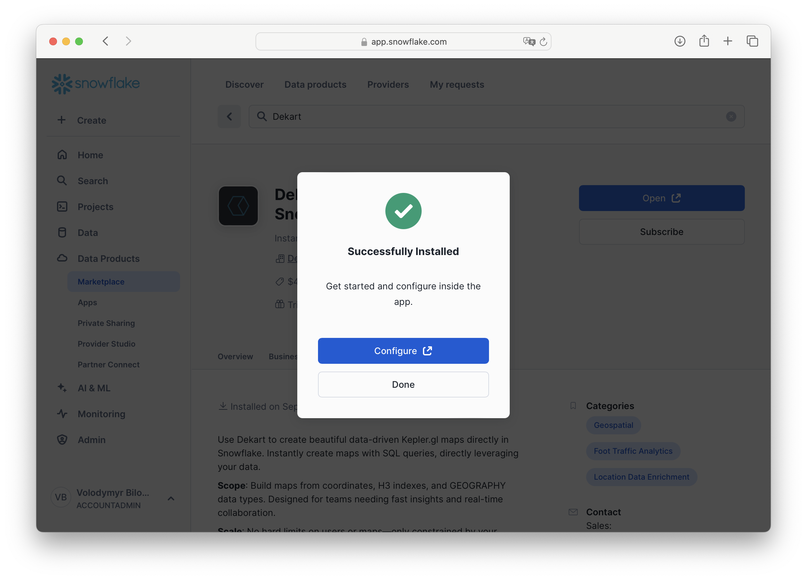
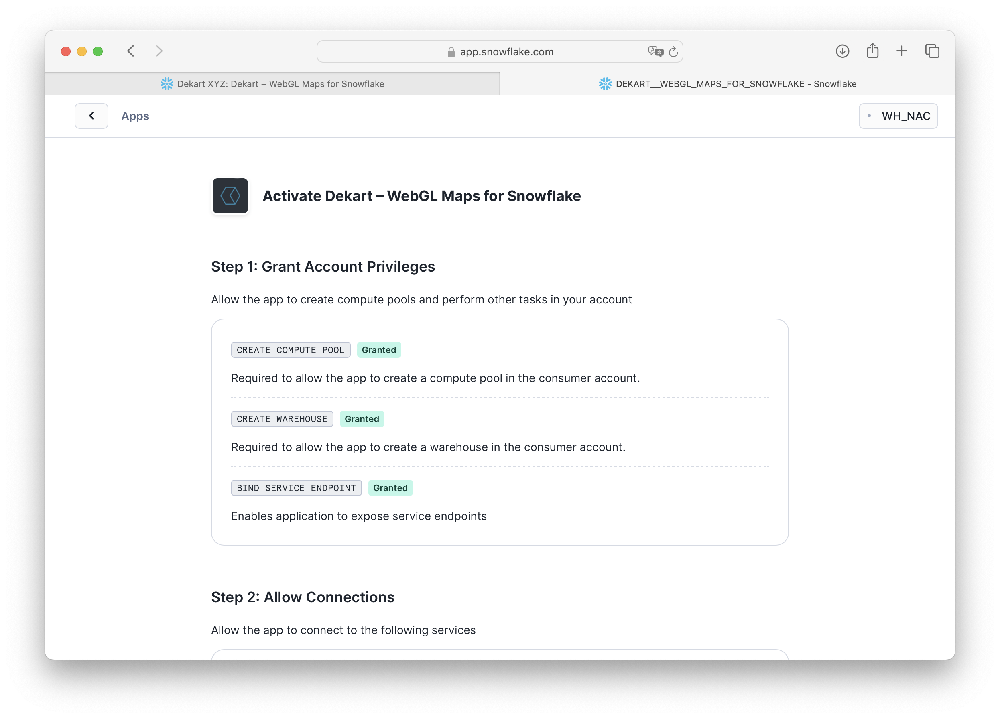
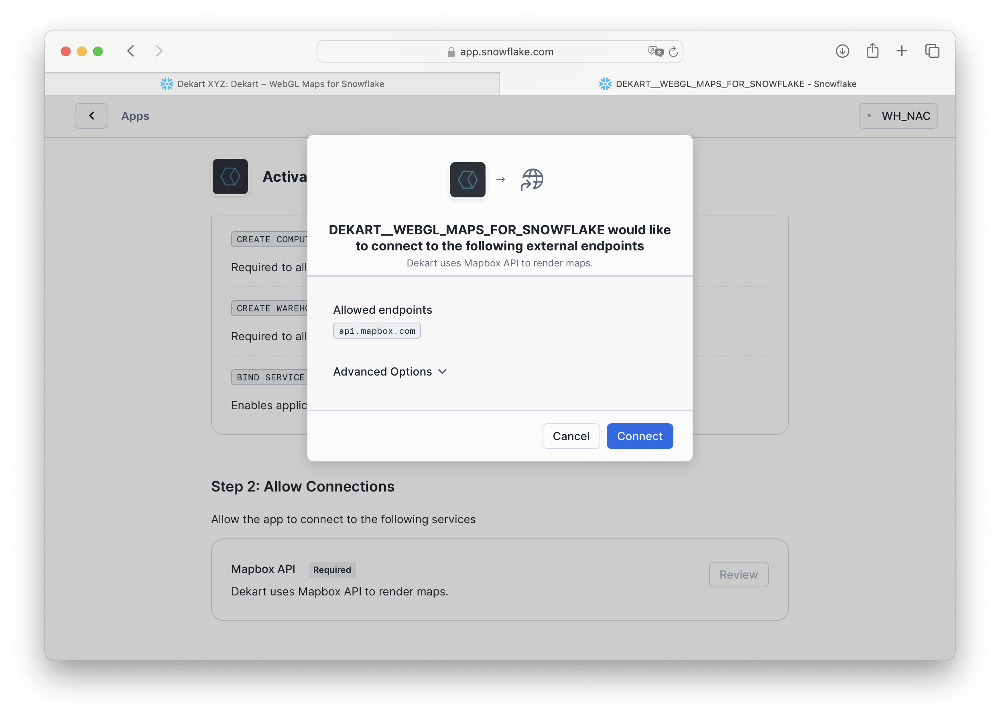
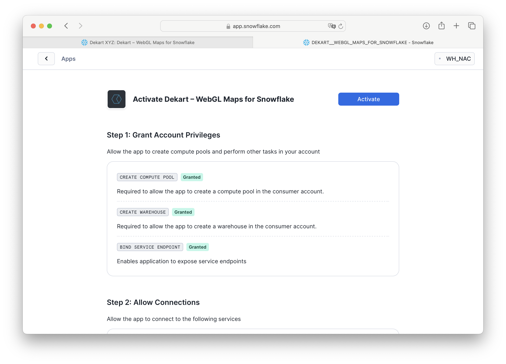
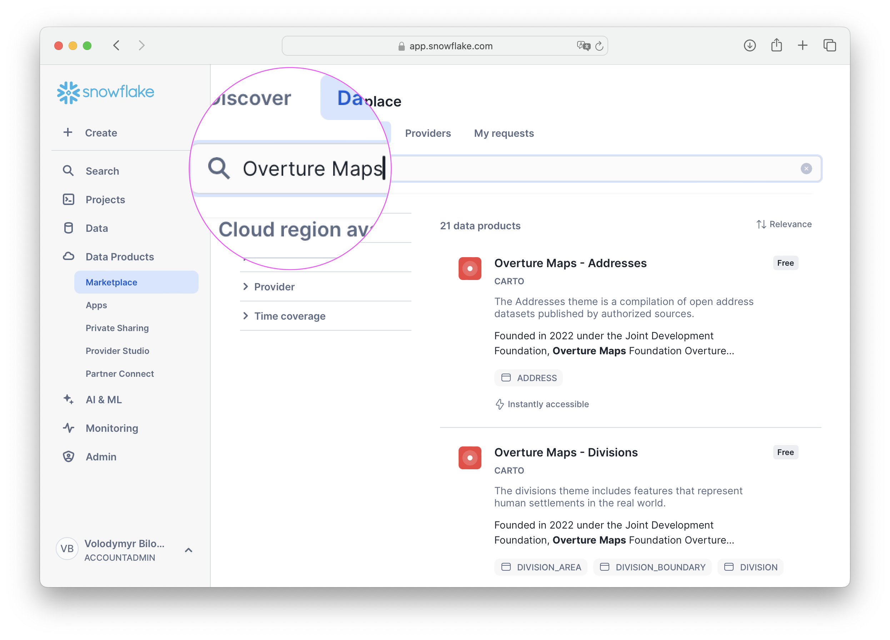
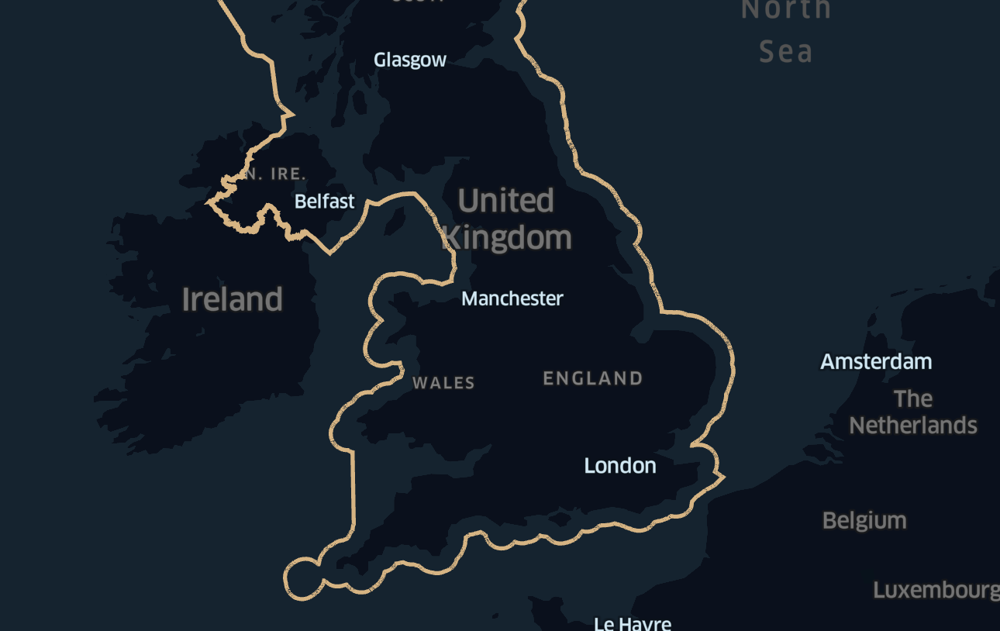
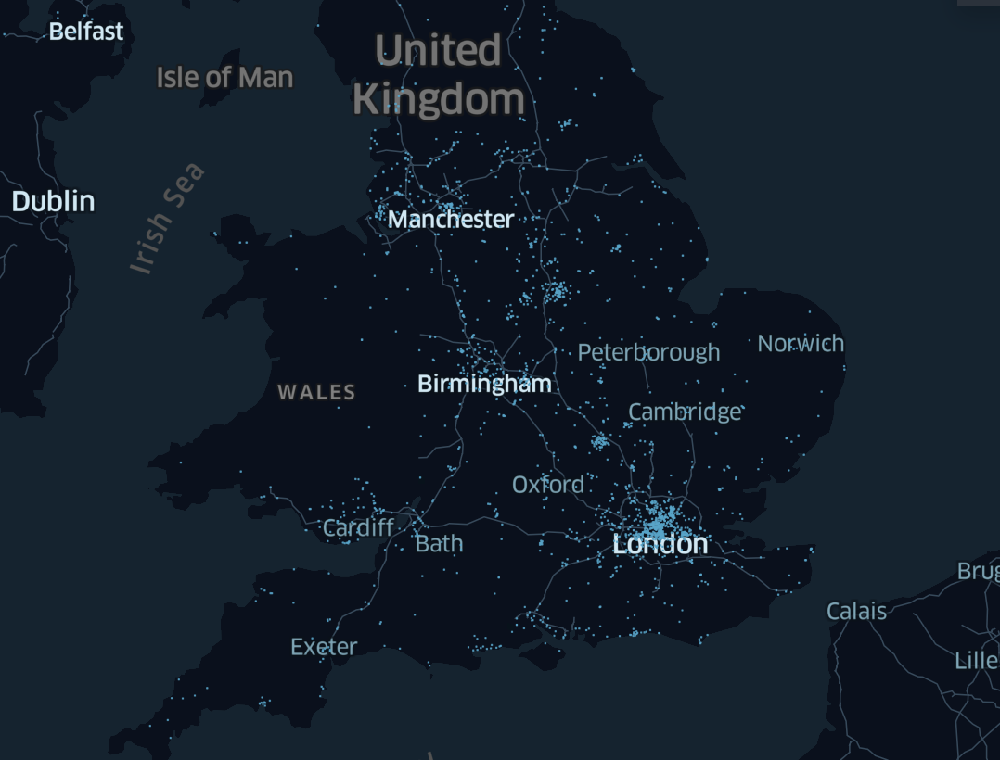
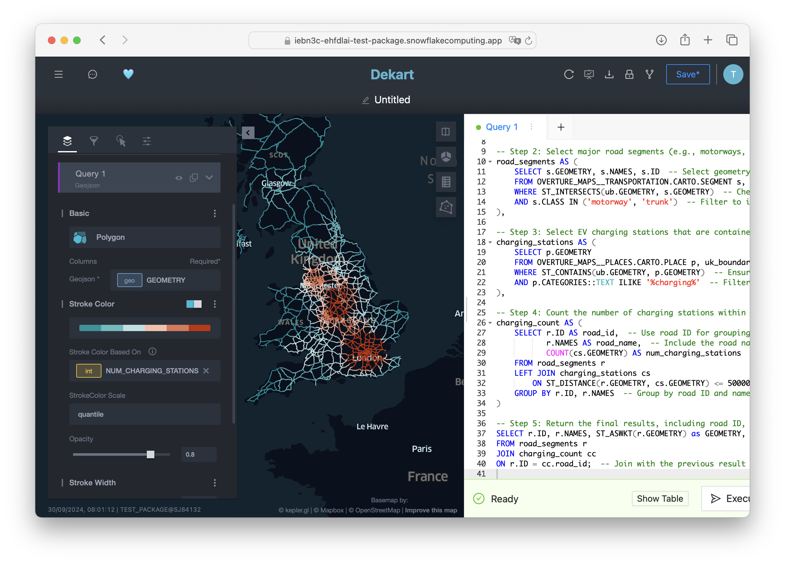

author: Vladi Bilonenko
id: kepler_gl_maps_inside_snowflake
categories: snowflake-site:taxonomy/solution-center/certification/quickstart, snowflake-site:taxonomy/product/data-engineering, snowflake-site:taxonomy/product/applications-and-collaboration, snowflake-site:taxonomy/snowflake-feature/build
language: en
summary: This guide will help you create interactive maps directly within Snowflake using Kepler.gl
environments: web
status: Archived
feedback link: https://github.com/Snowflake-Labs/sfguides/issues

# Creating Interactive Maps with Kepler.gl in Snowflake Using Dekart
<!-- ------------------------ -->
## Overview
Duration: 1

This guide will help you create interactive maps directly within Snowflake using [Kepler.gl](https://kepler.gl), powered by [Dekart Snowpark Application](https://dekart.xyz/docs/snowflake-snowpark/about/). With this approach, you can analyze and visualize geospatial data from public datasets, all within Snowflake, avoiding external data transfers and approvals.

### What You Will Build

A map that visualizes UK highways with color-coded density of nearby EV charging stations.


### What You Will Learn
- How to create interactive maps within Snowflake using Kepler.gl and Dekart.
- How to access and use Overture Maps data to build your map.
- How to construct SQL queries for extracting, filtering, and visualizing geospatial data.

### Prerequisites

[Snowflake Account](https://signup.snowflake.com/?utm_cta=quickstarts_) with `ACCOUNTADMIN` role for managing permissions.

<!-- ------------------------ -->
## Install Dekart for Snowflake
Duration: 12

[Dekart](https://dekart.xyz) is an open-source application that integrates [Kepler.gl](https://kepler.gl) with Snowflake. With [Dekart Snowpark Application](https://dekart.xyz/docs/snowflake-snowpark/about/), you can create maps directly in Snowflake, without any data transfers outside of your Snowflake account.

1. **Navigate to the Marketplace** in Snowsight.
2. **Search for "Dekart"**



3. Start a **30-day free trial**.

**Note**: Dekart is open-source, meaning you can opt for a self-hosted setup if preferred. Once configured, Dekart runs as a Snowpark Container Application within your Snowflake account, ensuring security and direct data access.




4. Follow the installation instructions as displayed in the Snowflake interface.



5. Grant Account Privileges to Dekart.

**Note**: Dekart creates single node `CPU_X64_XS` copmute pool and `XSMALL` warehouse.



6. Allow connections to the Mapbox API.

Dekart uses Mapbox for rendering maps. No user data is sent to Mapbox.



7. Activate Dekart.

This step may take around 10 minutes on Snowflake’s end.




### Step-by-Step Video Guide

Watch this video for a detailed walkthrough of the Dekart installation process.

<video id="KusNayeGFaI"></video>


<!-- ------------------------ -->
## Access Overture Maps
Duration: 2

To build our map, we need geospatial datasets from Overture Maps, available in the Snowflake Marketplace.

1. **Go to Snowsight** (Snowflake’s web interface) and select **Marketplace**.
2. **Search for "Overture Maps"** to find geospatial datasets.
3. Add **Overture Maps Divisions, Places, and Transportation datasets** to your Snowflake account.

   - These datasets include information on administrative divisions, transportation routes, and points of interest. The [Overture Maps Schema Reference](https://docs.overturemaps.org/schema/reference/) is an excellent resource to understand the structure and details of each dataset.

**Note**: You’ll need access to these tables to use them within Snowflake. Adding them from the Marketplace will ensure they’re ready for querying.




<!-- ------------------------ -->
## Configure Permissions to Data
Duration: 2

Since Dekart operates within your Snowflake account, it requires permissions to access the Overture Maps datasets. This ensures that Dekart can read and visualize the data within Snowflake without transferring it externally.

Execute the following SQL commands in Snowflake (make sure you have the `ACCOUNTADMIN` role for these operations):

```sql
-- Run as ACCOUNTADMIN
GRANT IMPORTED PRIVILEGES ON DATABASE OVERTURE_MAPS__TRANSPORTATION TO application DEKART_APP_NAME;

GRANT IMPORTED PRIVILEGES ON DATABASE OVERTURE_MAPS__DIVISIONS TO application DEKART_APP_NAME;

GRANT IMPORTED PRIVILEGES ON DATABASE OVERTURE_MAPS__PLACES TO application DEKART_APP_NAME;
```

* Note: application name `DEKART_APP_NAME` is selected by user during Dekart installation. If you have chosen a different name, replace `DEKART_APP_NAME` with your application name.
* Run `SHOW APPLICATIONS;` to list all applications in your account and find the name of your Dekart application.

These commands authorize Dekart to access the specific tables within the Overture Maps datasets, allowing it to query and display data on your map.


<!-- ------------------------ -->
## Create Maps with SQL in Snowflake
Duration: 2

Now we’re ready to start creating maps! Dekart allows you to visualize data directly from SQL queries, which means you can write custom queries to shape the data as you like.

1. **Open the Dekart App** within Snowsight by going to **Apps** and selecting **Dekart**.
2. **Authorize the Dekart App** with your Snowflake account.
3. In the Dekart interface, click **Create Report** to start building your map.


<!-- ------------------------ -->
## Build Map in Dekart
Duration: 5

Let’s construct a map that visualizes UK highways with color-coded density of nearby EV charging stations. We’ll use SQL queries to filter and aggregate data from Overture Maps, focusing on major roads and charging infrastructure.


### Define the UK Boundary

To create a map specific to the UK, we need to define the boundaries of the UK region. This can be done using the **DIVISION_AREA** table from Overture Maps, which contains geographic boundaries for different regions.



```sql
-- Define the UK boundary as a geographic region
SELECT ST_ASWKT(GEOMETRY) AS GEOMETRY_WKT
FROM OVERTURE_MAPS__DIVISIONS.CARTO.DIVISION_AREA
WHERE COUNTRY = 'GB' AND SUBTYPE = 'country';
```

Explanation:
- `ST_ASWKT(GEOMETRY)`: Converts the geometric shape of the UK boundary into a format compatible with Kepler.gl.
- This query filters by `COUNTRY = 'GB'` to select only boundaries relevant to the United Kingdom and limits results to the outer boundary using `SUBTYPE = 'country'`.

### Select Major Road Segments

To focus on major roads, such as highways and trunk roads, we’ll query the **SEGMENT** table from Overture Maps. This will limit the map to primary roadways that are most relevant to our EV charging station analysis.


```sql
WITH uk_boundary AS (
    SELECT GEOMETRY
    FROM OVERTURE_MAPS__DIVISIONS.CARTO.DIVISION_AREA
    WHERE COUNTRY = 'GB'
    AND SUBTYPE = 'country'
)
SELECT ST_ASWKT(s.GEOMETRY) AS GEOMETRY_WKT, s.NAMES, s.ID
FROM OVERTURE_MAPS__TRANSPORTATION.CARTO.SEGMENT s, uk_boundary ub
WHERE ST_INTERSECTS(ub.GEOMETRY, s.GEOMETRY) AND s.CLASS IN ('motorway', 'trunk');
```

Explanation:
- This query uses `ST_INTERSECTS` to find road segments that lie within the defined UK boundary.
- We filter to include only major roads, such as `motorway` and `trunk` roads, for a focused map of primary road infrastructure.

### Select EV Charging Stations

Next, we’ll locate EV charging stations within the UK boundary. Using the **PLACES** table, we can filter for points of interest categorized as charging stations.



```sql
WITH uk_boundary AS (
    SELECT GEOMETRY
    FROM OVERTURE_MAPS__DIVISIONS.CARTO.DIVISION_AREA
    WHERE COUNTRY = 'GB'
    AND SUBTYPE = 'country'
)
SELECT ST_ASWKT(p.GEOMETRY) GEOMETRY
FROM OVERTURE_MAPS__PLACES.CARTO.PLACE p, uk_boundary ub
WHERE ST_CONTAINS(ub.GEOMETRY, p.GEOMETRY) AND p.CATEGORIES::TEXT ILIKE '%charging%';
```

Explanation:
- `ST_CONTAINS`: Ensures that only charging stations within the UK boundary are selected.
- `ILIKE '%charging%'`: Filters points of interest to include only those that contain “charging” in their category, ensuring relevance to EV infrastructure.

### Complete query: calculate Charging Station Density Near Roads

We’ll calculate the density of charging stations within a 50-kilometer radius of each road segment. This helps identify areas along highways with higher or lower access to charging facilities.


```sql
-- Step 1: Define the UK boundary as a geographic region
WITH uk_boundary AS (
    SELECT GEOMETRY
    FROM OVERTURE_MAPS__DIVISIONS.CARTO.DIVISION_AREA
    WHERE COUNTRY = 'GB'  -- Filter to select only the boundaries of the UK
    AND SUBTYPE = 'country'  -- Assuming 'SUBTYPE' helps filter specifically the outer boundary of the country
),

-- Step 2: Select major road segments (e.g., motorways, trunk roads) that intersect the UK boundary
road_segments AS (
    SELECT s.GEOMETRY, s.NAMES, s.ID  -- Select geometry, names, and unique road ID
    FROM OVERTURE_MAPS__TRANSPORTATION.CARTO.SEGMENT s, uk_boundary ub
    WHERE ST_INTERSECTS(ub.GEOMETRY, s.GEOMETRY)  -- Check if road segments intersect with the UK boundary
    AND s.CLASS IN ('motorway', 'trunk')  -- Filter to include only major roads like motorways and trunk roads
),

-- Step 3: Select EV charging stations that are contained within the UK boundary
charging_stations AS (
    SELECT p.GEOMETRY
    FROM OVERTURE_MAPS__PLACES.CARTO.PLACE p, uk_boundary ub
    WHERE ST_CONTAINS(ub.GEOMETRY, p.GEOMETRY)  -- Ensure the charging stations are within the UK boundary
    AND p.CATEGORIES::TEXT ILIKE '%charging%'  -- Filter places categorized as EV charging stations
),

-- Step 4: Count the number of charging stations within a 50 km radius of each road segment
charging_count AS (
    SELECT r.ID AS road_id,  -- Use road ID for grouping
           r.NAMES AS road_name,  -- Include the road name for context
           COUNT(cs.GEOMETRY) AS num_charging_stations  -- Count the number of charging stations near the road
    FROM road_segments r
    LEFT JOIN charging_stations cs
        ON ST_DISTANCE(r.GEOMETRY, cs.GEOMETRY) <= 50000  -- Check if charging stations are within 50 km of the road
    GROUP BY r.ID, r.NAMES  -- Group by road ID and name to aggregate the count of charging stations
)

-- Step 5: Return the final results, including road ID, name, geometry, and the number of nearby charging stations
SELECT r.ID, r.NAMES, ST_ASWKT(r.GEOMETRY) as GEOMETRY, cc.num_charging_stations
FROM road_segments r
JOIN charging_count cc
ON r.ID = cc.road_id;  -- Join with the previous result set to match road details with charging station counts
```

Explanation:
- `ST_DISTANCE`: Calculates the distance between road segments and charging stations.
- This query counts the number of charging stations within 50 km of each road segment, using `GROUP BY` to aggregate by road ID and name.


### Style the Map in Dekart

- **Select Layer**: Click your data layer (e.g., **Query 1**) to open **Layer Configuration**.

- **Stroke Color**:
  - Choose a color gradient to represent EV station density (e.g., light to dark/red).
  - Set **Stroke Color Based On** to **NUM_CHARGING_STATIONS**.
  - Use **quantile** for **StrokeColor Scale** to balance color distribution.

- **Opacity and Width**:
  - Set **Opacity** to 0.8 for transparency.
  - Adjust **Stroke Width** as needed for visibility.

This will color-code road segments based on EV station density.




<!-- ------------------------ -->
## Conclusion and Resources
Duration: 1

### Conclusion
In this guide, you created an interactive, real-time map within Snowflake, using Dekart and the Overture Maps datasets. You explored UK highway infrastructure with a focus on EV charging station density.

### What You Learned
- Creating interactive maps directly within Snowflake using Kepler.gl and Dekart.
- Accessing and using public Overture Maps data to create meaningful geospatial visualizations.
- Writing SQL queries for filtering, calculating, and mapping geospatial data.

### Resources
- [Snowflake Kepler.gl Maps Examples](https://dekart.xyz/docs/about/snowflake-kepler-gl-examples/): Explore more examples and use cases for Kepler.gl in Snowflake.
- [Dekart Snowpark Application Documentation](https://dekart.xyz/docs/snowflake-snowpark/about/): Learn more about Dekart and its capabilities.
- [Overture Maps Schema Reference](https://docs.overturemaps.org/schema/reference/): For more details on available tables and fields.

