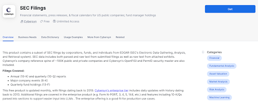
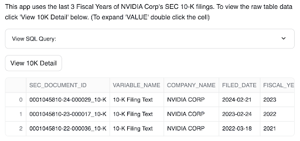
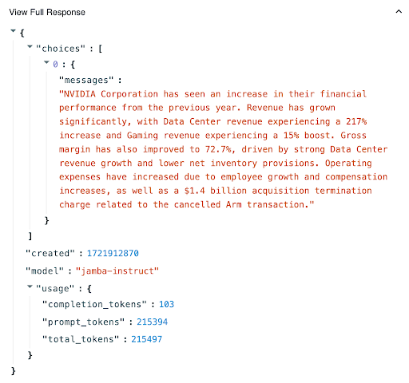

author: camwasi
id: sec_10k_decoder_without_rag
categories: snowflake-site:taxonomy/solution-center/certification/quickstart, snowflake-site:taxonomy/product/ai, snowflake-site:taxonomy/product/applications-and-collaboration, snowflake-site:taxonomy/snowflake-feature/build
language: en
summary: This quickstart will help you create a streamlit application to interact with Cortex's AI21's Jamba-Instruct
environments: web
status: Archived
feedback link: https://github.com/Snowflake-Labs/sfguides/issues

# AI21's Jamba-Instruct Quickstart | SEC 10K Decoder Without RAG
<!-- ------------------------ -->
## Overview 
Duration: 1

In this quickstart, we will review how to build a Streamlit App within Snowflake that allows you to easily analyze years of NVIDIA 10K filings using Jamba-Instruct in Cortex. With Jamba’s 256K context window, there is no requirement to build a RAG pipeline that chunks the filings into segments that fit into a smaller context window.

### What is Streamlit?
Streamlit enables Snowflake users to combine Streamlit’s component-rich, open-source Python library with the scale, performance, and security of the Snowflake platform.
https://www.snowflake.com/en/data-cloud/overview/streamlit-in-snowflake/

### What is Snowflake Cortex?
Snowflake Cortex AI provides access to top-tier LLMs within your Snowflake environment. Build GenAI applications with fully managed LLMs and chat with your data services.
https://www.snowflake.com/en/data-cloud/cortex/

### What is Jamba-Instruct?
AI21’s Jamba-Instruct is the world’s first-ever commercial LLM to successfully leverage SSM-Transformer architecture. This hybrid approach delivers leading quality, performance, and cost, offering the best value per cost across an impressive 256k context window.
https://www.ai21.com/jamba

### Prerequisites
- A Snowflake account in a region where Snowflake Cortex and Jamba-Instruct are available. [check availability](https://docs.snowflake.com/en/user-guide/snowflake-cortex/llm-functions?_fsi=mg3vAFop&_fsi=mg3vAFop#label-cortex-llm-availability)
- A Snowflake account that is [credentialed to mount data](https://docs.snowflake.com/en/user-guide/data-share-consumers) from the Marketplace 

### What You’ll Learn 
- How to access data from the Snowflake Marketplace
- How to call Jamba-Instruct from within Snowflake Cortex
- Best practices for prompting Jamba-Instruct

### What You’ll Build 
This Streamlit application within Snowflake illustrates Jamba-Instruct's text analysis capabilities using Cybersyn's SEC Filings database. While 10K filings serve as our example, Jamba-Instruct on Cortex can be applied to various text-intensive scenarios such as processing internal documentation, analyzing customer feedback, or tackling any large-scale text analysis task specific to your industry.

<!-- ------------------------ -->
## Setup code and streamlit prerequisites
Duration: 5

### Step 1: Accessing the data in Snowflake Marketplace
<button>

  [Get Cybersyn's SEC Filings Data](https://app.snowflake.com/marketplace/listing/GZTSZAS2KH9/cybersyn-sec-filings)
</button>

After logging into your Snowflake account, access [Cybersyn’s SEC Filings](https://app.snowflake.com/marketplace/listing/GZTSZAS2KH9/cybersyn-sec-filings) in the Marketplace.
- Click the Get button on the top right box of the listing
- Read and accept the terms
- Note: This data listing is available for free, at no additional charge
- The data is now available in your Snowflake Instance, as the SEC_FILINGS database under the Data menu on the left hand side panel

### Step 2: Create a database and schema where the Streamlit app will run

- On the left side panel, click Data
- Click the blue + Database button in the top right corner
- Create a new database with a name of your choosing (e.g. CORTEX_STREAMLIT) for the Streamlit app to live in
- Create a new Schema in the database you created (e.g. CORTEX_STREAMLIT) with a name of your choosing (e.g. JAMBA)

### Step 3: Create the Streamlit app in Snowflake

- On the left side panel, click Streamlit
- Click the blue + Streamlit App button in the top right corner
  - Make sure the role that you are using has access to Snowflake Cortex AI [Required Privileges](https://docs.snowflake.com/en/user-guide/snowflake-cortex/llm-functions?_fsi=mg3vAFop&_fsi=mg3vAFop#required-privileges)
  - Name your App (e.g. Jamba-10K-Decoder)
  - Select a Warehouse (XS will work for this demonstration)
  - Select the database and schema for your app. If you followed Step 2, select this database (e.g. CORTEX_STREAMLIT and JAMBA)
  - Click the blue Create button
  - Delete all of the existing code

### Step 4: Copy the Streamlit app code from GitHub

[Streamlit GitHub Code](https://github.com/AI21Labs/AI21-Industry-Samples/blob/main/Snowflake_10K_Decoder/Snowflake_10K_Decoder.py)

- Click the button above which will direct you to our Jamba-Instruct quickstart code that is hosted on GitHub.
- Within GitHub, navigate to the right side of the window and click the ‘Copy Raw Contents’ button. This will copy all of the required Python code into your clipboard.
- Paste the Python code into the Streamlit code area in your newly created Streamlit app in Snowflake.

### Step 5: Run the Jamba Streamlit Application

- In the upper right corner of your Snowflake Streamlit app, click the blue Run button.
- Wait for the app to load.

**You’ve successfully built the Jamba-Instruct 10K Decoder Streamlit app in Snowflake!**

<!-- ------------------------ -->
## Using Jamba-Instruct in Cortex
Duration: 3

AI21’s Jamba-Instruct is a powerful language model designed with a 256k context window to handle large volumes of text, up to ~800 pages, making it ideal for tasks such as summarizing lengthy documents, analyzing call transcripts, and extracting information from extensive data.

Another major advantage of a long context window is its capacity to make advanced techniques more accessible, often eliminating the need for complex configurations. While Retrieval-Augmented Generation (RAG) is frequently employed to anchor language models with a company’s curated data, Jamba-Instruct’s long context window allows for achieving accurate results with or without RAG, simplifying the architecture and enhancing performance across various applications.

### 10K-Decoder Usage

Cybersyn’s [SEC_FILINGS](https://app.snowflake.com/marketplace/listing/GZTSZAS2KH9/cybersyn-sec-filings?originTab=provider&providerName=Cybersyn%2C&ref=blog.streamlit.io) database is used for this application. This dataset provides real-world SEC filing documents for many companies, illustrating Jamba-Instruct's effectiveness in processing large volumes of text in a single prompt. The last few years of NVIDIA 10K filings are used for this demonstration. There are over 200k tokens in this text, and using Jamba-Instruct, you can fit all this text (and your questions about it) into a single prompt!

> aside negative
>
> Jamba-Insruct is not available in all regions, confirm your region is on the list [check availability](https://docs.snowflake.com/en/user-guide/snowflake-cortex/llm-functions?_fsi=mg3vAFop&_fsi=mg3vAFop#label-cortex-llm-availability)

- You can view the data by clicking the View 10K Detail button
- You can ask questions about the filings by entering your question in the Enter your Question section, and then clicking Run Filing Query

.png)

- Clicking on View Full Response will display the whole JSON structure returned from Cortex. This is helpful for seeing usage details

### Prompting Tips

- Be clear with your prompt
- Ensure your prompt doesn’t contain grammatical errors
- Describe what you want, not what you don’t want
- For more tips on effectively prompting Jamba check out our [Jamba prompt engineering guide](https://docs.ai21.com/docs/prompt-engineering)

<!-- ------------------------ -->
## Conclusion And Resources
Duration: 1

Congratulations! You’ve successfully built a GenAI Streamlit app using Jamba-Instruct on Snowflake Cortex AI. With this fully managed approach, GenAI can be harnessed without any data ever needing to leave Snowflake's secure walls.

Jamba’s 256k context window delivers superior performance across key long context use cases:
- Summarization and QA of long text (e.g. financial documents)
- Paired document reasoning and analysis
- Longer memory for customer service and agent chatbots
- Extracting insight from earnings calls
- Contradiction and compliance detection
- Long multi-shot prompt templates with many examples

### What You Learned
- How to access data from the Snowflake Marketplace
- How to call Jamba-Instruct from within Snowflake Cortex
- Best practices for prompting Jamba-Instruct

### Related Resources

- [Jamba-Instruct Launch Blog](https://www.ai21.com/jamba)
- [Jamba-Instruct in Cortex AI Launch Blog](https://www.linkedin.com/posts/snowflake-computing_ai21-labss-jamba-instruct-is-now-integrated-activity-7222333089492918272-63mG/)
- [Jamba Whitepaper](https://arxiv.org/abs/2403.19887)
- [Cortex AI Complete Product Reference](https://docs.snowflake.com/en/sql-reference/functions/complete-snowflake-cortex)
- [Streamlit in Snowflake](https://docs.snowflake.com/en/developer-guide/streamlit/about-streamlit)
