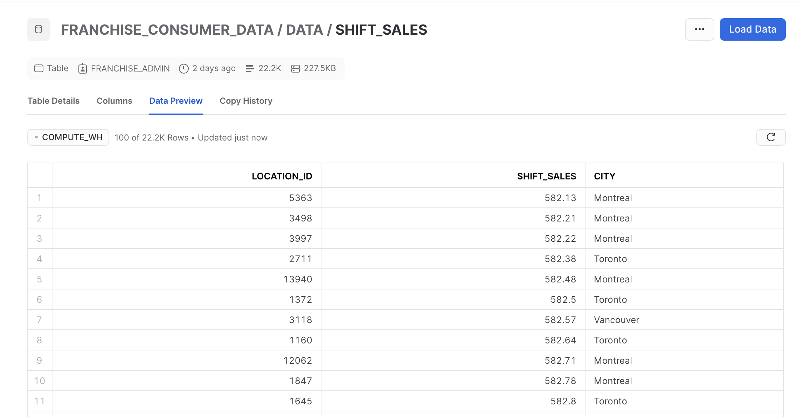
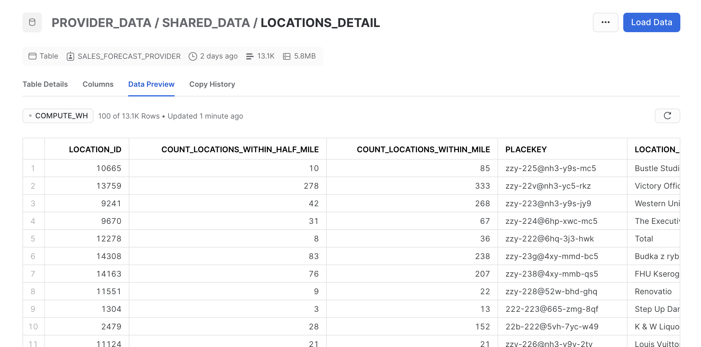
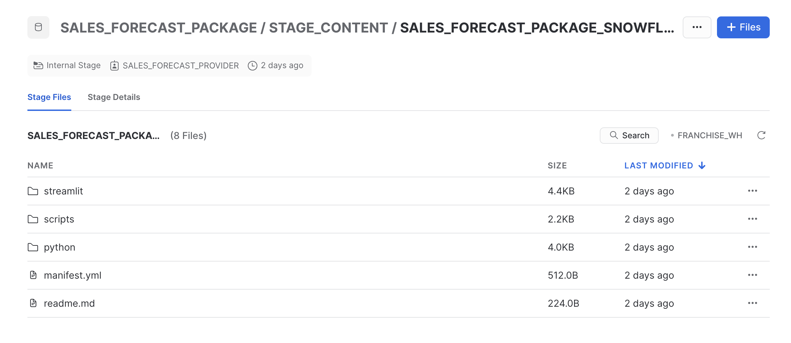
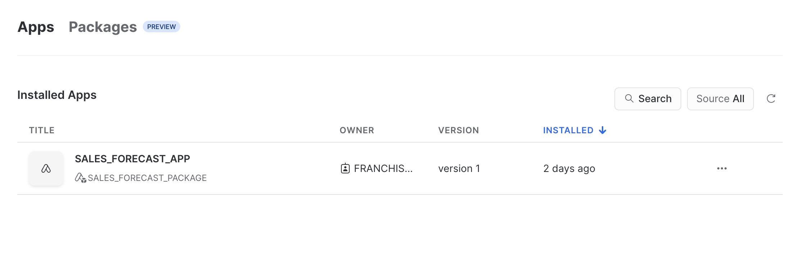
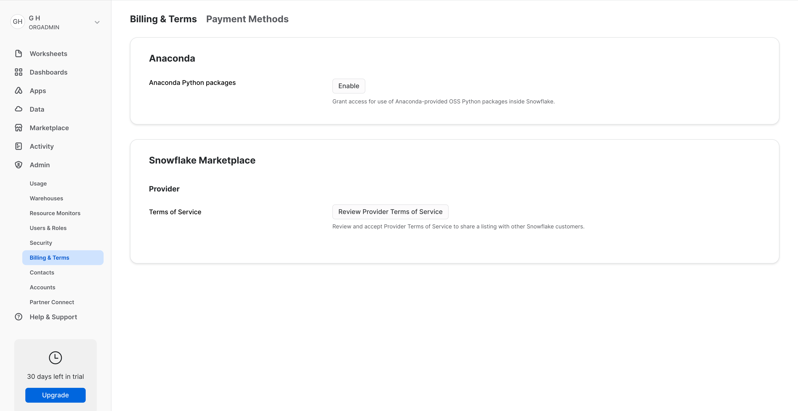

author: Gilberto Hernandez, Charlie Hammond
id: tasty_bytes_native_app
categories: snowflake-site:taxonomy/solution-center/certification/quickstart, snowflake-site:taxonomy/product/applications-and-collaboration, snowflake-site:taxonomy/snowflake-feature/build, snowflake-site:taxonomy/snowflake-feature/native-apps
language: en
summary: This is a Quickstart on how to build a Snowflake Native Application with Tasty Bytes.
environments: web
status: Archived
feedback link: https://github.com/Snowflake-Labs/sfguides/issues

# Tasty Bytes - Snowflake Native Application
<!-- ------------------------ -->
## Overview 
Duration: 3

> aside negative
> 
> **Important**
> At the time of writing, Snowflake Native Application are currently only available to Snowflake accounts in all non-government AWS and Azure regions. Ensure your Snowflake deployment or trial account uses one of these options as the cloud provider. Native Apps will be available on other major cloud providers soon.


In this Quickstart, you'll build a Snowflake Native Application that provides food truck owners with a machine learning model they can use to forecast sales. Here are some additional details behind the scenario:

**Consumer**

* The application consumer is a food truck franchisee. They own a Tasty Bytes food truck and have raw sales data in their Snowflake account. They'd like to be able to use their data to predict sales volume across food trucks in different cities.

**Provider**

* The application provider will build an application that the consumer will use to enrich their raw sales data. The application will also contain a machine learning model that will used for inference with the enriched data. Finally, the application will visualize the results of the inference.

### Prerequisites

To successfully complete this Quickstart, your Snowflake account must have the Tasty Bytes data set and Tasty Bytes machine learning models. Make sure you complete the following before attempting this Quickstart:

1. Step 2 of [An Introduction to Tasty Byes](https://quickstarts.snowflake.com/guide/tasty_bytes_introduction/index.html?index=..%2F..index#1)

2. Steps 2 and 3 of [Tasty Bytes - Snowpark 101 for Data Science
](https://quickstarts.snowflake.com/guide/tasty_bytes_snowpark_101_for_data_science/index.html?index=..%2F..index#1)

If these prerequisites are not completed, you will not able to complete this Quickstart.


### What You'll Learn 
- The Snowflake Native Application Framework
- Consumer account setup
- Provider account setup
- How the application is structured (data, logic, and user interface)
- How to create an application package 
- How to add application source code to an application package
- How to create the first version of an application
- How to install and run the application in your account

### What You'll Need 
- A Snowflake account with ACCOUNTADMIN access ([trial](https://signup.snowflake.com/developers/?utm_cta=developer-toolkit-quickstart), or otherwise)

> aside negative
> 
> **Important**
> At the time of writing, Snowflake Native Apps are currently only available to Snowflake accounts in all non-government AWS and Azure regions. Ensure your Snowflake deployment or trial account uses one of these options as the cloud provider. Native Apps will be available on other major cloud providers soon.

### What You'll Build 
- A Snowflake Native Application for visualizing sales forecasts

<!-- ------------------------ -->
## Prerequisites
Duration: 10

To successfully complete this Quickstart, your Snowflake account must have the Tasty Bytes data set and Tasty Bytes machine learning models. Make sure you complete the following before attempting this Quickstart:

1. Step 2 of [An Introduction to Tasty Byes](https://quickstarts.snowflake.com/guide/tasty_bytes_introduction/index.html?index=..%2F..index#1)

2. Steps 2 and 3 of [Tasty Bytes - Snowpark 101 for Data Science
](https://quickstarts.snowflake.com/guide/tasty_bytes_snowpark_101_for_data_science/index.html?index=..%2F..index#1)

If these prerequisites are not completed, you will not able to complete this Quickstart.

In addition, clone or download the source code for the application you'll build in this Quickstart here: [Tasty Bytes - Native App](https://github.com/Snowflake-Labs/sf-samples/tree/main/samples/sfguide-tasty-bytes-native-app).
<!-- ------------------------ -->
## Account Set Up: Consumer
Duration: 3

For the purposes of convenience, we'll use one Snowflake account to build the application. This means the account will contain consumer data and provider data. In practice, there would be two separate accounts. Providers would build the application package in their account, publish it to the Snowflake marketplace, and consumers would discover the application there and install it into their Snowflake account.

Let's start by setting up the consumer objects and data in the account. In Snowflake, open a SQL worksheet and run the following SQL:

```sql
-- Create consumer roles and grant privileges
USE ROLE accountadmin;

CREATE ROLE IF NOT EXISTS franchise_admin;
CREATE ROLE IF NOT EXISTS franchise_viewer;

GRANT ROLE franchise_admin TO ROLE accountadmin;
GRANT ROLE franchise_viewer TO ROLE accountadmin;

GRANT CREATE DATABASE ON ACCOUNT TO ROLE franchise_admin;
GRANT CREATE APPLICATION ON ACCOUNT TO ROLE franchise_admin;
GRANT EXECUTE TASK, EXECUTE MANAGED TASK ON ACCOUNT TO ROLE franchise_admin WITH GRANT option;
GRANT ROLE franchise_viewer TO ROLE franchise_admin;

-- Create a warehouse to be used by the application consumer
CREATE WAREHOUSE IF NOT EXISTS franchise_wh;
GRANT USAGE ON WAREHOUSE franchise_wh TO ROLE franchise_admin;
GRANT USAGE ON WAREHOUSE franchise_wh TO ROLE franchise_viewer;

-- Grant usage on source data to consumer roles
GRANT USAGE ON DATABASE frostbyte_tasty_bytes_dev TO ROLE franchise_admin;
GRANT USAGE ON ALL SCHEMAS IN DATABASE frostbyte_tasty_bytes_dev TO ROLE franchise_admin;
GRANT SELECT ON TABLE frostbyte_tasty_bytes_dev.analytics.shift_sales_v TO ROLE franchise_admin;
```

The SQL above does the following:

* Creates two application roles, `franchise_admin` and `franchise_viewer`. These are roles that exist in the consumer account. An account admin in the consumer account would be able to assign users in the Snowflake account to either one of these roles. One role (say, `franchise_admin`) could have more privileges within the application than another role (say, `franchise_viewer`).

* Grants certain privileges to the `franchise_admin` role. It also allows the `franchise_admin` role to assume the `franchise_viewer` role if necessary.

* Creates a warehouse to be used by either one of these app user while running the application.

With the base roles and privileges now defined, let's now create the consumer data in the account. Open a SQL worksheet and run the following:

```sql 
-- Create consumer data

USE ROLE franchise_admin;
USE WAREHOUSE franchise_wh;

-- Create consumer database
CREATE DATABASE IF NOT EXISTS franchise_consumer_data;
USE DATABASE franchise_consumer_data;
CREATE SCHEMA IF NOT EXISTS data;
USE SCHEMA data;

-- Create sales table for consumer
CREATE OR REPLACE TABLE shift_sales AS
(
    WITH row_cte 
    AS
    (
        SELECT
            location_id,
            shift_sales,
            city,
            ROW_NUMBER() OVER (ORDER BY shift_sales) as row_count
        FROM frostbyte_tasty_bytes_dev.analytics.shift_sales_v
    )
    SELECT 
        * EXCLUDE row_count 
    FROM row_cte
    WHERE city IN ('Toronto', 'Vancouver', 'Montreal')
    AND (row_count % 10) = 0 -- only copy 10% of sales
);
```

The SQL above creates a database called `franchise_consumer_data` that contains some sales data for the cities of Toronto, Vancouver, and Montreal.



<!-- ------------------------ -->
## Account Set Up: Provider
Duration: 3

Let's now prep the account with the roles, grants, and objects that the application provider will need to create the application.

Open a SQL worksheet and run the following:

```sql
-- Create application provider roles and grant privileges
USE ROLE accountadmin;

CREATE ROLE IF NOT EXISTS sales_forecast_provider;
GRANT ROLE sales_forecast_provider TO ROLE accountadmin;
GRANT CREATE application package ON ACCOUNT TO ROLE sales_forecast_provider;
GRANT CREATE DATABASE ON ACCOUNT TO ROLE sales_forecast_provider;

-- Create warehouse and ensure a warehouse is usable by provider
CREATE WAREHOUSE IF NOT EXISTS franchise_wh;
GRANT USAGE ON WAREHOUSE franchise_wh TO ROLE sales_forecast_provider;

-- Grant usage on source data to provider role
GRANT USAGE ON DATABASE frostbyte_tasty_bytes TO ROLE sales_forecast_provider;
GRANT USAGE ON ALL SCHEMAS IN DATABASE frostbyte_tasty_bytes TO ROLE sales_forecast_provider;
GRANT SELECT ON TABLE frostbyte_tasty_bytes.raw_pos.location TO ROLE sales_forecast_provider;
GRANT SELECT ON TABLE frostbyte_tasty_bytes.raw_pos.country TO ROLE sales_forecast_provider;
```

The SQL above does the following:

* Creates the application provider role, `sales_forecast_provider`. This is the provider role you can imagine is building the application. We will assume this role as we build the application in the account. 

* Grants certain privileges to the `sales_forecast_provider` role. Note that this role is granted `CREATE application package` privileges. This is the grant that will enable us to package and distribute the application source code.

* Allows the `sales_forecast_provider` role to use the `franchise_wh`. This is for the purposes of convenience given that we are using a single Snowflake account to build the application. In practice, the provider would use their own compute resources (i.e., warehouses) in their account while building the application.

With the provider roles, grants, and objects now defined, let's now create some provider data in the account. This is the data that will enrich the consumer data for use in the forecasting model.

Open a SQL worksheet and run the following:

```sql
-- Create provider data

USE ROLE sales_forecast_provider;
USE WAREHOUSE franchise_wh;

CREATE DATABASE IF NOT EXISTS provider_data;
CREATE SCHEMA IF NOT EXISTS provider_data.shared_data;

CREATE OR REPLACE TABLE provider_data.shared_data.locations_detail
AS
(
    WITH _location_point AS
    (SELECT 
        cpg.placekey,
        l.location_id,
        cpg.city,
        cpg.country,
        ST_MAKEPOINT(cpg.longitude, cpg.latitude) AS geo_point
    FROM frostbyte_safegraph.public.frostbyte_tb_safegraph_s cpg
    LEFT JOIN frostbyte_tasty_bytes.raw_pos.location l
        ON cpg.placekey = l.placekey),
    _distance_between_locations AS
    (SELECT 
        a.placekey,
        a.location_id,
        b.placekey AS placekey_2,
        b.location_id AS location_id_2,
        a.city,
        a.country,
        ROUND(ST_DISTANCE(a.geo_point, b.geo_point)/1609,2) AS geography_distance_miles
    FROM _location_point a
    JOIN _location_point b
        ON a.city = b.city
        AND a.country = b.country
        AND a.placekey <> b.placekey
    ),
    _locations_within_half_mile AS
    (
    SELECT
        dbl.placekey,
        dbl.location_id,
        COUNT(DISTINCT dbl.placekey_2) AS count_locations_within_half_mile
    FROM _distance_between_locations dbl
    WHERE dbl.geography_distance_miles <= 0.5
    GROUP BY dbl.location_id, dbl.placekey
    ),
    _locations_within_mile AS
    (
    SELECT
        dbl.placekey,
        dbl.location_id,
        COUNT(DISTINCT dbl.placekey_2) AS count_locations_within_mile
    FROM _distance_between_locations dbl
    WHERE dbl.geography_distance_miles <= 1
    GROUP BY dbl.location_id, dbl.placekey
    )
    SELECT
        l.location_id,
        ZEROIFNULL(hm.count_locations_within_half_mile) AS count_locations_within_half_mile,
        ZEROIFNULL(m.count_locations_within_mile) AS count_locations_within_mile,
        cpg.placekey,
        cpg.location_name,
        cpg.top_category,
        cpg.sub_category,
        cpg.naics_code,
        cpg.latitude,
        cpg.longitude,
        ST_MAKEPOINT(cpg.longitude, cpg.latitude) AS geo_point,
        cpg.street_address,
        cpg.city,
        c.city_population,
        cpg.region,
        cpg.country,
        cpg.polygon_wkt,
        cpg.geometry_type
    FROM frostbyte_tasty_bytes.raw_pos.location l
    JOIN frostbyte_safegraph.public.frostbyte_tb_safegraph_s cpg
        ON l.placekey = cpg.placekey
    JOIN frostbyte_tasty_bytes.raw_pos.country c
        ON l.city = c.city
    LEFT JOIN _locations_within_half_mile hm
        ON l.location_id = hm.location_id
    LEFT JOIN _locations_within_mile m
        ON l.location_id = m.location_id
);
```

The SQL above creates a table containing location data that will be used alongside the consumer data for forecasting and visualization within the application.



<!-- ------------------------ -->
## Application: Structure
Duration: 5

Before building the application, let's quickly take a look at the structure of the application.

```console
tasty-bytes-native-app/
├─ python/
│  ├─ evaluate_model.py
│  ├─ inference_pipeline.py
│  ├─ linreg_location_sales_model.sav
├─ scripts/
│  ├─ setup.sql
├─ streamlit/
│  ├─ environment.yml
│  ├─ forecast_ui.py
├─ manifest.yml
├─ README.md
```

* **Application user interface (UI)** – The code powering the UI of the application resides in **streamlit/**. This directory contains two files, **environment.yml** and **forecast_ui.py**. The former contains the definition for an environment used to build the UI, and contains references to dependencies (packages) used in the UI. The latter contains the Streamlit code that defines the layout and data rendering in the app.

* **Application logic** – You can find the logic powering the sales forecasting model in the **python/** directory. The **inference_pipeline.py** file contains the logic that enriches, transforms, and preps the data that will be used for sales predictions. **evaluate_model.py** contains a user-defined function (UDF) that accepts a DataFrame and calls the prediction model (**linreg_location_sales_model.sav**) on that DataFrame to returns a sales forecast.

* **scripts/** contains the application set up script **setup.sql**, which is required by the Snowflake Native Application framework and will execute when a consumer installs the application in their account.

* **manifest.yml** contains application metadata, including references to important artifacts used by the application (the set up script, the default Streamlit file, etc.) and object references that describe the privileges the application should have on those objects.

* **README.md** contains information about the application. The user interface will display a button that opens the README file. It's best practice to include one.

That's a high level overview of the structure and components of the application. Let's dive into more details in subsequent sections.

<!-- ------------------------ -->
## Application: User Interface (UI)
Duration: 5


In GitHub, or your preferred code editor, navigate to **streamlit/forecast_ui.py** file. This file contains all of the code for the application's user interface (approximately 120 lines of code).

Broadly, this file:

* **Imports required packages** – The code imports the necessary Python packages, including Streamlit (used to build the interface), Snowpark (to establish a session withSnowflake), pandas, pydeck, and others.

* **Checks for object permissions** – The Snowflake permissions SDK (specifically `snowflake.permissions`) is used to check whether the application has been granted access to the `shift_sales` table.  If not, it requests these permissions.

* **Defines layout and state** – The file lays out the interface in three columns, along with a "Get Forecast" button. It also retrieves a list of distinct cities from the Snowflake database (only cities where the franchisee operates) and stores it in the session state for use in dropdown menus.

* **Generates a sales forecast** – When the user clicks the "Get Forecast" button, the app calls a stored procedure in Snowflake to perform sales forecast inference for the selected city, date, and shift.
The results are then formatted into a pandas DataFrame and displayed in a table with a gradient background based on sales forecast values.

* **Visualizes the sales forecast** – The sales forecast data is visualized on a map using pydeck, with the size and color of scatter plot points varying based on the sales forecast. A scatter plot on a map shows locations of food trucks, with varying point sizes and colors representing different sales forecast values.

<!-- ------------------------ -->
## Application: Logic
Duration: 10

Let's now take a look at some of the logic powering the application, including the data preparation and the sales forecasting generated by our pre-trained linear regression model.

In GitHub, or your preferred code editor, navigate to **python/evaluate_model.py** file. 

```py
# evaluate_model.py

import sys
import pandas as pd
from joblib import load
from _snowflake import vectorized

# vectorized decorator allows the UDF to bulk process rows during inference to speed up processing
@vectorized(input=pd.DataFrame)
def evaluate_model(X: pd.DataFrame) -> pd.Series:

    # import model from package stage
    import_dir = sys._xoptions.get("snowflake_import_directory")
    model_file = import_dir + 'linreg_location_sales_model.sav'
    model = load(model_file)

    # run inference
    sales = model.predict(X)
    return sales
```

The code in **evaluate_model.py** does the following:

* **Imports required packages** – The script imports required Python libraries. `joblib` is specifically imported for loading the pre-trained linear regression model (**linreg_location_sales_model.sav**), and `vectorized` is imported to allow the UDF to process multiple rows at once for efficient bulk processing.

* **Defines the `evaluate_model()` function** – The `@vectorized` decorator is applied to the function, allowing the function to process a DataFrame of input rows in batch, rather than one row at a time. The function accepts a pandas DataFrame as an argument.

* **Retrieves the pre-trained model, performs inference, and returns the results** – The pre-trained model is retrieved, loaded using `load`, and is used to predict sales given a DataFrame by calling the model's `predict()` function. The function returns a pandas Series containing the sales predictions for each row in the DataFrame passed in.

In GitHub, or your preferred code editor, navigate to **python/inference_pipeline.py** file. 

```py
# inference_pipeline.py

import snowflake.snowpark.functions as F
import snowflake.snowpark.types as T
from snowflake.snowpark import Session

def inference(session: Session, city: T.StringType, shift: T.IntegerType, forecast_date: T.DateType):
    # create dimensional table for date and shifts
    dates_df = session.create_dataframe(
        [[forecast_date.month, forecast_date.weekday(), shift]], 
        schema = ["month", "day_of_week", "shift"]
    )

    # pull locations information from provider
    locations_df = session.sql('''
                        select * 
                        from package_shared.location_detail_v
                        ''')
    locations_df = locations_df.select([
        "city", 
        "location_name", 
        "location_id", 
        "count_locations_within_half_mile", 
        "latitude", "longitude", 
        "city_population",
    ])
    locations_df = locations_df.filter(F.col("city") == city)
    
    # cross join with dates to have all locations and date/shift combinations
    locations_df = locations_df.cross_join(dates_df)
    
    # get sales data from consumer
    sales_df = session.sql('''
                        select location_id, shift_sales 
                        from reference('shift_sales')
                        ''')
    sales_df = sales_df.group_by("location_id").agg(F.mean("shift_sales").alias("avg_location_shift_sales"))
    
    # join sales and location data for inference
    locations_df = locations_df.join(
        sales_df, locations_df.location_id == sales_df.location_id
    ).rename(
        locations_df.location_id, "location_id"
    ).drop(sales_df.location_id)

    # run inference by calling evaluate_model udf
    features = [
        'MONTH', 
        'DAY_OF_WEEK', 
        'LATITUDE', 
        'LONGITUDE', 
        'COUNT_LOCATIONS_WITHIN_HALF_MILE', 
        'CITY_POPULATION', 
        'AVG_LOCATION_SHIFT_SALES', 
        'SHIFT',
    ]
    df_results =  locations_df.select(
        F.col("city"),
        F.col("location_name"),
        F.col("location_id"),
        F.col("latitude"),
        F.col("longitude"),
        F.col("month"),
        F.col("day_of_week"),
        F.iff(F.col("shift") == 1, "AM", "PM").alias("shift"),
        F.call_udf("code_schema.evaluate_model", [F.col(c) for c in features]).alias("prediction")
    ).order_by(
        F.col("prediction").desc()
    ).limit(10)
    
    return df_results
```

The code in **inference_pipeline.py** does the following:

* **Creates the `inference()` function** – The `inference()` function accepts a Snowflake session, city, shift (AM/PM), and forecast date. This is the function that will be called when a user clicks the "Get Forecast" button in the interface. It'll use the values set by the user in the user interface and make the call to `inference()` using those values. The function returns a DataFrame with the results.

* **Retrieves location data** – Location details are retrieved from a view named `location_detail_v` within Snowflake. The data is filtered for the selected city and specific columns are selected for further analysis. This location data is then cross-joined with `dates_df` to combine location details with the date and shift information.

* **Aggregates sales data** – Sales data is retrieved from the `shift_sales` table. The sales data is grouped by `location_id` and the average sales (`shift_sales`) per location is calculated.

* **Prepares data for inference** – The location data and aggregated sales data are joined on `location_id`. A list of features are prepared for the model inference, including details like month, day of the week, geographical coordinates, city population, average sales, and shift.

* **Performs inference** – The model inference is performed by calling a user-defined function (`evaluate_model()`, described earlier in the step), passing in the required features. The results are ordered by the prediction value in descending order and limited to the top 10 results.
The function returns a DataFrame containing the city, location name, location ID, latitude, longitude, date details, shift (AM/PM), and the sales prediction.

<!-- ------------------------ -->
## Application: manifest.yml
Duration: 3

Now that we've covered the application user interface and logic, let's move on to a couple of files required by the Snowflake Native Application framework.

In GitHub, or your preferred code editor, navigate to the **manifest.yml** file.

```yml
manifest_version: 1

version:
  name: v1
  label: "version 1"
  comment: "Initial version of the application"

artifacts:
  setup_script: scripts/setup.sql
  readme: readme.md
  default_streamlit: code_schema.forecast_streamlit_app  

references:
  - shift_sales:
      label: "Shift Sales"
      description: "Table that contains franchise sales data."
      privileges:
        - SELECT
      object_type: TABLE
      multi_valued: false
      register_callback: config.register_sales_data_callback
```

This file is required by the Snowflake Native Application framework – all application packages must have a **manifest.yml** file. This file contains important metadata about the application (version, name), as well as references to artifacts and objects required by the application.

In `artifacts`, we provide paths to the set up script **setup.sql** (which we'll cover in the next step), the README file, and the default Streamlit (also covered in the next step).

In `references`, we describe the objects that the application will need access to. There's one entry, `shift_sales`, representing a table in the consumer's account that the application will require `SELECT` privileges on. The `register_callback` is set to a procedure that is intended to handle application references – we'll cover this in the next step.


<!-- ------------------------ -->
## Application: setup.sql
Duration: 5

In GitHub, or your preferred code editor, navigate to the **setup.sql** file.

```sql
-- Setup script for sales forecast application

CREATE APPLICATION ROLE app_public;
CREATE APPLICATION ROLE app_admin;

CREATE OR ALTER VERSIONED SCHEMA code_schema;
GRANT USAGE ON SCHEMA code_schema TO APPLICATION ROLE app_public;
GRANT USAGE ON SCHEMA code_schema TO APPLICATION ROLE app_admin;

CREATE OR REPLACE FUNCTION code_schema.evaluate_model(month float, day_of_week float, latitude float, longitude float, count_locations_within_half_mile float, city_population float, avg_location_shift_sales float, shift float)
RETURNS FLOAT
LANGUAGE PYTHON
RUNTIME_VERSION=3.8
IMPORTS = ('/python/evaluate_model.py', '/python/linreg_location_sales_model.sav')
PACKAGES = ('snowflake-snowpark-python', 'scikit-learn', 'joblib','pandas')
HANDLER='evaluate_model.evaluate_model';

CREATE OR REPLACE PROCEDURE code_schema.inference(city string, shift int, forecast_date date)
RETURNS TABLE()
LANGUAGE PYTHON
RUNTIME_VERSION=3.8
IMPORTS = ('/python/inference_pipeline.py')
PACKAGES = ('snowflake-snowpark-python', 'scikit-learn', 'joblib','pandas')
HANDLER='inference_pipeline.inference';

GRANT USAGE ON PROCEDURE code_schema.inference(STRING, INT, DATE) TO APPLICATION ROLE app_public;

CREATE OR ALTER VERSIONED SCHEMA config;
GRANT USAGE ON SCHEMA config TO APPLICATION ROLE app_admin;

CREATE PROCEDURE CONFIG.register_sales_data_callback(ref_name STRING, operation STRING, ref_or_alias STRING)
  RETURNS STRING
  LANGUAGE SQL
  AS $$
    BEGIN
      CASE (operation)
        WHEN 'ADD' THEN
          SELECT SYSTEM$SET_REFERENCE(:ref_name, :ref_or_alias);
        WHEN 'REMOVE' THEN
          SELECT SYSTEM$REMOVE_REFERENCE(:ref_name);
        WHEN 'CLEAR' THEN
          SELECT SYSTEM$REMOVE_REFERENCE(ref_name);
      ELSE
        RETURN 'unknown operation: ' || operation;
      END CASE;
      RETURN NULL;
    END;
  $$;

GRANT USAGE ON PROCEDURE CONFIG.register_sales_data_callback(STRING, STRING, STRING) TO APPLICATION ROLE app_admin;

CREATE STREAMLIT code_schema.forecast_streamlit_app
  FROM '/streamlit'
  MAIN_FILE = '/forecast_ui.py';

GRANT USAGE ON STREAMLIT code_schema.forecast_streamlit_app TO APPLICATION ROLE app_admin;
GRANT USAGE ON STREAMLIT code_schema.forecast_streamlit_app TO APPLICATION ROLE app_public;
```

This file is required by the Snowflake Native Application framework – all application packages must have a **setup.sql** file. This file executes when a consumer installs the application into their account.

Set up scripts will typically define application roles, bind logic to functions or stored procedures, and define all of the grants and privileges that the application roles will have.

We can summarize the majority of the script as follows:

* **Application roles** – The application has two roles: `app_public` and `app_admin`.

* **Application logic** – The logic we covered in the **python/** directory in the application's source code is defined as either a function or stored procedure within the script. This ensures that we can invoke the logic in the application. These are defined within a versioned schema called `code_schema`, allowing the application provider to upgrade them as necessary in any future versions of the application.

* **Role privileges** - Take a look at the several different privileges granted to the different application roles. This is how the application provider creates different application experiences based on the role.

There are a couple of other things that are created in the set up script that facilitate application references allow access to the user interface:

* **`config` schema** – This schema contains a procedure used to manage object references in the application. That is, it handles the adding, removing, or clearing of an object reference to the application, specifically the application's access to the `shift_sales` table specified in the manifest file.

* `STREAMLIT code_schema.forecast_streamlit_app` – Creates a Streamlit from the file containing the user interface code (**forecast_ui.py**, which we covered in a previous step).

<!-- ------------------------ -->
## Create the application package
Duration: 5

Now that we've covered all of the components of the application's source code, let's begin creating the application package that will contain the source code.

Open a SQL worksheet and run the following:
```sql
-- Create application package
USE ROLE sales_forecast_provider;
USE WAREHOUSE franchise_wh;

CREATE APPLICATION PACKAGE sales_forecast_package;
USE APPLICATION PACKAGE sales_forecast_package;

-- Allow package to reference provider data
GRANT REFERENCE_USAGE ON DATABASE provider_data
  TO SHARE IN APPLICATION PACKAGE sales_forecast_package;

-- This schema will be accessible inside of our setup script
CREATE SCHEMA IF NOT EXISTS sales_forecast_package.package_shared;
USE SCHEMA sales_forecast_package.package_shared;

-- View for location details
CREATE VIEW IF NOT EXISTS package_shared.location_detail_v
  AS SELECT *
  FROM provider_data.shared_data.locations_detail;

-- These grants allow our setup script to refer to our views
GRANT USAGE ON SCHEMA package_shared
  TO SHARE IN APPLICATION PACKAGE sales_forecast_package;
GRANT SELECT ON VIEW package_shared.location_detail_v
  TO SHARE IN APPLICATION PACKAGE sales_forecast_package;

CREATE SCHEMA sales_forecast_package.stage_content;
CREATE OR REPLACE STAGE sales_forecast_package.stage_content.sales_forecast_package_snowflake_stage;
```

The SQL above creates the application package `sales_forecast_package`. This application package will contain the application source code.

We also share provider data with the consumer in a safe and secure way. In the SQL above, we grant **reference usage** on the provider's data to the application package. We then create a schema that holds a view constructed from the provider's data. We grant the application package privileges on the schema and view, allowing the consumer to "access" the provider data through the application when they run it in their account.

<!-- ------------------------ -->
## Upload application source code
Duration: 5

Let's now upload the application source code into the application package. We'll upload the source code into a stage in the package.

Set your role to **SALES_FORECAST_PROVIDER**. Navigate to the `sales_forecast_package.stage_content.sales_forecast_package_snowflake_stage` stage. Click on the **+ FILES** button at the top right. Next, click **Browse** in the modal that appears.

To avoid breaking any references to objects needed by the app, the folder structure within the stage must reflect the folder structure in the **tasty-bytes-native-app** directory. Be sure to upload the source code exactly as follows:

1. Ensure you're in the **sfguide-tasty-bytes-native-app/tasty-bytes-native-app** directory and start by uploading the following files: **README.md** and **manifest.yml**.

2. Next, upload the set up script. Once again, click on the **+ FILES button**. Note the "Specify the path to an existing folder or create a new one (optional)" field in the modal. In this field, enter **scripts**. The modal will automatically prepend a forward slash to your entry, so the value will read as **/scripts**. 

3. Click **Browse**, navigate to the local **sfguide-tasty-bytes-native-app/tasty-bytes-native-app/scripts** folder on your computer, select **setup.sql** and upload the file.

4. Next, upload the application logic files. Click on the **+ FILES** button, and use **/python** as the destination path in the stage.

5. Click **Browse**, navigate to the local **sfguide-tasty-bytes-native-app/tasty-bytes-native-app/python** folder on your computer, select all files, and upload them. 

6. Finally, upload the user interface files. Click on the **+ FILES** button, and use **/streamlit** as the destination path in the stage.

5. Click **Browse**, navigate to the local **sfguide-tasty-bytes-native-app/tasty-bytes-native-app/streamlit** folder on your computer, select all files, and upload them.  

The folder structure within the stage should now reflect the folder structure in your local application directory.



<!-- ------------------------ -->
## Create first version
Duration: 2

With the application source code uploaded, let's create the first version of the application.

Open a SQL worksheet and run the following:

```sql
USE ROLE sales_forecast_provider;

-- Allow the franchisee to install our new package
GRANT INSTALL, DEVELOP ON APPLICATION PACKAGE sales_forecast_package TO ROLE franchise_admin;

ALTER APPLICATION PACKAGE sales_forecast_package
  ADD VERSION v1_0 USING '@sales_forecast_package.stage_content.sales_forecast_package_snowflake_stage';
```

Recall that we are using a single Snowflake account for the purposes of convenience and demonstration. As a result, we must grant install and develop privileges to the application consumer so that we can install the application in the account. In practice, this would not be necessary.

The final few lines of SQL create the first version of the application (`v1_0`) using the source code.

<!-- ------------------------ -->
## Install application
Duration: 2

Let's now install the application in the account. In practice, the consumer would be installing the application in their own account, so we'll assume the role of a user in the consumer account (in this case, `franchise_admin`) and install the application. In addition, running this SQL would not be necessary in practice. Instead, consumers would install the application into their account directly from the Snowflake Marketplace listing.

Open a SQL worksheet and run the following:

```sql
-- Install application in account

USE ROLE franchise_admin;
USE WAREHOUSE franchise_wh;

CREATE APPLICATION sales_forecast_app
FROM APPLICATION PACKAGE sales_forecast_package
USING VERSION v1_0;

GRANT APPLICATION ROLE sales_forecast_app.app_public
  TO ROLE franchise_viewer;
```

The SQL above creates the application from the application package and grants the `app_public` application role to the `franchise_viewer` role in the Snowflake account.

<!-- ------------------------ -->
## Run the application
Duration: 3

If all went as expected, the application is now installed in the account! Set your role to **FRANCHISE_ADMIN**, then navigate to the **Apps** section in your account. You should see an application titled **SALES_FORECAST_APP** installed. Click on the name of the app to run the app.



When running the app for the first time, you'll be prompted to create bindings. The bindings link references defined in the manifest file (`shift_sales`) to corresponding objects (`shift_sales` table) in the Snowflake account. These bindings ensure that the application can access necessary objects in the account.


Once the bindings are properly configured, the application will start up. Play around in the app to get a feel for how it works!


> aside negative
> 
>  **NOTE** Before being able to run the app, you may be prompted to accept the Anaconda terms and conditions. Exit the app, set your role to **ORGADMIN**, then navigate to "**Admin** -> **Billing & Terms**". Click **Enable** and then acknowledge and continue in the ensuing modal. If, when navigating back to the app, you are again prompted to accept the terms, refresh your browser.



<!-- ------------------------ -->
## Clean up
Duration: 1

To clean up, open a SQL worksheet and run the following:

```sql
-- Tear down

USE ROLE accountadmin;

DROP ROLE IF EXISTS sales_forecast_provider;
DROP ROLE IF EXISTS franchise_admin;
DROP ROLE IF EXISTS franchise_viewer;

DROP DATABASE IF EXISTS franchise_consumer_data;
DROP DATABASE IF EXISTS provider_data;

DROP APPLICATION IF EXISTS sales_forecast_app;
DROP APPLICATION PACKAGE IF EXISTS sales_forecast_package;

DROP WAREHOUSE IF EXISTS franchise_wh;
```

<!-- ------------------------ -->
## Conclusion
Duration: 1

Congratulations! In just a few steps, you were able to build a Snowflake Native Application that uses a pre-trained machine learning model to make sales forecasts on consumer data. You played the role of the application provider, building an application that provides the consumer with data enrichment and application logic that performs model inference on their raw sales data to visualize sales forecasts.

### What we've covered
- The structure of the application
- How to create a application package
- How to add source code to an application package
- How to create the first version of an application
- How to install and run the app in the account
