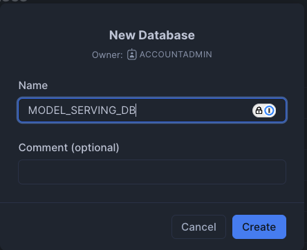
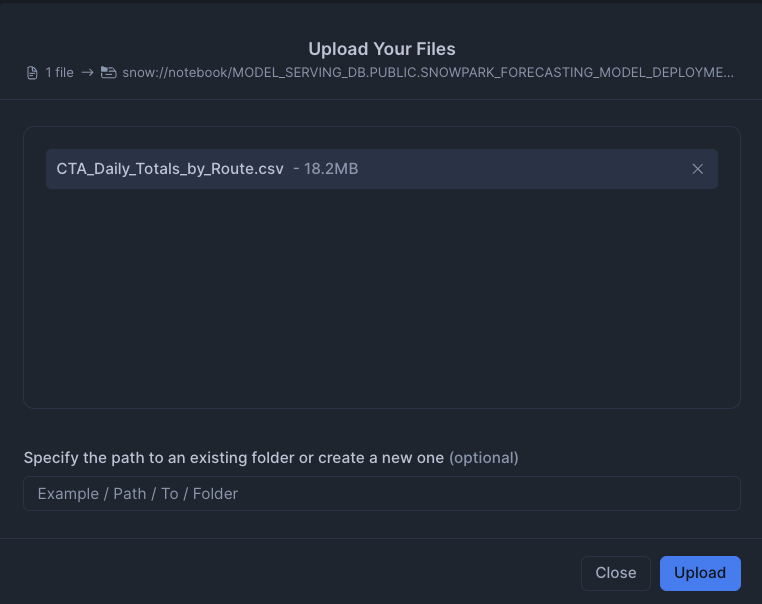
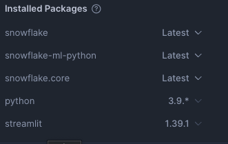
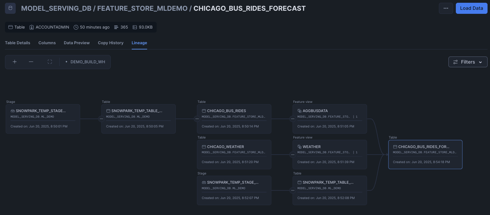
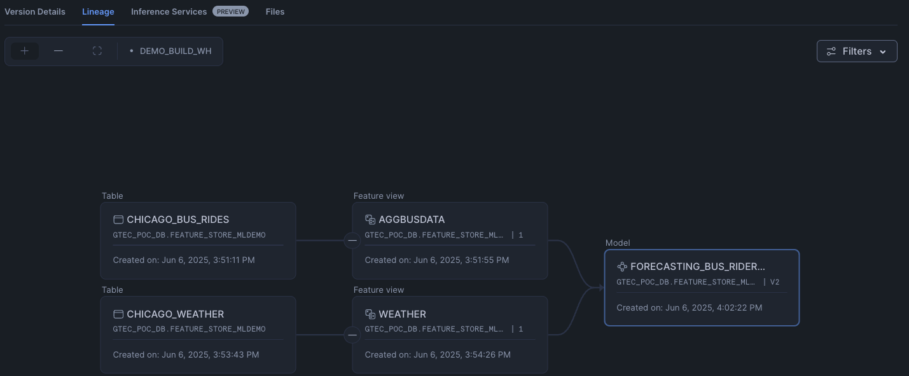
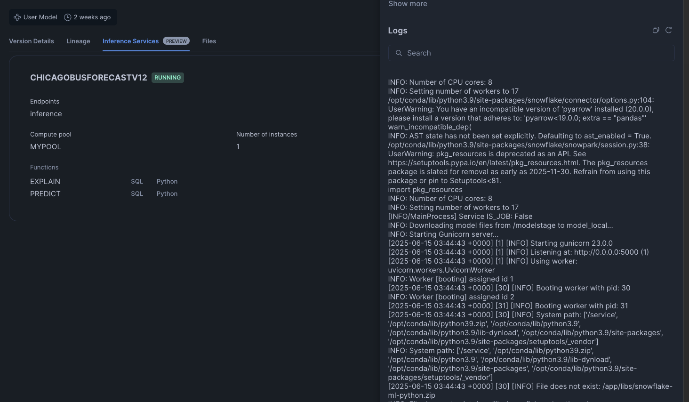
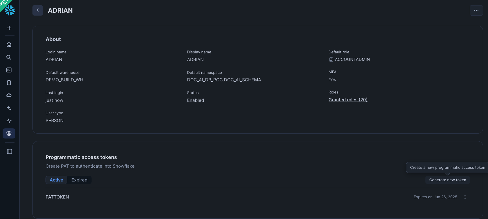
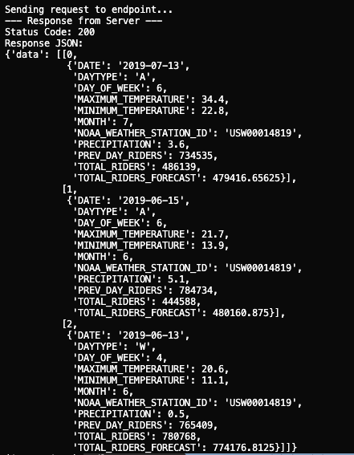

author: Adrian
id: snowpark-container-services-model-serving-guide
language: en
summary: Learn how to build and deploy a machine learning model for real-time inference using Snowpark Container Services and the Snowflake Model Registry.
categories: Getting-Started, Data-Science, Machine-Learning
environments: web
status: Published 
feedback link: https://github.com/Snowflake-Labs/sfguides/issues
tags: Getting Started, Data Science, Data Engineering, Snowpark, SPCS, Model Serving

# Getting Started with Model Serving in Snowpark Container Services
<!-- ------------------------ -->
## Overview
Duration: 2

In this guide, you will learn how to leverage the power of Snowpark Container Services (SPCS) and the Snowflake Model Registry to build, deploy, and serve a machine learning model for real-time predictions in Snowflake ML. We will walk through a complete data science workflow, from data preparation and feature engineering to model training and deployment as a secure, scalable service.

This guide uses a real-world dataset of Chicago Transit Authority (CTA) daily ridership to forecast future demand. By the end, you will have a fully functional model serving endpoint accessible from both within and outside of Snowflake.

### What You Will Learn
-   How to set up your Snowflake environment for machine learning.
-   How to perform feature engineering with Snowpark.
-   How to train, register, and version a model using the Snowflake Model Registry.
-   How to deploy a model as a service in Snowpark Container Services.
-   How to access the deployed model endpoint using both Key-Pair and Programmatic Access Token (PAT) authentication.

### What You Will Build
-   A complete data pipeline for feature engineering.
-   A trained XGBoost regression model to forecast bus ridership.
-   A secure, scalable model serving endpoint hosted in Snowpark Container Services.

### Prerequisites
-   Familiarity with Python and SQL.
-   Basic understanding of machine learning concepts.
-   Note that, trial account does not allow creation of compute pool, so model serving on Container Services cannot be tested in Trial Account.
- Have a database schema where objects can be created. In this exercise, we will create a notebook, table to store data, stored proc for training, model to log the trained model, container images for model serving and the service hosting the model. You need privileges to have all of them. 


<!-- ------------------------ -->
## Snowflake Setup
Duration: 5

First, we will create a database called **MODEL_SERVING_DB** in Snowflake as below. We will also create a warehouse called **DEMO_BUILD_WAREHOUSE**.  If you do not have privileges to create a database or warehouse, feel free to use existing ones where you have permission (please note to change database schema name accordingly throughout this exercise).



We will then import the attached notebook inside this github [repo](https://github.com/Snowflake-Labs/sfguide-getting-started-with-model-serving-in-spcs) by clicking the import notebook option in Snowflake. 


- Name: **SNOWPARK_FORECASTING_MODEL_DEPLOYMENT**
- Notebook location: Set to the **"MODEL_SERVING_DB"** database and the **"PUBLIC"** schema.
- Python environment: **"Run on warehouse"** is selected, which is described as best for data analysis. The alternative, **"Run on container"** is for AI/ML workloads. In this case we will choose Run on container and we will choose the default compute pool. 
- Query warehouse: This is the name of the warehouse used to run our queries. In this case I have created a warehouse called **DEMO_BUILD_WH**.

We will also import the CSV file into the stage. This can be found in the github [repo](https://github.com/Snowflake-Labs/sfguide-getting-started-with-model-serving-in-spcs) 



Lastly, we will import our packages into Snowflake

- snowflake: Latest
- snowflake-ml-python: Latest
- snowflake.core: Latest
- python: 3.9.*
- streamlit: 1.39.1



### Setup Environment
First, we set up the Python environment by importing the necessary libraries. This includes Snowpark for data manipulation, Snowflake ML for modeling, and the Feature Store.

```python
# Snowpark for Python
from snowflake.snowpark.session import Session
from snowflake.snowpark.version import VERSION
from snowflake.snowpark import functions as F

# Snowpark ML
from snowflake.ml.modeling.pipeline import Pipeline
from snowflake.ml.modeling.xgboost import XGBRegressor
from snowflake.ml.feature_store import FeatureStore, CreationMode, Entity, FeatureView
from snowflake.ml.registry import Registry

# Misc
import pandas as pd

# Get active session
session = get_active_session()
```

### Load Data 
We begin by loading the Chicago bus ridership data from a CSV file into a Pandas DataFrame, and then into a Snowpark DataFrame. This data is then saved as a table in Snowflake

```python
# Read data and create Snowpark DataFrame
df_clean = pd.read_csv('CTA_Daily_Totals_by_Route.csv')
df_clean.columns = df_clean.columns.str.upper()
input_df = session.create_dataframe(df_clean)

# Save DataFrame as a table in Snowflake
input_df.write.mode('overwrite').save_as_table('MODEL_SERVING_DB.FEATURE_STORE_MLDEMO.CHICAGO_BUS_RIDES')
```

<!-- ------------------------ -->
## Machine Learning
Duration: 10

### Create and Register a Feature Store
A Feature Store is created to manage and version our features. We then register an Entity which represents a real-world object that our features are associated with, in this case, a bus route.

```python
# Create a feature store
fs = FeatureStore(
    session=session,
    database="MODEL_SERVING_DB",
    name="FEATURE_STORE_MLDEMO",
    default_warehouse="DEMO_BUILD_WH",
    creation_mode=CreationMode.CREATE_IF_NOT_EXIST,
)

# Register an entity
entity = Entity(
    name="route",
    join_keys=["DATE"],
)
fs.register_entity(entity)
```

### Distributed Feature Engineering
We perform feature engineering to create new features that will be useful for our model. This includes extracting the day of the week and month from the date, and calculating the previous day's ridership. These engineered features are then registered as a FeatureView.

```python
# Perform feature engineering
from snowflake.snowpark.functions import col, to_timestamp, dayofweek, month, sum, lag
from snowflake.snowpark import Window

df = session.read.table('MODEL_SERVING_DB.FEATURE_STORE_MLDEMO.CHICAGO_BUS_RIDES')
df = df.with_column('DATE', to_timestamp(col('DATE'), 'MM/DD/YYYY'))
df = df.with_column('DAY_OF_WEEK', dayofweek(col('DATE')))
df = df.with_column('MONTH', month(col('DATE')))

total_riders = df.group_by('DATE','DAY_OF_WEEK','MONTH').agg(
    F.listagg('DAYTYPE', is_distinct=True).alias('DAYTYPE'),
    F.sum('RIDES').alias('TOTAL_RIDERS')
).order_by('DATE')

window_spec = Window.order_by('DATE')
total_riders = total_riders.with_column('PREV_DAY_RIDERS', lag(col('TOTAL_RIDERS'), 1).over(window_spec))

# Register the feature view
agg_fv = FeatureView(
    name="AggBusData",
    entities=[entity],
    feature_df=total_riders,
    timestamp_col="DATE",
)
agg_fv = fs.register_feature_view(agg_fv, version="1", overwrite=True)
```

### Model Training and Evaluation
With our features ready, we define a machine learning pipeline to preprocess the data and train an XGBoost Regressor model. The model is trained and evaluated in a distributed manner using Snowflake's compute resources.

Create and Train the Model

```python
from snowflake.ml.modeling.compose import ColumnTransformer
from snowflake.ml.modeling.preprocessing import StandardScaler, OrdinalEncoder
from snowflake.ml.modeling.pipeline import Pipeline
from snowflake.ml.modeling.xgboost import XGBRegressor
from snowflake.ml.modeling.model_selection import GridSearchCV

# Define preprocessing steps
numeric_features = ['DAY_OF_WEEK','MONTH','PREV_DAY_RIDERS','MINIMUM_TEMPERATURE','MAXIMUM_TEMPERATURE','PRECIPITATION']
numeric_transformer = Pipeline(steps=[('scaler', StandardScaler())])

categorical_cols = ['DAYTYPE']
categorical_transformer = Pipeline(steps=[('onehot', OrdinalEncoder(handle_unknown='use_encoded_value',unknown_value=-99999))])

preprocessor = ColumnTransformer(
    transformers=[
        ('num', numeric_transformer, numeric_features),
        ('cat', categorical_transformer, categorical_cols)
        ])

pipeline = Pipeline(steps=[('preprocessor', preprocessor),('model', XGBRegressor())])

# Use GridSearchCV for hyperparameter tuning
hyper_param = dict(model__max_depth=[2,4], model__learning_rate=[0.1,0.3])
xg_model = GridSearchCV(
    estimator=pipeline,
    param_grid=hyper_param,
    input_cols=numeric_features + categorical_cols,
    label_cols=['TOTAL_RIDERS'],
    output_cols=["TOTAL_RIDERS_FORECAST"],
)

# Fit the model
xg_model.fit(train)
```

### Model Lineage
Snowflake’s UI provides a graphical representation of the lineage, making it easier to visualize and communicate your findings. To do so, we can go to the CHICAGO_BUS_RIDES_FORECAST table and click on lineage



## Model Deployment

### Evaluate the Model
After training, we evaluate the model's performance on the test set.

```python
from snowflake.ml.modeling.metrics import mean_absolute_error

testpreds = xg_model.predict(test)
print('MSE:', mean_absolute_error(df=testpreds, y_true_col_names='TOTAL_RIDERS', y_pred_col_names='\"TOTAL_RIDERS_FORECAST\"'))
```

### Model Registration and Deployment
Finally, the trained model is logged to the Snowflake Model Registry. This allows for versioning, management, and easy deployment of the model.

```python
reg_model = reg.log_model(
    model_name="Forecasting_Bus_Ridership",
    version_name="v2",    
    model=xg_model,
    target_platforms=["WAREHOUSE"],
    conda_dependencies=["scikit-learn","xgboost"],
    sample_input_data=train,
    comment="My awesome XGBoost model"
)

```

We are able to see the model stored inside the Model tab of the database. 


Clicking on the model, we can then further drill down to understand the model such as the model lineage. 



### Deploy to Snowpark Container Services (SPCS)
The registered model can be deployed as a service in SPCS for real-time inference.

```python
reg_model = reg.get_model("Forecasting_Bus_Ridership").version("v2")

reg_model.create_service(service_name="ChicagoBusForecastv12",
                  service_compute_pool="mypool",
                  ingress_enabled=True)
```

### Seeing the Inference endpoint
To see our inference endpoint, we can go to our model and click on the Inference Services tab. Opening the details, we can futher view the logs of our inference service




<!-- ------------------------ -->
## Model Serving
Duration: 10

The Snowflake Model Registry, when used with containers, allows you to package, manage, and deploy machine learning models with complex dependencies or custom runtime environments inside Snowflake. This is accomplished by using Snowpark Container Services (SPCS) which we have done above. Some parts of the architecture for [model serving](https://docs.snowflake.com/en/developer-guide/snowflake-ml/model-registry/container) are as described below.


- Inference Server: This is the engine that runs the model to serve predictions. It can use multiple processes to maximize the node's resources and includes an admission control feature to manage incoming requests, preventing overloads. Currently, Snowflake offers a flexible Python-based server, with plans to introduce servers optimized for specific model types in the future.
- Model-specific Python environment: To minimize the startup time for a model, Snowflake creates a container that packages the model with all its specific dependencies.
- Service functions: These functions allow you to call the inference server from code running within a Snowflake warehouse. They are designed with the same signature as the original model and use the external function protocol to communicate with the server.
- Ingress endpoint: An optional HTTP endpoint can be created, making the model accessible to applications outside of Snowflake over the public internet. This is achieved when we did the create service in the previous section. 

Our model is now deployed and ready to serve predictions. The service endpoint is secured and requires authentication. We will explore two common methods for accessing it: Key-Pair Authentication for service accounts and Programmatic Access Tokens (PAT) for user-centric access.

First, you need the service's ingress URL. You can find it by running the following SQL command:
```sql
SHOW ENDPOINTS IN SERVICE MODEL_SERVING_DB.FEATURE_STORE_MLDEMO.CHICAGOBUSFORECASTV12
```

The full prediction endpoint will be 
```
https://<YOUR_INGRESS_PATH>/predict
```
predict here comes from the function exposed by the model. To know all the functions exposed in a model, you can use:

```
SHOW FUNCTIONS IN MODEL Forecasting_Bus_Ridership VERSION v2;
```

### Using Key-Pair Authentication

This method is ideal for applications and service accounts. It involves using a public/private key pair to generate a session token for authentication. We will set up our SnowSQL connection and have a named connection in your [connections.toml](https://docs.snowflake.com/en/developer-guide/snowpark/python/creating-session#connect-by-using-the-connections-toml-file). In this example our named connection is called **"named_connection"**

```yaml
[named_connection]
#Can be used in SnowSql as #connect example
accountname = XXX
username = YYY
role = myrole
```

We will be passing in some dummy data and transforming the DataFrame into a JSON-like format before passing it to our predict URL endpoint. The full code can be found below.

```python
test = [[6 ,7,"A",486139,734535,"USW00014819",22.8,34.4,3.6 ,'2019-07-13'],  
[6 ,6,"A",444588,784734,"USW00014819",13.9,21.7,5.1 ,'2019-06-15'],
[4 ,6,"W",780768,765409,"USW00014819",11.1,20.6,0.5 ,'2019-06-13']]

df = pd.DataFrame(test, columns=['DAY_OF_WEEK' ,'MONTH' ,'DAYTYPE' ,'TOTAL_RIDERS' ,'PREV_DAY_RIDERS' ,'NOAA_WEATHER_STATION_ID' ,'MINIMUM_TEMPERATURE' ,'MAXIMUM_TEMPERATURE' ,'PRECIPITATION' ,'DATE'])

data = {"data": np.column_stack([range(df.shape[0]), df.values]).tolist()}
```

Once done, save the code inside a file called "KP-app.py" and do "

```shell
python KP-app.py
```


```python
import json
from pprint import pprint
import requests
import snowflake.connector
from snowflake.ml.utils.connection_params import SnowflakeLoginOptions
import pandas as pd
import numpy as np

# --- 1. Connection and Authentication ---
# This part of your code is correct. It gets a valid token.
def initiate_snowflake_connection():
    # IMPORTANT: Ensure "named_connection" is correctly defined in your
    # ~/.snowflake/connections.toml file.
    connection_parameters = SnowflakeLoginOptions("named_connection")
    connection_parameters["session_parameters"] = {"PYTHON_CONNECTOR_QUERY_RESULT_FORMAT": "json"}
    connection_parameters["insecure_mode"] = True  # Disable SSL verification
    snowflake_conn = snowflake.connector.connect(**connection_parameters)
    return snowflake_conn

def get_headers(snowflake_conn):
    token = snowflake_conn._rest._token_request('ISSUE')
    headers = {'Authorization': f'Snowflake Token="{token["data"]["sessionToken"]}"'}
    return headers

print("Connecting to Snowflake to get auth token...")
headers = get_headers(initiate_snowflake_connection())
print("Token acquired successfully.")

# --- 2. Endpoint URL ---
# This must be the public endpoint for your service.
URL = 'https://<YOUR_INGRESS_PATH>/predict'

# --- 3. Preparing our data ---
def prepare_data():
    # Ensure 'test' is defined before this point
    # Assuming 'test' is a Snowpark DataFrame object
    test = [[6 ,7,"A",486139,734535,"USW00014819",22.8,34.4,3.6 ,'2019-07-13'],  
[6 ,6,"A",444588,784734,"USW00014819",13.9,21.7,5.1 ,'2019-06-15'],
[4 ,6,"W",780768,765409,"USW00014819",11.1,20.6,0.5 ,'2019-06-13']]

    df = pd.DataFrame(test, columns=['DAY_OF_WEEK' ,'MONTH' ,'DAYTYPE' ,'TOTAL_RIDERS' ,'PREV_DAY_RIDERS' ,'NOAA_WEATHER_STATION_ID' ,'MINIMUM_TEMPERATURE' ,'MAXIMUM_TEMPERATURE' ,'PRECIPITATION' ,'DATE'])
    print(df)

    data = {"data": np.column_stack([range(df.shape[0]), df.values]).tolist()}     
    print(data)
    return data

sample_df = prepare_data()


# --- 4. Sending the Request ---
def send_request(data: dict, headers: dict):
    """Posts the data to the URL and handles the response."""
    print("\nSending request to endpoint...")
    try:
        output = requests.post(URL, json=sample_df, headers=headers)
        
        print("--- Response from Server ---")
        print(f"Status Code: {output.status_code}")
        
        # Try to print JSON if possible, otherwise print raw text
        try:
            response_json = output.json()
            print("Response JSON:")
            pprint(response_json)
        except json.JSONDecodeError:
            print("Raw Response Text:")
            print(output.text)
            
        return output

    except requests.exceptions.RequestException as e:
        print(f"An error occurred during the request: {e}")
        return None

# --- Run the request ---
send_request(data=sample_df, headers=headers)

```
### Using Programmatic Access Token (PAT)

PATs are excellent for interactive or user-driven scenarios. A user generates a token in the Snowsight UI and uses it to authenticate.

Setup: 

1. Sign in to Snowsight.
2. Click on your username in the top left corner, then select My Profile.
3. In the dialog that appears, scroll down to the Programmatic Access Tokens section.
4. Click + Generate new token.
5. Fill in the token details:
- Name: A descriptive name for your token (e.g., dbt_cloud_token).
- Expires in: Choose an expiration period (e.g., 90 days). It is a security best practice to set an expiration date.
- Role: You can restrict the token to a specific role. This is highly recommended to limit the token's permissions to only what is necessary.
6. Click Generate.
7. A dialog box will display your new token. This is the only time the token secret will be shown. Copy it immediately. 



Once done, save the code below inside a file called "PAT-app.py" and do 


```shell
python PAT-app.py \
  --account <ACCOUNT_IDENTIFIER> \
  --user <USERNAME>> \
  --role ACCOUNTADMIN \
  --pat <PASS_IN_YOUR_PAT_TOKEN>\
  --endpoint <YOUR_INGRESS_PATH> \
  --endpoint-path /predict
```

```python
from datetime import timedelta
import argparse
import logging
import sys
import requests
import numpy as np
from pprint import pprint
import json
import pandas as pd

logger = logging.getLogger(__name__)

def main():
    args = _parse_args()
    spcs_access_token = token_exchange_pat(args.pat, endpoint=args.endpoint,
					      role=args.role,
					      snowflake_account_url=args.snowflake_account_url, 
      snowflake_account=args.account)
    spcs_url=f'https://{args.endpoint}{args.endpoint_path}'
    connect_to_spcs(spcs_access_token, spcs_url)

def token_exchange_pat(pat, role, endpoint, snowflake_account_url, snowflake_account) -> str:
    scope_role = f'session:role:{role}' if role is not None else None
    scope = f'{scope_role} {endpoint}' if scope_role is not None else endpoint

    data = {
        'grant_type': 'urn:ietf:params:oauth:grant-type:token-exchange',
        'scope': scope,
        'subject_token': pat,
        'subject_token_type': 'programmatic_access_token'
    }
    logger.info(data)
    url = f'https://{snowflake_account}.snowflakecomputing.com/oauth/token'
    if snowflake_account_url:
        url = f'{snowflake_account_url}/oauth/token'
    response = requests.post(url, data=data)
    logger.info("snowflake token : %s" % response.text)
    logger.info("snowflake token response code : %s" % response.status_code)
    assert 200 == response.status_code, "unable to get snowflake token"
    return response.text


def prepare_data():
    # Ensure 'test' is defined before this point
    # Assuming 'test' is a Snowpark DataFrame object
    test = [[6 ,7,"A",486139,734535,"USW00014819",22.8,34.4,3.6 ,'2019-07-13'],  
[6 ,6,"A",444588,784734,"USW00014819",13.9,21.7,5.1 ,'2019-06-15'],
[4 ,6,"W",780768,765409,"USW00014819",11.1,20.6,0.5 ,'2019-06-13']]

    df = pd.DataFrame(test, columns=['DAY_OF_WEEK' ,'MONTH' ,'DAYTYPE' ,'TOTAL_RIDERS' ,'PREV_DAY_RIDERS' ,'NOAA_WEATHER_STATION_ID' ,'MINIMUM_TEMPERATURE' ,'MAXIMUM_TEMPERATURE' ,'PRECIPITATION' ,'DATE'])
    print(df)

    data = {"data": np.column_stack([range(df.shape[0]), df.values]).tolist()}     
    print(data)
    return data
       

def connect_to_spcs(token, url):
  # Create a request to the ingress endpoint with authz.
  headers = {'Authorization': f'Snowflake Token="{token}"'}
  logger.info(url)
  request_body = prepare_data()  # Convert the DataFrame to the right format
  print (request_body)
  response = requests.post(f'{url}',data=json.dumps(request_body), headers=headers)     #data=json.dumps(request_body)
  #assert (response.status_code == 200), f"Failed to get response from the service. Status code: {response.status_code}"
  #return response.content
  logger.info("return code %s" % response.status_code)
  logger.info(response.text)
  logger.info(response.content)
  logger.debug(response.content)

def _parse_args():
  logging.basicConfig(stream=sys.stdout, level=logging.INFO)
  cli_parser = argparse.ArgumentParser()
  cli_parser.add_argument('--account', required=True,
              help='The account identifier (for example, "myorganization-myaccount" for '
                '"myorganization-myaccount.snowflakecomputing.com").')
  cli_parser.add_argument('--user', required=True, help='The user name.')
  cli_parser.add_argument('--role',
              help='The role we want to use to create and maintain a session for. If a role is not provided, '
                'use the default role.')
  cli_parser.add_argument('--endpoint', required=True,
              help='The ingress endpoint of the service')
  cli_parser.add_argument('--endpoint-path', default='/',
              help='The url path for the ingress endpoint of the service')
  cli_parser.add_argument('--snowflake_account_url', default=None,
              help='The account url of the account for which we want to log in. Type of '
                'https://myorganization-myaccount.snowflakecomputing.com')
  cli_parser.add_argument('--pat',
                            help='PAT for the user.')
  args = cli_parser.parse_args()
  return args


if __name__ == "__main__":
    main()

```

If all is well you should get a response like below


<!-- ------------------------ -->
## Conclusion And Resources
Duration: 2

Congratulations! You have successfully built, deployed, and accessed a machine learning model using Snowpark Container Services. You've seen how [Snowflake ML](https://www.snowflake.com/en/product/use-cases/end-to-end-ml-workflows/) can manage the entire MLOps lifecycle within a single, unified platform, from data engineering to production deployment.

This powerful combination of Snowpark, the Model Registry, and SPCS enables data teams to build and scale AI/ML applications securely and efficiently.

### What You Learned
- Setting up a complete ML environment in Snowflake.
- Training and versioning models with the Snowflake Model Registry.
- Deploying models as scalable services using SPCS.
- Authenticating and consuming model predictions from a secure endpoint.

### Related Resources
- [Snowflake ML homepage](https://www.snowflake.com/en/product/use-cases/end-to-end-ml-workflows/)
- [More ML Quickstart](https://docs.snowflake.com/en/developer-guide/snowflake-ml/quickstart)
- [Model Serving in SPCS](https://docs.snowflake.com/en/developer-guide/snowflake-ml/model-registry/container)
- [Source Code on GitHub](https://github.com/Snowflake-Labs/sfguide-getting-started-with-model-serving-in-spcs)