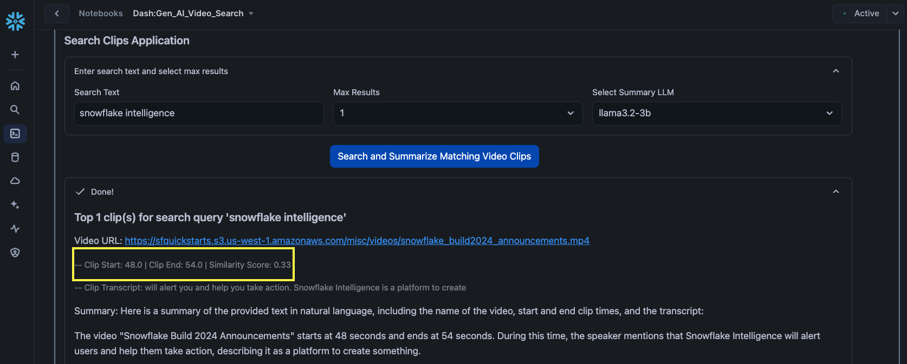
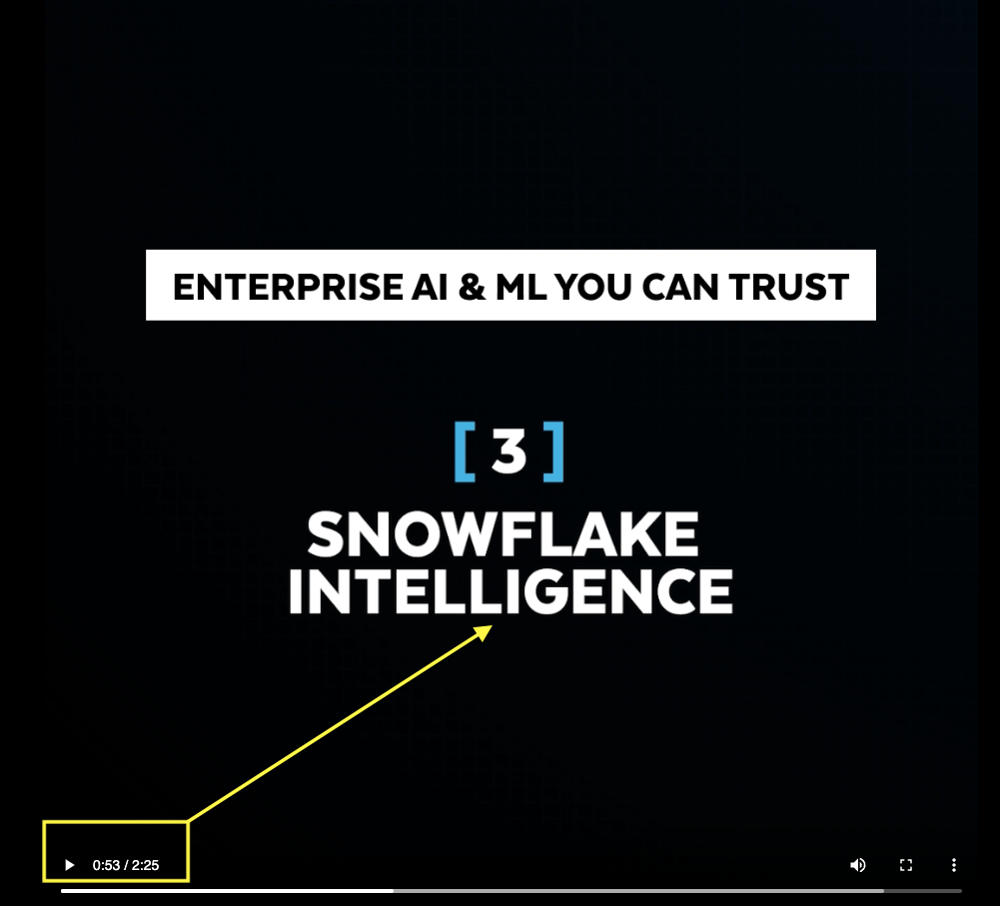
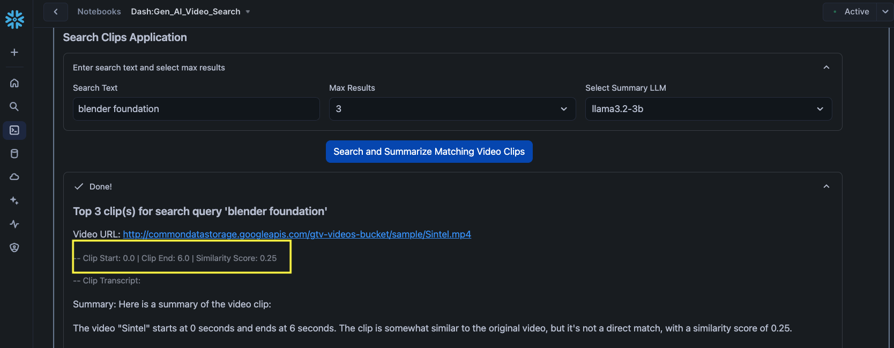
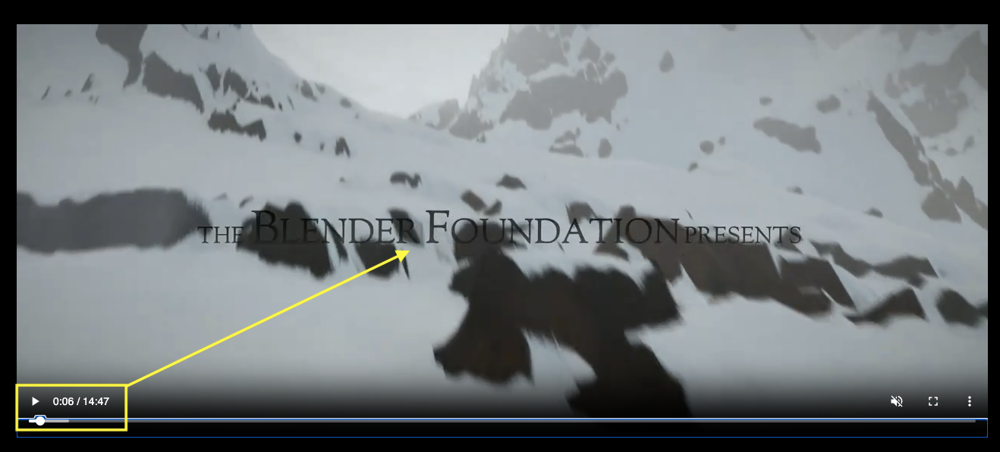
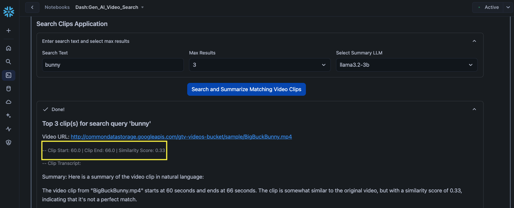

id: ai-video-search-with-snowflake-and-twelveLabs
categories: snowflake-site:taxonomy/solution-center/certification/quickstart, snowflake-site:taxonomy/product/data-engineering, snowflake-site:taxonomy/snowflake-feature/transformation
language: en
summary: This guide outlines the process for creating a video search and summarization workflow in Snowflake Notebook on Container Runtime.
environments: web
status: Published
feedback link: <https://github.com/Snowflake-Labs/sfguides/issues>
authors: Dash Desai

# AI Video Search with Snowflake and Twelve Labs
<!-- ------------------------ -->

## Overview

Duration: 4

This guide outlines the process for creating a video search and summarization workflow in Snowflake Notebook on Container Runtime. Videos stored in the cloud storage are processed to generate embeddings using the Twelve Labs API, with parallelization achieved through a Snowpark Python User Defined Table Function (UDTF). These embeddings are stored in a Snowflake table using the VECTOR datatype, enabling efficient similarity searches with VECTOR_COSINE_SIMILARITY. Text queries are converted into embeddings using the same API to find the top N matching video clips. Audio from these clips is extracted using MoviePy and transcribed with Whisper. Finally, Cortex Complete is used to summarize the results, including video details, timestamps, and transcripts.

### What is Container Runtime? 

Snowflake Notebooks on Container Runtime enable advanced data science and machine learning workflows directly within Snowflake. Powered by Snowpark Container Services, it provides a flexible environment to build and operationalize various workloads, especially those requiring Python packages from multiple sources and powerful compute resources, including CPUs and GPUs. With this Snowflake-native experience, you can train models, perform hyperparameter tuning, and execute batch inference while seamlessly running SQL queries. Unlike virtual warehouses, Container Runtime for ML offers greater flexibility and tailored compute options for complex workloads. ***NOTE: This feature is currently in Public Preview.***

Learn more about [Container Runtime](https://docs.snowflake.com/en/user-guide/ui-snowsight/notebooks-on-spcs).

### What is Twelve Labs? 

Twelve Labs is a platform that provides AI-powered video understanding tools. It enables developers to extract meaningful insights from video content by creating embeddings that represent visual and audio features, allowing for advanced search, categorization, and analysis. With APIs for generating embeddings and querying them for similarity, Twelve Labs is ideal for tasks like content-based retrieval, scene detection, and semantic search in videos. It integrates seamlessly into workflows, making it easier to process and analyze large-scale video data efficiently.

Learn more about [Twelve Labs](https://www.twelvelabs.io/).

### What is Snowflake Cortex? 

Snowflake Cortex is a suite of AI features that use large language models (LLMs) to understand unstructured data, answer freeform questions, and provide intelligent assistance.

Learn more about [Snowflake Cortex](https://docs.snowflake.com/en/user-guide/snowflake-cortex/overview).

### What is Whisper? 

OpenAI’s Whisper is an open-source automatic speech recognition (ASR) model designed for high-quality transcription and translation of spoken language. Trained on diverse multilingual data, it handles various languages, accents, and challenging audio conditions like background noise. Whisper supports transcription, language detection, and translation to English, making it versatile for applications such as subtitles, accessibility tools, and voice interfaces. Available in multiple model sizes, it balances performance and resource needs, enabling seamless integration into real-world projects.

Learn more about [Whisper](https://openai.com/index/whisper/).

### Prerequisites

* Access to a [Snowflake account](https://signup.snowflake.com/) with ACCOUNTADMIN role.
* Access to a [Twelve Labs account and API key](https://www.twelvelabs.io/).
* Access to video(s) uploaded to a publicly accessible URL.

> aside positive
> NOTE: In this guide, three sample videos have been provided.

### What You Will Learn

* **Generate Video Embeddings**: Use the Twelve Labs API to create embeddings for videos stored in the cloud storage.
* **Parallel Processing**: Leverage a Python UDTF to process the videos in parallel.
* **Store Embeddings**: Save the video embeddings in a Snowflake table using the VECTOR datatype.
* **Similarity Search**: Use VECTOR_COSINE_SIMILARITY to find the top *N* matching clips for a given text query. The query is converted into embeddings via the Twelve Labs API.
* **Transcription**: Use MoviePy to extract audio from the top *N* video clips, then transcribe them with Whisper.
* **Summarize Results**: Utilize Cortex Complete to summarize results, including video name/URL, clip start and end times (in seconds), and the transcript of each clip.

### What You Will Build

AI videos processing and search app using Twelve Labs, Whisper, Streamlit, and Snowflake Cortex in Snowflake Notebook on Container Runtime running in Snowflake.

<!-- ------------------------ -->
## Setup

Duration: 10 

**Step 1.** In Snowsight, [create a SQL Worksheet](https://docs.snowflake.com/en/user-guide/ui-snowsight-worksheets-gs?_fsi=THrZMtDg,%20THrZMtDg&_fsi=THrZMtDg,%20THrZMtDg#create-worksheets-from-a-sql-file) and open [setup.sql](https://github.com/Snowflake-Labs/sfguide-ai-video-search-with-snowflake-and-twelveLabs/blob/main/setup.sql) to execute all statements in order from top to bottom.

**Step 2.** In Snowsight, switch your user role to `DASH_CONTAINER_RUNTIME_ROLE`.

**Step 3.** Click on [Gen_AI_Video_Search.ipynb](https://github.com/Snowflake-Labs/sfguide-ai-video-search-with-snowflake-and-twelveLabs/blob/main/Gen_AI_Video_Search.ipynb) to download the Notebook from GitHub. (NOTE: Do NOT right-click to download.)

**Step 4.** In Snowsight:

* On the left hand navigation menu, click on **Projects » Notebooks**
* On the top right, click on **Notebook** down arrow and select **Import .ipynb file** from the dropdown menu
* Select **Gen_AI_Video_Search.ipynb** file you downloaded in the step above
* In the Create Notebook popup
    * For Notebook location, select `DASH_DB` and `DASH_SCHEMA`
    * For SQL warehouse, select `DASH_WH_S`
    * For Python environment, select `Run on container`
    * For Runtime, select `Snowflake ML Runtime CPU 1.0`
    * For Compute pool, select `CPU_X64_XS`
    * Click on **Create** button

<!--  -->

**Step 5.** Open Notebook

* Click in the three dots at the very top-right corner and select `Notebook settings` >> `External access`
* Turn on **ALLOW_ALL_ACCESS_INTEGRATION**
* Click on **Save** button
* Click on **Start** button on top right

> aside positive
> NOTE: At this point, the container service will take about 5-7 minutes to start. You will not be able to proceed unless the status changes from **Starting** to **Active**.

<!-- ------------------------ -->
## Run Notebook

Duration: 15

> aside negative
> PREREQUISITE: Successful completion of steps outlined under **Setup**.

Here's the code walkthrough of the [Gen_AI_Video_Search.ipynb](https://github.com/Snowflake-Labs/sfguide-ai-video-search-with-snowflake-and-twelveLabs/blob/main/Gen_AI_Video_Search.ipynb) notebook that you downloaded and imported into your Snowflake account.

**Cell 1:** Install Python packages and other libraries

**Cell 2:** Import installed libraries

**Cell 3:** This is where we provide a list of publicly accessible URLs of videos.  *NOTE: In this guide, three sample videos have been provided.*

**Cell 4:** Create and register `create_video_embeddings` Snowpark Python User Defined Table Function (UDTF) for creating embeddings for the videos using Twelve Labs.

Things to note in the UDTF:

* `session.add_import('@"DASH_DB"."DASH_SCHEMA"."DASH_PKGS"/twelvelabs.zip')` adds the **twelvelabs** Python package that will create the video embeddings
* `packages=['httpx','pydantic']` adds the additional packages required and also readily available in the Snowflake Anaconda channel
* `external_access_integrations=['twelvelabs_access_integration'],` and `secrets={'cred': 'twelve_labs_api'}` adds the external access integration and the twelvelabs API (secret) that will authorize the UDTF to securely access Twelve Labs account to create the video embeddings
*  `    output_schema=StructType([
        StructField("embedding", VectorType(float,1024)),
        StructField("start_offset_sec", FloatType()),
        StructField("end_offset_sec", FloatType()),
        StructField("embedding_scope", StringType())
    ])` defines the schema with columns and their datatypes that will be the output of this UDTF. Notice the **VectorType** of the `embedding` column

**Cell 5:** Create a Snowpark DataFrame using the list of videos and for each video call `create_video_embeddings` UDTF to generate embeddings. Note that the parallel processing of each video is achieved by `.over(partition_by="url")`. Then, save those embeddings in a Snowflake table called `video_embeddings`.

**Cell 6:** Download open source `whisper` model and define the following Python functions:
    * download_video
    * extract_audio_from_video
    * transcribe_with_whisper
    * transcribe_video
    * transcribe_video_clip

**Cell 7:** Replace `tlk_XXXXXXXXXXXXXXXXXX` with your Twelve Labs API Key. Here we define Python function `similarity_scores` that uses Twelve Labs to create embeddings for a given text -- *entered_text* passed in as a parameter. Then, similarity scores are generated using Snowflake function **VECTOR_COSINE_SIMILARITY** between text embeddings and video embeddings stored in `video_embeddings` table. This function returns top *N* records (based on *max_results* passed in as a parameter) with columns VIDEO_URL, START_OFFSET_SEC, END_OFFSET_SEC, and SIMILARITY_SCORE.

**Cell 8:** Streamlit application that takes **Search Text**, **Max Results**, and **Summary LLM** as user input. Then, it first calls `similarity_scores` function to get top *N* video clip records along with their similarity scores. For each clip, it then calls `transcribe_video_clip` function passing in its VIDEO_URL, START_OFFSET_SEC, END_OFFSET_SEC to generate the clip transcription. Finally, it calls `snowflake.cortex.Complete` to summarize the output.

### Search Examples

For all search results, the app displays the URL of the video, the clip start and end times, similarity score generated by VECTOR_COSINE_SIMILARITY, clip transcript generated by open source whisper model, as well as the summary generated by Snowflake Cortex.

In all of the following examples, notice the highlighted clip start and end times as well as the timestamps in the respective videos.

#### Example 1

**Search text**: `snowflake intelligence`

---

#### Example 2

**Search text**: `blender foundation`

---

#### Example 3

**Search text**: `bunny`

---

> aside positive
> So AWESOME! Feel free to play around with different search texts, LLM models, and also try it out with your own videos.

<!-- ------------------------ -->
## Conclusion And Resources

Duration: 1

Congratulations! You've successfully created a interactive AI videos processing and search app using Twelve Labs, Whisper, Streamlit, and Snowflake Cortex in Snowflake Notebook on Container Runtime running in Snowflake.

### What You Learned

* Generate Video Embeddings: Use the Twelve Labs API to create embeddings for videos stored in the cloud storage.
* Parallel Processing: Leverage a Python UDTF to process the videos in parallel.
* Store Embeddings: Save the video embeddings in a Snowflake table using the VECTOR datatype.
* Similarity Search: Use VECTOR_COSINE_SIMILARITY to find the top *N* matching clips for a given text query. The query is converted into embeddings via the Twelve Labs API.
* Transcription: Use MoviePy to extract audio from the top *N* video clips, then transcribe them with Whisper.
* Summarize Results: Utilize Cortex Complete to summarize results, including video name/URL, clip start and end times (in seconds), and the transcript of each clip.

### Related Resources

- [GitHub Repo](https://github.com/Snowflake-Labs/sfguide-ai-video-search-with-snowflake-and-twelveLabs)
- [Snowflake Notebooks on Container Runtime](https://docs.snowflake.com/en/user-guide/ui-snowsight/notebooks-on-spcs)
