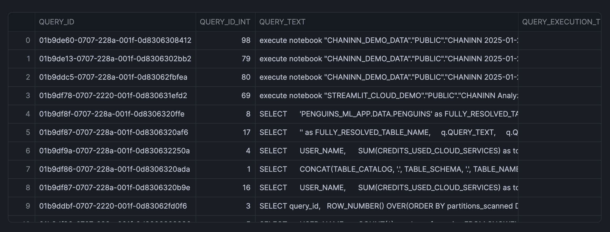
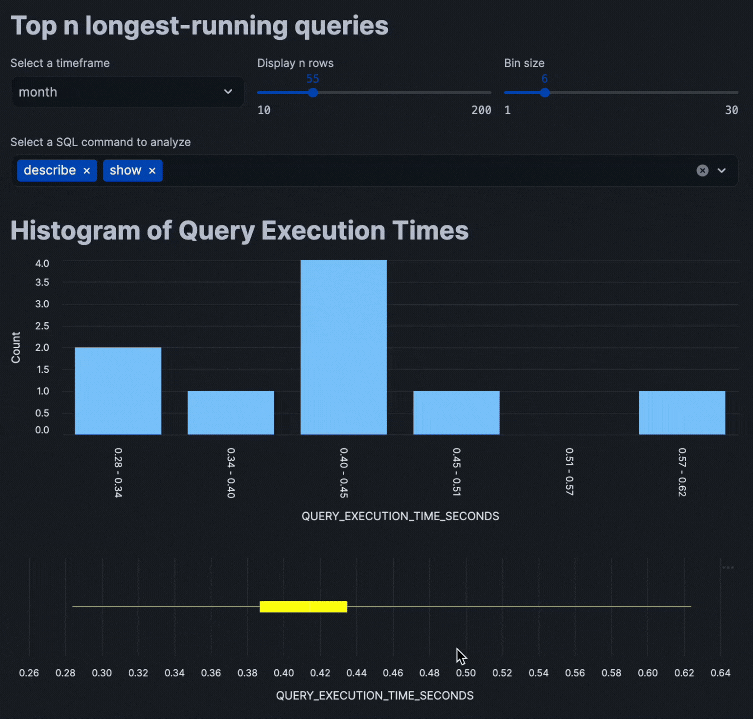

author: Chanin Nantasenamat
id: automated-query-performance-insights-with-streamlit
categories: snowflake-site:taxonomy/solution-center/certification/quickstart, snowflake-site:taxonomy/product/applications-and-collaboration, snowflake-site:taxonomy/snowflake-feature/build
language: en
summary: Build an interactive Streamlit app within Snowflake Notebooks to analyze query performance and identify optimization opportunities. This guide demonstrates how to create visualizations and insights for query execution times.
environments: web
status: Published
feedback link: https://github.com/Snowflake-Labs/sfguides/issues

# Build Interactive Query Performance App in Snowflake Notebooks

<!-- ------------------------ -->
## Overview
Duration: 10

Learn how to create an interactive Streamlit application within Snowflake Notebooks that helps analyze query performance. This tool will enable you to identify long-running queries and generate insights for optimization, potentially saving both time and computational resources.

### What You'll Learn
- How to create an interactive Streamlit app in Snowflake Notebooks
- Techniques for visualizing query performance data
- Methods to analyze query execution times
- Ways to implement interactive widgets for data exploration

### What You'll Build
An interactive app that visualizes the query performance metrics.

Here are features that we'll implement in the app:
- Histograms of query execution times
- Box plots for statistical distribution
- Interactive filters for timeframes
- Summary statistics for query performance

### What You'll Need
- Access to a [Snowflake account](https://signup.snowflake.com/)
- Basic familiarity with SQL and Python
- Understanding of basic statistical concepts

<!-- ------------------------ -->
## Setup
Duration: 3

Firstly, to follow along with this quickstart, you can click on [Build_an_Interactive_Query_Performance_App_with_Streamlit.ipynb](https://github.com/Snowflake-Labs/snowflake-demo-notebooks/blob/main/Query_Performance_Insights_using_Streamlit/Build_an_Interactive_Query_Performance_App_with_Streamlit.ipynb) to download the Notebook from GitHub.

Snowflake Notebooks comes pre-installed with common Python libraries for data science and machine learning. The following libraries will be used in this tutorial:
- Snowflake Snowpark
- Pandas
- Streamlit
- Altair
- NumPy

### Warehouse Configuration
Select a warehouse that will be used for analysis. Here in this tutorial, I'll be using 'CHANIN_XS' (please replace with your own warehouse name).

<!-- ------------------------ -->
## Create the Base Query
Duration: 5

### Write the Performance Query
First, we'll create the SQL query to retrieve query performance data:

```sql
SELECT query_id,
  ROW_NUMBER() OVER(ORDER BY partitions_scanned DESC) AS query_id_int,
  query_text,
  total_elapsed_time/1000 AS query_execution_time_seconds,
  partitions_scanned,
  partitions_total,
FROM snowflake.account_usage.query_history Q
WHERE warehouse_name = 'CHANIN_XS' 
  AND TO_DATE(Q.start_time) > DATEADD(day,-1,TO_DATE(CURRENT_TIMESTAMP()))
  AND total_elapsed_time > 0
  AND error_code IS NULL
  AND partitions_scanned IS NOT NULL
ORDER BY total_elapsed_time desc
LIMIT 50;
```




<!-- ------------------------ -->
## Build the Streamlit Interface
Duration: 15

### Create Interactive Widgets
Firstly, we'll import the necessary libraries and implement the user interface widgets:

```python
from snowflake.snowpark.context import get_active_session
import pandas as pd
import streamlit as st
import altair as alt
import numpy as np

st.title('Top n longest-running queries')

# Input widgets
col = st.columns(3)

with col[0]:
    timeframe_option = st.selectbox('Select a timeframe', ('day', 'week', 'month'))

with col[1]:
    limit_option = st.slider('Display n rows', 10, 200, 100)

with col[2]:
    bin_option = st.slider('Bin size', 1, 30, 10)
```

### Data retrieval
Next, we'll load in the data via a SQL query into the app:
```python
# Data retrieval
session = get_active_session()
df = session.sql(
    f"""
    SELECT query_id,
      ROW_NUMBER() OVER(ORDER BY partitions_scanned DESC) AS query_id_int,
      query_text,
      total_elapsed_time/1000 AS query_execution_time_seconds,
      partitions_scanned,
      partitions_total,
    FROM snowflake.account_usage.query_history Q
    WHERE warehouse_name = 'CHANIN_XS' AND TO_DATE(Q.start_time) > DATEADD({timeframe_option},-1,TO_DATE(CURRENT_TIMESTAMP()))
      AND total_elapsed_time > 0 --only get queries that actually used compute
      AND error_code IS NULL
      AND partitions_scanned IS NOT NULL
    ORDER BY total_elapsed_time desc
    LIMIT {limit_option};
    """
    ).to_pandas()

df = df[df['QUERY_TEXT'].str.lower().str.startswith(tuple(commands.lower() for commands in sql_command_option))]
```

### Display Data Visualization
Finally, we'll proceed to adding data visualization to the app:

```python
st.title('Histogram of Query Execution Times')

# Create a DataFrame for the histogram data
hist, bin_edges = np.histogram(df['QUERY_EXECUTION_TIME_SECONDS'], bins=bin_option)

histogram_df = pd.DataFrame({
    'bin_start': bin_edges[:-1],
    'bin_end': bin_edges[1:],
    'count': hist
})
histogram_df['bin_label'] = histogram_df.apply(lambda row: f"{row['bin_start']:.2f} - {row['bin_end']:.2f}", axis=1)

# Create plots
histogram_plot = alt.Chart(histogram_df).mark_bar().encode(
    x=alt.X('bin_label:N', sort=histogram_df['bin_label'].tolist(),
            axis=alt.Axis(title='QUERY_EXECUTION_TIME_SECONDS', labelAngle=90)),
    y=alt.Y('count:Q', axis=alt.Axis(title='Count')),
    tooltip=['bin_label', 'count']
)

box_plot = alt.Chart(df).mark_boxplot(
    extent="min-max",
    color='yellow'
).encode(
    alt.X("QUERY_EXECUTION_TIME_SECONDS:Q", scale=alt.Scale(zero=False))
).properties(
    height=200
)

st.altair_chart(histogram_plot, use_container_width=True)
st.altair_chart(box_plot, use_container_width=True)


# Data display
with st.expander('Show data'):
    st.dataframe(df)
with st.expander('Show summary statistics'):
    st.write(df['QUERY_EXECUTION_TIME_SECONDS'].describe())
```

Putting all of these code snippets together, we can build out the interactive query performance insights app that looks like the following:



<!-- ------------------------ -->
## Conclusion And Resources
Duration: 5

Congratulations! You've successfully built an interactive query performance analysis application using Streamlit within Snowflake Notebooks. This tool will help you identify optimization opportunities in your SQL queries through interactive data exploration.

### What You Learned
- Create interactive Streamlit widgets
- Visualize query performance data
- Implement real-time data filtering
- Generate statistical insights from the query history

### Related Resources

Articles:
- [Exploring execution times](https://docs.snowflake.com/en/user-guide/performance-query-exploring)

Documentation:
- [Snowflake Documentation](https://docs.snowflake.com/)
- [Streamlit Documentation](https://docs.streamlit.io/)

Happy coding!
