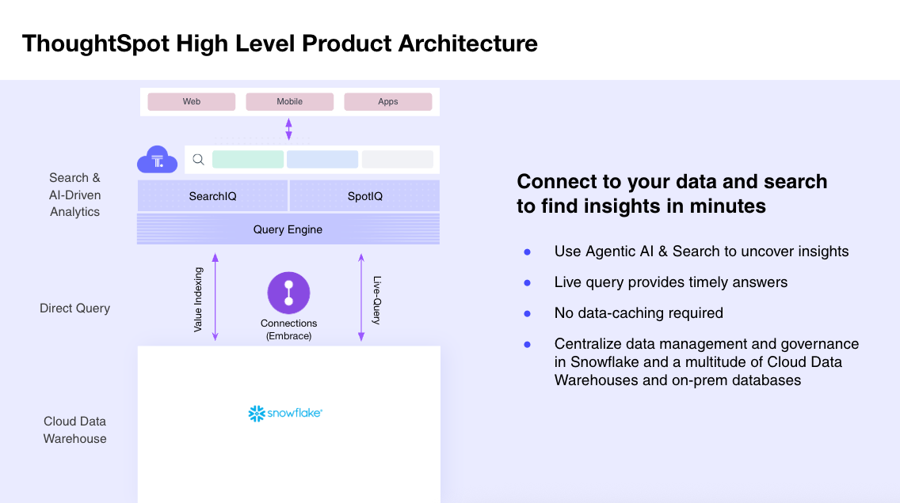
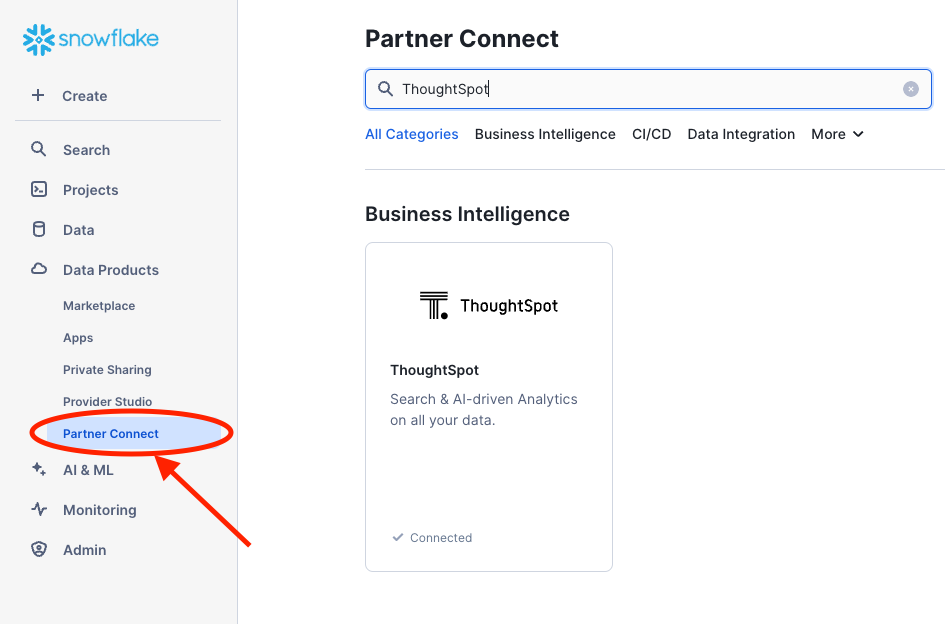
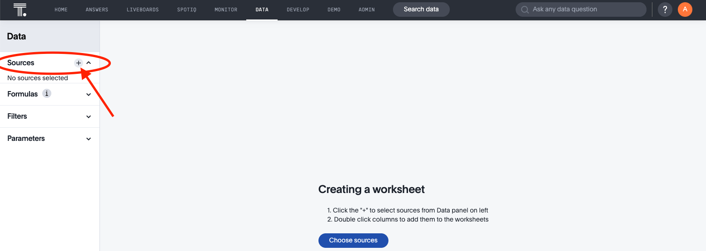
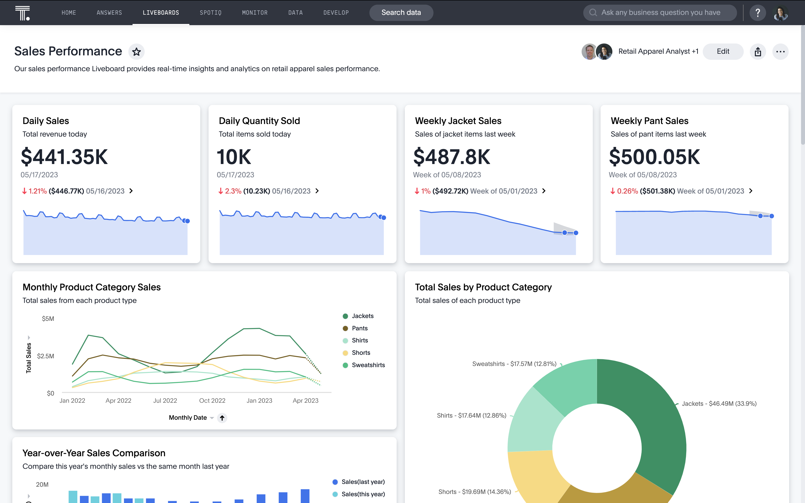

author: Ali Alladin (ali.alladin@thoughtspot.com)
id: ai_powered_embedded_analytics_using_thoughtspot
language: en
summary: Guide to create your own embedded analytics application using ThoughtSpot
categories: Getting-Started, Embedded Analytics, BI
environments: web
status: Published 
feedback link: https://github.com/Snowflake-Labs/sfguides/issues
tags: Getting Started, Data Science, Data Engineering, analytics, app-development, solution-examples, marketing, retail 

# AI Powered Embedded Analytics using ThoughtSpot
<!-- ------------------------ -->
## Overview 
Duration: 1

When combined with Snowflake’s robust and efficient data cloud solution, ThoughtSpot can help you turn your data into actionable insights. Our AI-Powered Analytics platform is designed for everyone—whether you’re code first or code free. Instead of relying on data teams to crank out clunky dashboards and outdated reports, business users can use a familiar natural language search interface and augmented analytics to discover insights, create and share Liveboards, and make real-time decisions. This frees analysts and data teams to work on more impactful projects, like data pipeline optimizations or complex analysis. By choosing ThoughtSpot and Snowflake, you’re investing in a modern data infrastructure built to scale, grow, and innovate with your business. 



### Prerequisites
- Familiarity with Snowflake and React.
- ThoughtSpot Free Trial.
- A Snowflake Account to connect ThoughtSpot
- A [GitHub](https://github.com/) Account 
- Your favorite IDE like [VSCode](https://code.visualstudio.com/download)
- [NodeJS](https://nodejs.org/en/download/) Installed

### What You’ll Learn
- How to connect your free ThoughtSpot [trial](https://www.thoughtspot.com/trial) instance to Snowflake 
- How to use Natural Language Search
- How to search data using search tokens
- How to create [Liveboards](https://docs.thoughtspot.com/cloud/latest/liveboards) which are interactive dashboards
- How to use [Ask Sage](https://docs.thoughtspot.com/cloud/latest/ask-sage) to interact with your data conversationally
- How to use [SpotIQ](https://docs.thoughtspot.com/cloud/latest/spotiq) and AI driven analytics feature for trend analysis and anomaly detection
- And finally how to build a very simple yet powerful embedded application 

### What You’ll Build 
- A simple yet highly customizable embedded ThoughtSpot Application

<!-- ------------------------ -->
## Get Started
Duration: 10

To get started, we are going to need a few cloud environments, one for Snowflake and another for ThoughtSpot. Thankfully, both platforms offer free trials you can sign up for online. This tutorial will use sample datasets in each environment. If you already have an existing Snowflake or ThoughtSpot instance, it is recommended to create a new free trial instance.

- To sign up for a ThoughtSpot free trial, follow these steps:
  - Go to the [ThoughtSpot Website](https://www.thoughtspot.com)
  - Click on the "Free Trial" or "Try for Free" button.
  - Select Snowflake from the drop down list under "Select Cloud Data Platform" and fill out the required information in the sign-up form.
  - Follow the instructions sent to your email to complete the setup.
  - This will give you access to ThoughtSpot's features for a limited time.

  - *Optionally you could use [Snowflake Partner Connect](https://docs.thoughtspot.com/software/latest/connections-snowflake-partner) and get a ThoughtSpot free trial*



- Sign up for a Snowflake Free Trial: 
  - Jump over to the [Snowflake Free Trial signup page](https://signup.snowflake.com/), enter the details required, and tap continue. Follow the steps required and check your email for an Activation link. Keep the credentials handy as you will need them to connect.


<!-- ------------------------ -->
## Connect to Snowflake
Duration: 2

### Snowflake Connection

Now that we have our cloud environments setup, it is time to create the connection from ThoughtSpot to Snowflake. If you haven’t done so already, go ahead and log into your ThoughtSpot account. From the top menu, select **Data**, then **Connections** from the left hand menu, tap **Snowflake**, give your connection the name `TutorialSnowStore`, and tap continue. 


After tapping **Continue**, you will be prompted to enter Snowflake connection details. These are the details you collected earlier from the Snowflake Free Trial. Copy these into the form, paying careful attention to case. Connection details are case sensitive and need to appear exactly as they appear in Snowflake. 

- Click on the link below for a step by step guide to connecting ThoughtSpot to your Snowflake instance
  - [Connect ThoughtSpot to Snowflake](https://docs.thoughtspot.com/cloud/latest/connections-snowflake-add)

<!-- ------------------------ -->
## Create a Worksheet in ThoughtSpot
Duration: 10

Worksheet is a flat table representation exposed to business users, the goal is for business users to express questions on top of this worksheet without having to worry about the data schema hidden behind this simplistic definition. ThoughtSpot uses Worksheets, which are logical views of data, to model complex datasets. The Worksheets simplify access to data for end-users and application services by incorporating these key features, and more:

- Table joins supplement the primary data with information from various other data sources.

- Changing data types ensures that you can handle mismatches gracefully, For example, conversions of date/time type formats, and processing of   numeric codes (such as event IDs) correctly.

- Derived fields support flexible expressions and formulas.

- Renamed fields make charts and tables easily accessible.

- Selecting fields allows you to focus only on the fields that are necessary to the business use case.

- Hiding fields lets you change the visibility of data by obscuring and securing sensitive information without affecting the calculations that depend on it.

### Steps to Create a Worksheet


- Select Data, on the top navigation bar.

- Select the **+ Create** new button in the side navigation bar.

- Select **Worksheet**.


### Add Sources and Columns to a Worksheet



After creating a Worksheet, you need to add the sources that contain the data. A source is another name for a table. The sources you choose are typically related to one another by foreign keys.

To add sources to your Worksheet, follow these steps. The Worksheet creation UI also guides you through the process.

- Select the **+** icon next to Sources.

- Select the checkbox next to each of the sources you want to include in the Worksheet. You can search for specific Views or tables. You can also select every data source that has a specific tag, like **Retail**.

*Note that the list of sources only shows the data sources on which you have view or edit privileges.*

- Choose the Worksheet join rule. Either apply joins progressively or apply all joins. Applying joins progressively speeds up performance.

- Select **CLOSE** to save your changes.

- Expand the table names under **Sources** and select the columns to add to the Worksheet, by doing any of the following:

  - To add all of the columns from a table, click the table name and select **+ Add Columns**.

  - To add a single column, double-click its name.

  - To add multiple columns, `Control` + click each column you want to add and select + Add Columns.

*Note that after you add a column, non-related tables (those without a primary/foreign key relationship) become hidden. If you are working with two tables that should be related, but are not, you can add a relationship between them.*

- Select the more options icon, and select Save.

- In the Save Worksheet window, enter a name and description for your Worksheet and select SAVE.


### Here's more on creating a [Worksheet](https://docs.thoughtspot.com/cloud/latest/worksheets)

<!-- ------------------------ -->
## Build your own embedded application
Duration: 10

### ThoughtSpot Embed with Snowflake

This section demonstrates how to embed ThoughtSpot analytics into a web application using React, TypeScript, and Vite. It integrates with Snowflake as the data source.

### Overview

This application serves as a template for embedding ThoughtSpot into web applications. It utilizes modern web development tools and practices. We encourage you to customize it to fit your needs.

### Features

- Embed ThoughtSpot Analytics
- Built with React and TypeScript
- Fast development with Vite
- Integration with Snowflake

### Get Started

These instructions will help you set up and run the project on your local machine for development and testing purposes.

- Install [Node Version Mangager (nvm)](https://github.com/nvm-sh/nvm#installing-and-updating)
  - Not sure if you have it installed? Run `nvm` or `nvm -v` at the command line and hit enter. If you hit a "command not found" error, you likely do not have it installed.
- Install Node (required to run the site locally) using nvm: `nvm install latest`
  - If you have Homebrew installed and don't want to use nvm, run: `brew install node`
- Now that you have Node.js and npm installed on your machine ensure you have access to ThoughtSpot and Snowflake accounts

### Installation

1. Clone the repository: open a terminal window in VS Code or your favorite IDE and type in the following below

```bash
   git clone https://github.com/thoughtspot/snowflake-quickstart-tse

```

2. Navigate to the project directory:

```bash
cd ts-embed-snowflake

```

3. Install the dependencies:

```bash
npm install

```

### Run the Application

1. To start the development server, run:

```bash
npm run dev

```

Open your browser and go to [your newly created application](http://localhost:5173/) to see it in action.
1. Click on the Liveboard. A sample retail liveboard will appear. 



  - Visualize the Data with Liveboards

    For many users, viewing data in charts is the most efficient way of analysing data. The trouble with most charting solutions is that the results is very static. 
    
    Consider a traditional dashboard to view daily sales. Charts on these dashboards are effectively pre-defined queries. With ThoughtSpot however, charts and dashboards are fully dynamic; they are alive. You can modify the filters with natural language, tap and drill in to view deeper insights, and more. 
    
    For this tutorial, we are going to create a Liveboard, a dynamic dashboard, to represent product sales by store.  Let’s get started.

    From the top navigation, select **Liveboards**, then tap the **+Liveboard** button in the top right, and name your Liveboard `Snow - Store Sales`. Click **Create**. Your Liveboard is now available alongside any other Liveboards you may have in your environment. Go ahead and tap on `Snow - Store Sales` to open it. 


2. Use Natural Language Search with [Sage](https://docs.thoughtspot.com/cloud/latest/sage-search)

    Ask a question like "what are my best performing brands last week" in the Search bar


3. Or simply use our [token based search](https://docs.thoughtspot.com/cloud/latest/search-data)


<!-- ------------------------ -->
## Conclusion and Resources
Duration: 2

### What you learned today
Congratulations! You've successfully learned how to

- Use Natural Language Search (NLS) to answer any questions of your data in Snowflake
- Create interactive dashboards aka Liveboards
- Eembed ThoughtSpot and Liveboards you created to build your own AI-powered analytics application. 

Feel free to customize the application to suit your needs. 

### Resources
- [Source Code on Github](https://github.com/thoughtspot/snowflake-quickstart-tse)
- [ThoughtSpot Codespot - code samples, visualizations and more](https://developers.thoughtspot.com/codespot)
- [Developer Playground](https://try-everywhere.thoughtspot.cloud/v2/#/everywhere)
- [Getting Started with Snowflake Quickstarts](https://quickstarts.snowflake.com/)
- [Sign up for a Snowflake Free Trial](https://signup.snowflake.com/)
- [Download Reference Architecture](https://www.snowflake.com/content/dam/snowflake-site/developers/2024/10/ThoughtSpot-Solution-Architecture.pdf)
- [Read the Blog](https://medium.com/snowflake/supercharge-your-data-analytics-with-thoughtspot-and-snowflake-c29aeca474d0)
- [Watch the Demo](https://youtu.be/Zvzz86Usw_E?list=TLGGH5mY5yGmEhMyNDA5MjAyNQ)

  
