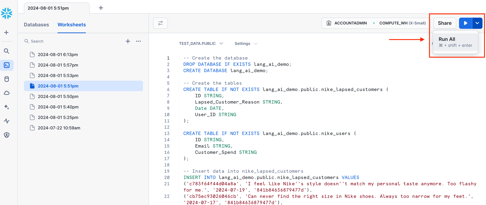
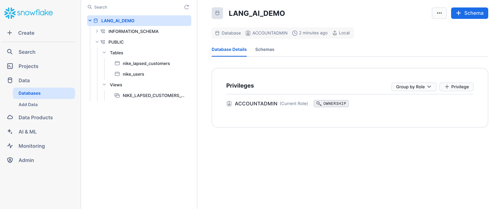
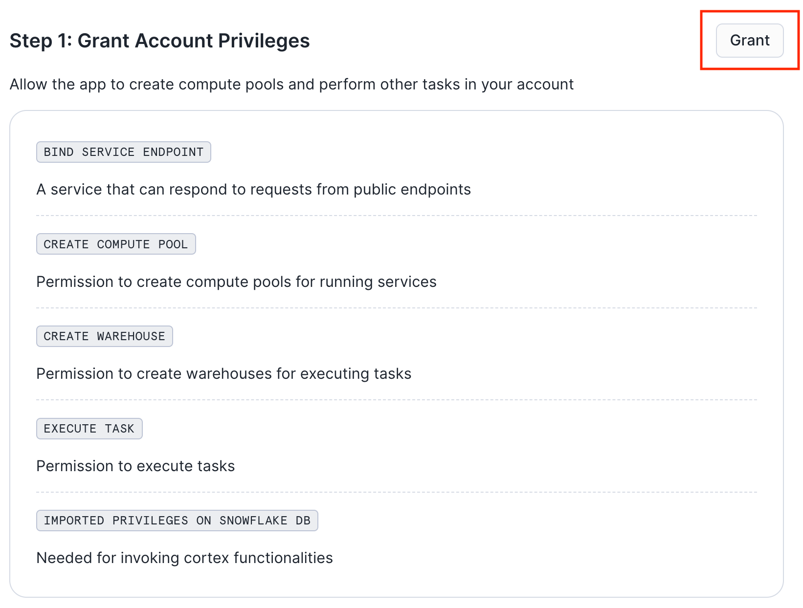
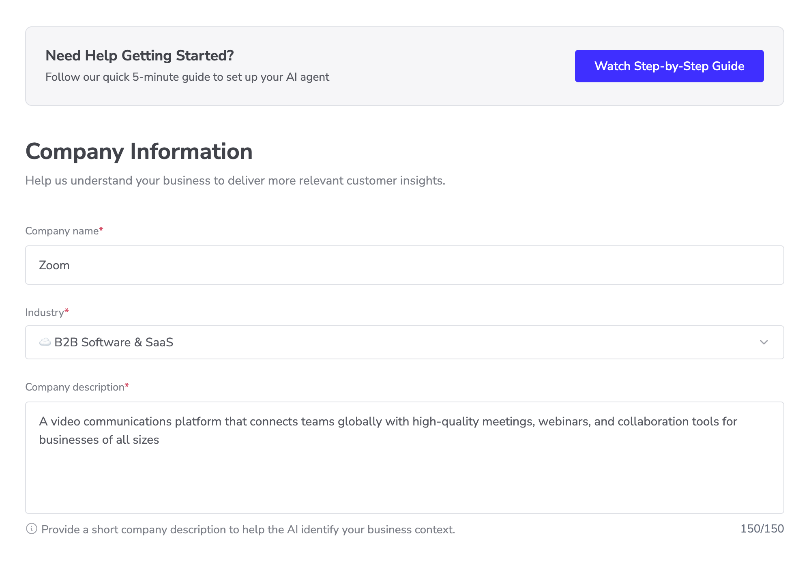
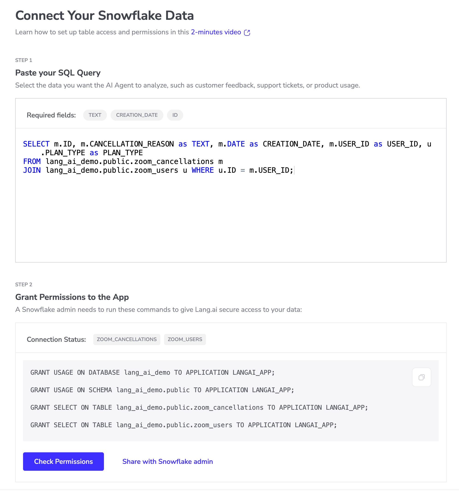
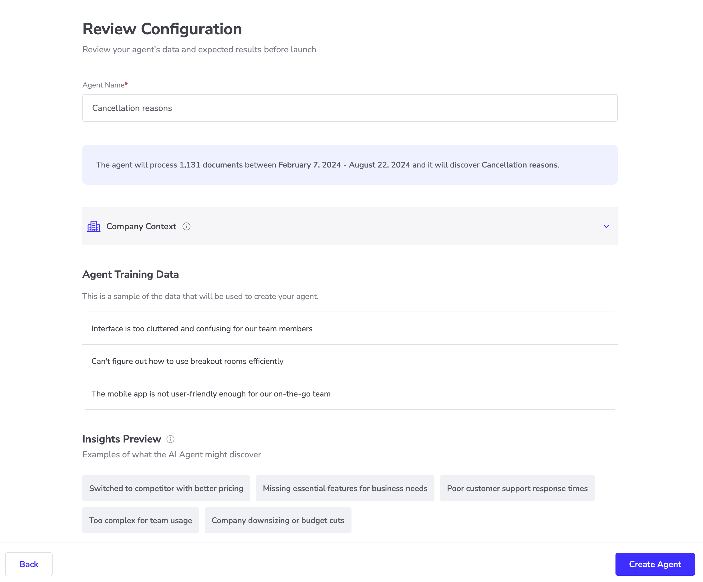

author: Lang.ai
id: create_ai_agents_on_snowflake_with_lang_ai
language: en
summary: Through this quickstart guide, you will set up an AI Agent running on Snowflake to set up recurring data analysis for your business teams.
categories: Getting-Started, Data-Science-&-Ai, Data-Science-&-Ml, partner-integrations 
environments: web
status: Published 
feedback link: https://github.com/Snowflake-Labs/sfguides/issues
tags: Getting Started, Data Science, Data Engineering, AI Agents 

# Create AI Agents on Snowflake with Lang.ai
<!-- ------------------------ -->
## Overview 
Duration: 1

Lang.ai's Snowflake AI Agents empower data teams to create custom agents that derive actionable priorities from customer interactions, driving retention and growth. 

This quickstart is a guide to installing and running your first Lang AI Agent for data analysis in your own Snowflake infrastructure.


### Prerequisites
- No prerequisites are required for this guide.

### What You'll Learn
- Installing and setting up the Lang.ai Native Application
- Creating and running your first AI Agent

### What You’ll Need 
- A Snowflake account with _ACCOUNTADMIN_ access to install the Lang.ai Native Application and give access to the data you want to analyze.

### What You’ll Build 
- A Snowflake AI Agent for data analysis

<!-- ------------------------ -->
## Creating a sample database
Duration: 5

In this step we will be creating a sample database and a sample view. We will be using this data in the following steps to create our first AI Agent.

Sign in to your Snowflake account and create a new SQL Worksheet.


To start, copy the <button>[SQL Script](https://raw.githubusercontent.com/lang-ai/snowflake-app-samples/main/retention-agent-demo/setup.sql)</button> and paste it into the SQL Worksheet, then click on the **Run All** button to execute the script.



This script will:
- Create a table called *zoom_cancellations* and populate it with demo data
- Create a table called *zoom_users* and populate it with demo data

After the script has successfully executed, you will see a LANG_AI_DEMO database with the following tables:



The tables created by the script already include the required fields to create AI Agents:

> aside positive
> 
>- **id:** The id of the document (ticket, survey, etc.)
>- **text:** The unstructured text to be analyzed
>- **creation_date:** The date of creation of the unstructured text

The last column _Customer_Spend_ is not mandatory, but it is included as we will configure the agent to use it to group the insights by the customer monthly spending. 

You may include additional columns that may be used by the AI Agent to aggregate the insights generated. 


<!-- ------------------------ -->
## Installing the application
Duration: 5

> aside positive
> NOTE: This guide shows the steps needed to install the app via the user interface. If you prefer to install it using SQL scripts, please follow this [guide](https://help.lang.ai/en/articles/9813363-install-the-native-app-with-an-sql-script).


Log in to Snowsight as an ACCOUNTADMIN and follow these steps to install the Lang.ai Native App:

### 1. Install the application

Go to the Snowflake Marketplace and install the Lang.ai Native Application: [Snowflake AI Agents](https://app.snowflake.com/marketplace/listing/GZTSZ1TJ3IU/lang-ai-snowflake-ai-agents).

Once installed, click on the name of the application to open the app.

### 2. Grant privileges

Click Grant to grant the application the necessary privileges:

#### Account-level Privileges

- The **BIND SERVICE ENDPOINT** privilege enables the services in the app to connect to each other.
- The **CREATE WAREHOUSE** and **CREATE COMPUTE POOL** are required by the Lang.ai Native App to create and manage resources for performing service operations. Learn more [here](https://help.lang.ai/en/articles/9813363-install-the-native-app-with-an-sql-script).


### 3. Launch the app
Click *Activate* to activate the application.

Navigate back to the *Data Products > Apps* page and wait for the spinner in the INSTALLED column to stop running. When it’s done you’ll see “1 minute ago” in that column. Then click _Launch App_ to start the application.

<!-- ------------------------ -->
## Creating Your First AI Agent
Duration: 5

Learn to run your first AI Agent on top of Snowflake data.

### Add your company information
Add basic information about your organization to help the AI Agent understand your business context. For this quickstart guide, we'll use Zoom as an example company.



### Select Your AI Agent
Select a predefined agent or create a custom one to meet your needs. For this quickstart guide using Zoom's synthetic data, we'll analyze survey responses to understand cancellation reasons. You'll see a preview of potential insights the AI Agent might discover, like pricing concerns or platform usability issues.


### Connect Your Snowflake Data

For this quickstart using Zoom's synthetic data, we'll analyze cancellation data by following two steps:



**Step 1: Paste your SQL Query**
Select the data you want the AI Agent to analyze. For this demo, paste this query to combine cancellation reasons with user data:

```sql
SELECT m.ID, m.CANCELLATION_REASON as TEXT, m.DATE as CREATION_DATE, u.PLAN_TYPE as PLAN_TYPE
FROM lang_ai_demo.public.zoom_cancellations m
JOIN lang_ai_demo.public.zoom_users u WHERE u.ID = m.USER_ID;
```

Required fields:
- TEXT: The cancellation feedback
- CREATION_DATE: When the cancellation happened
- ID: Unique identifier for each record

**Step 2: Grant Table Access**

A Snowflake admin needs to run these commands to give Lang.ai secure access to your data:

```sql
-- Customize the app name "LANGAI_APP" to your own if different
GRANT USAGE ON DATABASE lang_ai_demo TO APPLICATION LANGAI_APP;
GRANT USAGE ON SCHEMA lang_ai_demo.public TO APPLICATION LANGAI_APP;
GRANT SELECT ON TABLE lang_ai_demo.public.zoom_cancellations TO APPLICATION LANGAI_APP;
GRANT SELECT ON TABLE lang_ai_demo.public.zoom_users TO APPLICATION LANGAI_APP;
```

For this demo, we're connecting to the following tables:
- ZOOM_CANCELLATIONS table
- ZOOM_USERS table

Use the "Check Permissions" button to verify access or "Share with Snowflake admin" to send these commands to your admin.

Once access is granted, click on Next to continue.

Learn how to set up table access and permissions in this 2-minute video [here](https://help.lang.ai/en/articles/9914672-granting-table-access-to-your-ai-agent). 


### Run Your AI Agent for the First Time
Review your agent's configuration before launch. For this quickstart using Zoom's synthetic data, we'll analyze 1,131 cancellation documents from February to August 2024.

Click "Create Agent" to start the analysis. The AI Agent will process your data and discover patterns in cancellation reasons across different user segments.




## Reviewing the Insights of Your AI Agent
Duration: 5

> aside positive
> Automate insight delivery to Slack! For instructions on setting up the Slack integration, please check this [guide](https://help.lang.ai/en/articles/9950927-connecting-the-slack-integration).

### Navigate Your Agent Insights
Once the agent has finished processing, click on the table to see the generated insights. In the insights view, you can navigate through the data by sorting and searching. 


### Review the Data Associated with the Insights

To view the unstructured text that was analyzed to generate an insight, simply click on the specific insight.

Additionally, you have the option to download the data from your active filters by clicking on **Download CSV**.


<!-- ------------------------ -->
## Conclusion And Resources
Duration: 1

By following this guide, you have successfully set up an AI Agent running on Snowflake to automate your data analysis tasks.

### Related Resources
- [Marketplace Listing](https://app.snowflake.com/marketplace/listing/GZTSZ1TJ3IU/lang-ai-snowflake-ai-agents)
- [Lang.ai Help Center](https://help.lang.ai/en/collections/9808378-build-your-first-ai-agent)
- [Fork Repo on GitHub](https://github.com/Snowflake-Labs/sf-samples/tree/main/samples/create_ai_agents_on_snowflake_with_lang_ai)
- [Download Reference Architecture](https://www.snowflake.com/content/dam/snowflake-site/developers/2024/10/Snowflake-AI-Agents-by-Lang.ai_.pdf)
- [Read the Blog](https://medium.com/snowflake/ai-agents-in-snowflake-for-data-analysis-055c9f97338a)
- [Watch the Demo](https://youtu.be/giXLPbLDaOw?list=TLGGcxw4RdvtB40yMjA5MjAyNQ)

### What You Learned
- How to set up the Lang.ai Snowflake Native App
- How to create and configure an AI Agent in Lang.ai
