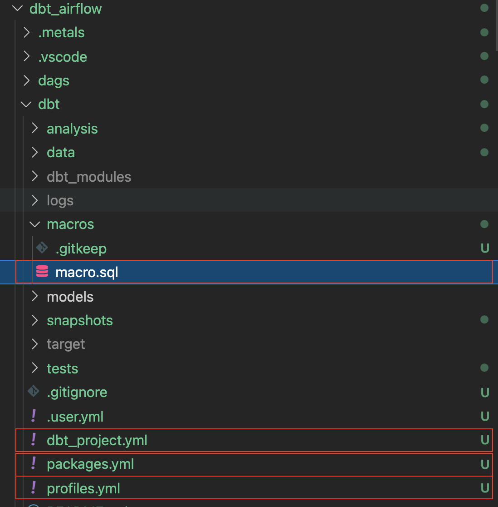
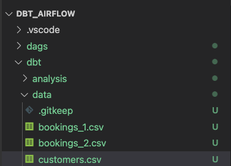
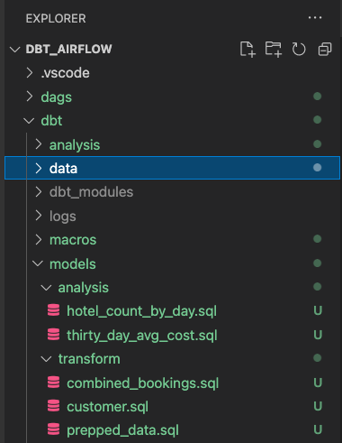
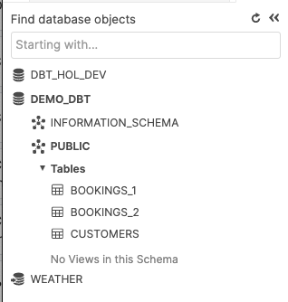
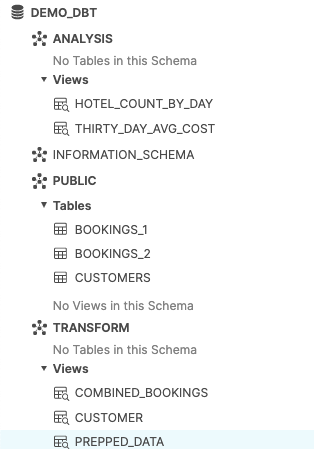

autors: Adrian Lee
id: data_engineering_with_apache_airflow_it
language: en
summary: questo è un esempio di guida di Snowflake
categories: data-engineering, modelli-di-architettura, integrazioni-dei-partner
environments: web
status: Pubblicato
feedback link: https://github.com/Snowflake-Labs/sfguides/issues
tags: Guida introduttiva, Data Engineering, dbt, Airflow, it  

# Data Engineering con Apache Airflow, Snowflake e dbt
<!-- ------------------------ -->
## Panoramica 
Duration: 5


Numerose aziende stanno cercando una strategia dati moderna, basata su piattaforme in grado di supportare agilità, crescita ed efficienza operativa. Snowflake è il Data Cloud, una soluzione a prova di futuro che può semplificare le pipeline di dati per tutte le tue attività aziendali, consentendoti di concentrarti sui tuoi dati e sull’analisi anziché sulla gestione e la manutenzione dell’infrastruttura.

Apache Airflow è una piattaforma open source per la gestione dei flussi di lavoro che può essere utilizzata per creare e gestire pipeline di dati. Airflow utilizza flussi di lavoro composti da grafi aciclici diretti (DAG) di task. 

[dbt](https://www.getdbt.com/) è un framework moderno per il data engineering mantenuto da [dbt Labs](https://www.getdbt.com/) che si sta affermando ampiamente nelle architetture di dati moderne, sfruttando cloud data platform come Snowflake. [dbt CLI](https://docs.getdbt.com/dbt-cli/cli-overview) è l’interfaccia della riga di comando open source gratuita utilizzata per eseguire i progetti dbt.

In questo workshop pratico seguirai una guida dettagliata all’uso di Airflow con dbt per creare utilità di pianificazione dei processi di trasformazione dei dati. 

Iniziamo. 
### Prerequisiti
Questa guida presuppone una conoscenza pratica di base di Python e dbt

### Cosa imparerai 
- Come usare uno strumento open source come Airflow per creare un’utilità di pianificazione dei dati
- Come scrivere un DAG e caricarlo su Airflow
- Come creare pipeline scalabili utilizzando dbt, Airflow e Snowflake

### Cosa ti serve 
Prima di iniziare dovrai disporre di:

1. Snowflake
  1. **Un account Snowflake.**
  1. **Un utente Snowflake con le autorizzazioni appropriate.** Questo utente deve essere autorizzato a creare oggetti nel database DEMO_DB.
1. GitHub
  1. **Un account GitHub.** Se non hai già un account GitHub, puoi crearne uno gratuitamente. Visita la [pagina di registrazione di GitHub](https://github.com/join) per iniziare.
  1. **Un repository GitHub.** Se non hai ancora creato un repository, o se desideri crearne un altro, [crea un nuovo repository](https://github.com/new). Seleziona il tipo `Public` (anche se potresti utilizzare qualsiasi tipo). Per il momento puoi evitare di aggiungere i file README, .gitignore e license.
1. Ambiente di sviluppo integrato (IDE)
  1. **L’IDE con integrazione Git che preferisci.** Se non hai ancora un IDE preferito che si integra con Git, puoi provare l’ottimo [Visual Studio Code](https://code.visualstudio.com/), gratuito e open source.
  1. **Il repository del progetto clonato sul tuo computer.** Per i dettagli sulla connessione del repository Git, apri il repository e copia il link `HTTPS` fornito nella parte superiore della pagina. Se il tuo repository contiene almeno un file, fai clic sull’icona verde `Code` nella parte superiore della pagina e copia il link `HTTPS`. Utilizza il link in VS Code o nel tuo IDE preferito per clonare il repository sul tuo computer.
1. Docker
  1. **Docker Desktop sul tuo laptop.** Eseguiremo Airflow come container. Installa Docker Desktop sul sistema operativo desiderato seguendo le [istruzioni per la configurazione di Docker](https://docs.docker.com/desktop/).

### Cosa realizzerai 
- Una semplice pipeline Airflow funzionante, utilizzando dbt e Snowflake 

<!-- ------------------------ -->
## Configurare l’ambiente
Duration: 2

Per prima cosa, creiamo una cartella eseguendo il comando riportato sotto

```
mkdir dbt_airflow && cd "$_"
```

Quindi estraiamo il file docker-compose di Airflow. Per farlo, eseguiamo un curl del file sul nostro laptop locale

``` bash
curl -LfO 'https://airflow.apache.org/docs/apache-airflow/2.3.0/docker-compose.yaml'
```

Ora adatteremo il file docker-compose aggiungendo le due cartelle come volumi. `dags` è la cartella in cui vengono collocati i DAG Airflow perché vengano recuperati e analizzati da Airflow. `dbt` è la cartella in cui abbiamo configurato i modelli dbt e i file CSV. 

``` bash 
volumes:
  - ./dags:/opt/airflow/dags 
  - ./logs:/opt/airflow/logs 
  - ./plugins:/opt/airflow/plugins 
  - ./dbt:/dbt # add this in 
  - ./dags:/dags # add this in
```

Ora dobbiamo creare un altro file con parametri aggiuntivi di docker-compose. In questo modo dbt sarà installato quando vengono avviati i container.

`.env` 
``` bash
_PIP_ADDITIONAL_REQUIREMENTS=dbt==0.19.0
```

---
Ora dobbiamo creare un progetto `dbt` e una cartella `dags`. 

Per il progetto dbt, usa il comando ```dbt init dbt```; in seguito, nel passaggio 4, eseguiremo qui la configurazione necessaria.

Crea la cartella dags utilizzando semplicemente il comando 

```
mkdir dags
```

La struttura del repository dovrebbe essere la seguente


<!-- ------------------------ -->
## Configurare il progetto dbt
Duration: 6

Ora che il repository è pronto, è il momento di configurare e preparare il progetto dbt. 

Prima di iniziare, riepiloghiamo ciò che intendiamo fare in questo progetto.

Come illustrato nel diagramma qui sotto, abbiamo tre file CSV: ```bookings_1```, ```bookings_2``` e ```customers ```. Utilizzeremo questi file CSV per il seeding in Snowflake inserendoli come tabelle. Questo sarà spiegato nei dettagli nel passaggio 4.

In seguito faremo il merge delle tabelle ```bookings_1``` e ```bookings_2``` in ```combined_bookings```. Quindi metteremo in join le tabelle ```combined_bookings``` e ```customer``` in base a customer_id per creare la tabella ```prepped_data```. 

Infine eseguiremo l’analisi e la trasformazione sulla tabella ```prepped_data``` creando due viste.  

1) ```hotel_count_by_day.sql```: questo file crea una vista hotel_count_by_day nello schema ANALYSIS, in cui conteremo il numero di prenotazioni dell’hotel per ciascun giorno.

2) ```thirty_day_avg_cost.sql```: questo file crea una vista thirty_day_avg_cost nello schema ANALYSIS, in cui calcoleremo il costo medio delle prenotazioni per gli ultimi 30 giorni.


Per prima cosa andiamo alla console Snowflake ed eseguiamo il seguente script, che crea un utente dbt_user e un ruolo dbt_dev_role. In seguito configureremo un database per dbt_user.

``` SQL 
USE ROLE SECURITYADMIN;

CREATE OR REPLACE ROLE dbt_DEV_ROLE COMMENT='dbt_DEV_ROLE'; 
GRANT ROLE dbt_DEV_ROLE TO ROLE SYSADMIN;

CREATE OR REPLACE USER dbt_USER PASSWORD='<PASSWORD>' 
        DEFAULT_ROLE=dbt_DEV_ROLE 
        DEFAULT_WAREHOUSE=dbt_WH 
        COMMENT='dbt User';
    
GRANT ROLE dbt_DEV_ROLE TO USER dbt_USER;

-- Grant privileges to role USE ROLE ACCOUNTADMIN;

GRANT CREATE DATABASE ON ACCOUNT TO ROLE dbt_DEV_ROLE;

/*--------------------------------------------------------------------------- 
Next we will create a virtual warehouse that will be used 
---------------------------------------------------------------------------*/ 
USE ROLE SYSADMIN;

--Create Warehouse for dbt work 
CREATE OR REPLACE WAREHOUSE dbt_DEV_WH 
  WITH WAREHOUSE_SIZE = 'XSMALL' 
  AUTO_SUSPEND = 120 
  AUTO_RESUME = true 
  INITIALLY_SUSPENDED = TRUE;

GRANT ALL ON WAREHOUSE dbt_DEV_WH TO ROLE dbt_DEV_ROLE;
```

Effettuiamo il login come ```dbt_user``` e creiamo il database ```DEMO_dbt``` eseguendo il comando

``` sql
CREATE OR REPLACE DATABASE DEMO_dbt
``` 


Ora torniamo al progetto ```dbt_airflow``` > ```dbt``` che abbiamo configurato in precedenza, nel passaggio 1.

Imposteremo alcune configurazioni per i file elencati sotto. Nota che per ```dbt_project.yml``` è sufficiente sostituire la sezione dei modelli.

profiles.yml 
``` yml 
default: 
  target: dev 
  outputs: 
    dev: 
      type: snowflake 
      ######## Please replace with your Snowflake account name 
      ######## for example sg_demo.ap-southeast-1 account: <ACCOUNT_URL>.<REGION> 

      user: “{{ env_var('dbt_user') }}”
      ######## These environment variables dbt_user and dbt_password 
      ######## are read from the variabls in Airflow which we will set later
      password: “{{ env_var('dbt_password') }}”

      role: dbt_dev_role
      database: demo_dbt
      warehouse: dbt_dev_wh
      schema: public
      threads: 200
```

packages.yml
``` yml 
packages: 
  - package: fishtown-analytics/dbt_utils 
    version: 0.6.4 
```

dbt_project.yml 
``` yml
models:
  my_new_project:
      # Applies to all files under models/example/
      transform:
          schema: transform
          materialized: view
      analysis:
          schema: analysis
          materialized: view
```

A questo punto installeremo ```fishtown-analytics/dbt_utils```, che avevamo collocato in ```packages.yml```. Per farlo, esegui il comando ```dbt deps``` dalla cartella ```dbt```. 

Ora creeremo un file chiamato ```custom_demo_macros.sql``` nella cartella ```macros``` e inseriremo il seguente codice SQL 

``` sql 
 
   
   
    {{ default_schema }} 
   
    {{ custom_schema_name | trim }} 
   



 
   {# always use model name #} 
   
     
    {{ log("Setting query_tag to '" ~ new_query_tag ~ "'. Will reset to '" ~ original_query_tag ~ "' after materialization.") }} 
     
    {{ return(original_query_tag)}} 
   
  {{ return(none)}} 
 
```

Se non ci sono errori, la cartella dovrebbe essere come quella illustrata sotto. Le caselle con annotazioni sono i passaggi che abbiamo appena eseguito. 

Il passaggio finale è installare il modulo dbt per ```db_utils```. Dalla directory dbt, esegui 
``` 
dbt deps
```
i moduli associati verranno installati nella cartella ```dbt_modules```

A questo punto dovresti vedere la seguente struttura delle cartelle: 



La configurazione di dbt è completata. Nella prossima sezione creeremo i file CSV e i DAG.

<!-- ------------------------ -->
## Creare i file di dati CSV in dbt
Duration: 10

In questa sezione prepareremo i file CSV di dati campione insieme ai modelli SQL associati. 

Per iniziare, creiamo tre file Excel nella cartella ```data``` all’interno della cartella dbt.

bookings_1.csv
``` csv
id,booking_reference,hotel,booking_date,cost
1,232323231,Pan Pacific,2021-03-19,100
1,232323232,Fullerton,2021-03-20,200
1,232323233,Fullerton,2021-04-20,300
1,232323234,Jackson Square,2021-03-21,400
1,232323235,Mayflower,2021-06-20,500
1,232323236,Suncity,2021-03-19,600
1,232323237,Fullerton,2021-08-20,700
```

bookings_2.csv
``` csv
id,booking_reference,hotel,booking_date,cost
2,332323231,Fullerton,2021-03-19,100
2,332323232,Jackson Square,2021-03-20,300
2,332323233,Suncity,2021-03-20,300
2,332323234,Jackson Square,2021-03-21,300
2,332323235,Fullerton,2021-06-20,300
2,332323236,Suncity,2021-03-19,300
2,332323237,Berkly,2021-05-20,200
```

customers.csv 
``` csv
id,first_name,last_name,birthdate,membership_no
1,jim,jone,1989-03-19,12334
2,adrian,lee,1990-03-10,12323
```

La struttura delle cartelle dovrebbe essere come segue



<!-- ------------------------ -->
## Creare i modelli dbt nella cartella “models”
Duration: 2

Crea due cartelle chiamate ```analysis``` e ```transform``` nella cartella “models”. Segui le procedure nelle sezioni riportate sotto, rispettivamente per l’analisi e la trasformazione. 

### Modelli dbt per la cartella “transform”

All’interno della cartella ```transform``` avremo tre file SQL

1) ```combined_bookings.sql```: questo combina i due file CSV delle prenotazioni della sezione precedente e crea la vista ```COMBINED_BOOKINGS``` nello schema ```TRANSFORM```. 

combined_bookings.sql 
``` SQL
{{ dbt_utils.union_relations(
    relations=[ref('bookings_1'), ref('bookings_2')]
) }}
```

2) ```customer.sql```: questo crea una vista ```CUSTOMER``` nello schema ```TRANSFORM```.

customer.sql 
``` SQL
SELECT ID 
    , FIRST_NAME
    , LAST_NAME
    , birthdate
FROM {{ ref('customers') }}
```

3) ```prepped_data.sql```: questo crea una vista ```PREPPED_DATA``` nello schema ```TRANSFORM``` in cui eseguirà un join interno sulle viste ```CUSTOMER``` e ```COMBINED_BOOKINGS``` dei passaggi precedenti. 

prepped_data.sql 
``` SQL
SELECT A.ID 
    , FIRST_NAME
    , LAST_NAME
    , birthdate
    , BOOKING_REFERENCE
    , HOTEL
    , BOOKING_DATE
    , COST
FROM {{ref('customer')}}  A
JOIN {{ref('combined_bookings')}} B
on A.ID = B.ID
```

### Modelli dbt per la cartella “analysis”

Ora passiamo alla cartella ```analysis```. Passa alla cartella ```analysis``` e crea questi due file SQL

1) ```hotel_count_by_day.sql```: questo file crea una vista hotel_count_by_day nello schema ```ANALYSIS``` in cui conteremo il numero di prenotazioni dell’hotel per ciascun giorno. 

``` SQL
SELECT
  BOOKING_DATE,
  HOTEL,
  COUNT(ID) as count_bookings
FROM {{ ref('prepped_data') }}
GROUP BY
  BOOKING_DATE,
  HOTEL
```

2) ```thirty_day_avg_cost.sql```: questo file crea una vista thirty_day_avg_cost nello schema ```ANALYSIS``` in cui calcoleremo il costo medio delle prenotazioni negli ultimi 30 giorni. 

``` SQL
SELECT
  BOOKING_DATE,
  HOTEL,
  COST,
  AVG(COST) OVER (
    ORDER BY BOOKING_DATE ROWS BETWEEN 29 PRECEDING AND CURRENT ROW
  ) as "30_DAY_AVG_COST",
  COST -   AVG(COST) OVER (
    ORDER BY BOOKING_DATE ROWS BETWEEN 29 PRECEDING AND CURRENT ROW
  ) as "DIFF_BTW_ACTUAL_AVG"
FROM {{ ref('prepped_data') }}
```

La struttura dei file dovrebbe essere come illustrato sotto. Abbiamo già completato i modelli dbt e possiamo iniziare a lavorare con Airflow. 



<!-- ------------------------ -->
## Preparare i DAG Airflow
Duration: 5

Nella cartella ```dags```, crea due file: ```init.py``` e ```transform_and_analysis.py```. ```init.py``` inizializza e rileva i dati CSV. ```transform_and_analysis.py``` esegue la trasformazione e l’analisi. 

Con Airflow possiamo quindi pianificare il DAG```transform_and_analysis``` su base giornaliera. In questo esempio, tuttavia, attiveremo il DAG manualmente.

init.py 
``` python 
from datetime import datetime 
import os

from airflow import DAG 
from airflow.operators.python import PythonOperator, BranchPythonOperator 
from airflow.operators.bash import BashOperator 
from airflow.operators.dummy_operator import DummyOperator

default_args = { 
    'owner': 'airflow', 
    'depends_on_past': False, 
    'start_date': datetime(2020,8,1), 
    'retries': 0 
}


with DAG('1_init_once_seed_data', default_args=default_args, schedule_interval='@once') as dag: 
    task_1 = BashOperator( 
        task_id='load_seed_data_once', 
        bash_command='cd /dbt && dbt seed --profiles-dir .', 
        env={ 
            'dbt_user': '{{ var.value.dbt_user }}', 
            'dbt_password': '{{ var.value.dbt_password }}', 
            **os.environ 
        }, 
        dag=dag 
)

task_1  
```

transform_and_analysis.py 
``` python 
from airflow import DAG 
from airflow.operators.python import PythonOperator, BranchPythonOperator 
from airflow.operators.bash import BashOperator 
from airflow.operators.dummy_operator import DummyOperator 
from datetime import datetime


default_args = { 
    'owner': 'airflow', 
    'depends_on_past': False, 
    'start_date': datetime(2020,8,1), 
    'retries': 0 
}

with DAG('2_daily_transformation_analysis', default_args=default_args, schedule_interval='@once') as dag: 
    task_1 = BashOperator( 
        task_id='daily_transform', 
        bash_command='cd /dbt && dbt run --models transform --profiles-dir .', 
        env={
            'dbt_user': '{{ var.value.dbt_user }}', 
            'dbt_password': '{{ var.value.dbt_password }}', 
            **os.environ 
        }, 
        dag=dag 
    )

    task_2 = BashOperator(
        task_id='daily_analysis',
        bash_command='cd /dbt && dbt run --models analysis --profiles-dir .',
        env={
            'dbt_user': '{{ var.value.dbt_user }}',
            'dbt_password': '{{ var.value.dbt_password }}',
            **os.environ
        },
        dag=dag
    )

    task_1 >> task_2 # Define dependencies
```


<!-- ------------------------ -->
## Eseguire il file docker-compose per Airflow
Duration: 5

Eseguiamo ```docker-compose up``` e andiamo all’indirizzo [http://localhost:8080/](http://localhost:8080/). Il nome utente predefinito è ```airflow``` e la password è ```airflow```


Ora creeremo due variabili. Vai a ```admin > Variables``` e fai clic sull’icona ```+```. 


Per prima cosa creiamo la chiave ```dbt_user``` e il valore ```dbt_user```. 


Ora creiamo la seconda chiave ```dbt_password``` con il valore ```<ADD IN YOUR PASSWORD>```


<!-- ------------------------ -->
## Attivare ed eseguire i DAG

Ora attiveremo i DAG. Fai clic sui pulsanti blu per ```1_init_once_seed_data``` e ```2_daily_transformation_analysis```


### Eseguire 1_init_once_seed_data
Ora eseguiamo ```1_init_once_seed_data``` per inserire i dati iniziali. Per eseguire il DAG, fai clic sull’icona di esecuzione sotto ```Actions``` a destra del DAG.


### Visualizzare i dati iniziali in tabelle create nello schema PUBLIC
Se non si verificano errori, tornando all’istanza Snowflake dovremmo vedere tre nuove tabelle nello schema ```PUBLIC```. 



### Eseguire 2_daily_transformation_analysis
Ora eseguiremo il secondo DAG, ```2_daily_transformation_analysis```, che eseguirà i modelli ```transform``` e ```analysis```


Le viste ```Transform``` e ```Analysis``` sono state create correttamente!



<!-- ------------------------ -->
## Conclusione
Duration: 1

Congratulazioni! Hai creato il tuo primo progetto Apache Airflow con dbt e Snowflake. Ti invitiamo a continuare la tua prova gratuita caricando i tuoi dati di esempio o di produzione e utilizzando alcune delle funzionalità più avanzate di Airflow e Snowflake non trattate in questo workshop. 

### Risorse aggiuntive:
- Entra oggi stesso nella nostra [community dbt su Slack](https://www.getdbt.com/community/) che comprende oltre 18.000 altri professionisti dei dati. Abbiamo un canale Slack dedicato agli argomenti relativi a Snowflake, #db-snowflake.
- Tutorial rapido su come scrivere un semplice [DAG Airflow](https://airflow.apache.org/docs/apache-airflow/stable/tutorial.html)

### Cosa abbiamo visto:
- Come configurare Airflow, dbt e Snowflake
- Come creare un DAG e utilizzarlo per eseguire dbt
