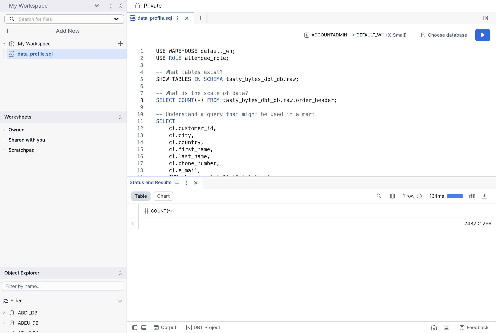
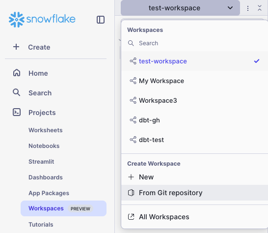
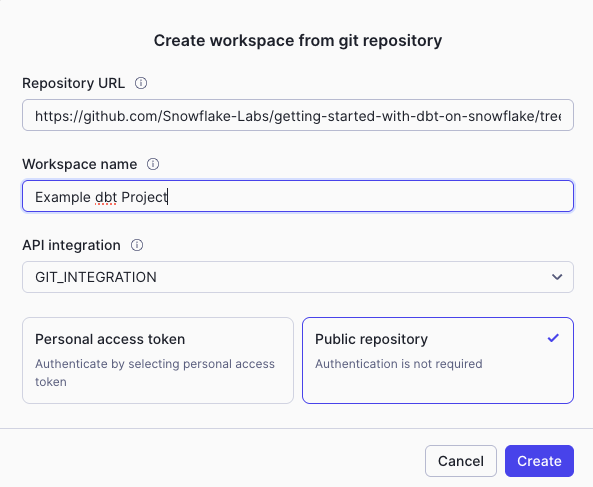
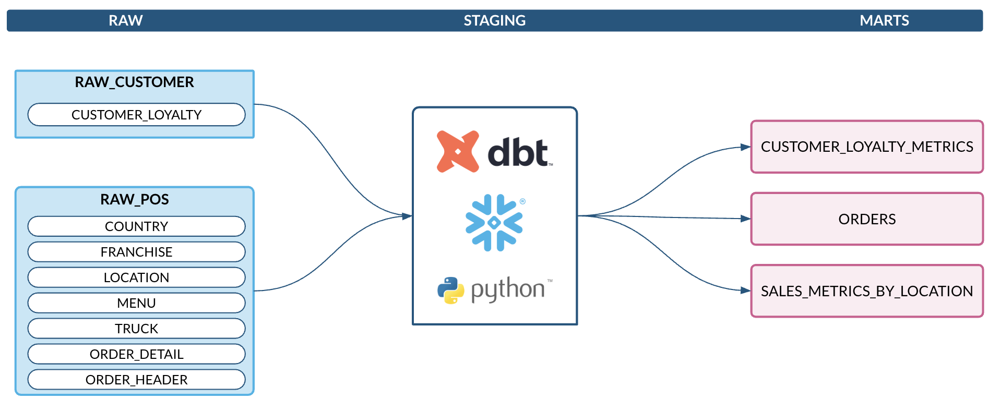
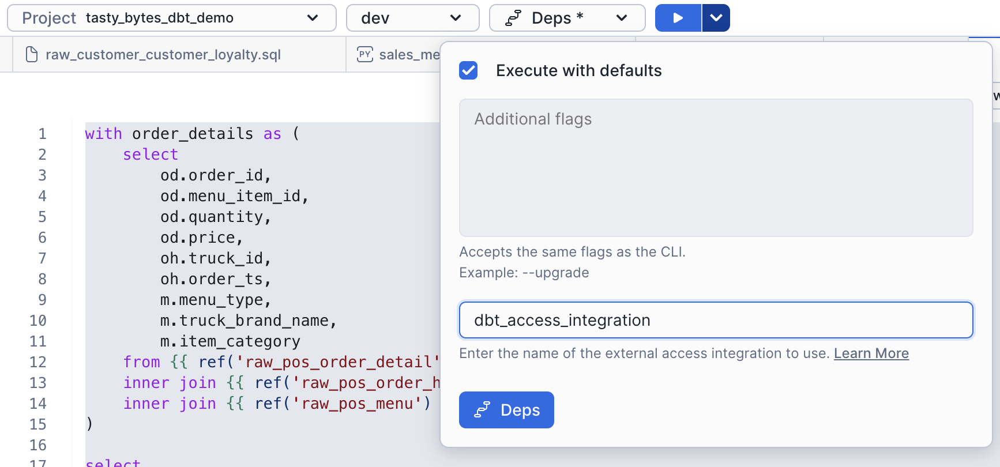
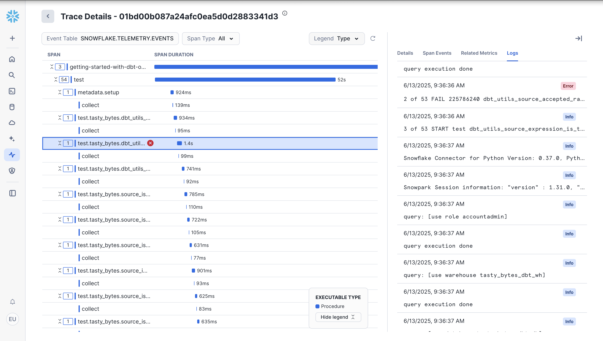

author: Charlie Hammond
id: dbt-projects-on-snowflake
categories: snowflake-site:taxonomy/solution-center/certification/quickstart, snowflake-site:taxonomy/product/data-engineering, snowflake-site:taxonomy/snowflake-feature/external-collaboration
language: en
summary: This Quickstart will show you how to get started using dbt Projects on Snowflake
environments: web
status: Published 
feedback link: https://github.com/Snowflake-Labs/sfguides/issues

# Exploring dbt Projects on Snowflake
<!-- ------------------------ -->
## Overview 
Duration: 1

dbt Core is an open-source data transformation tool and framework that you can use to define, test, and deploy SQL transformations. dbt on Snowflake allows you to use familiar Snowflake features to create, edit, test, run, and manage your dbt Core projects. Snowflake integrates with Git repositories and offers Snowflake CLI commands to support continuous integration and development (CI/CD) workflows for data pipelines.

In this lab, we will go through everything you need to know to get started with [dbt Projects on Snowflake](https://docs.snowflake.com/user-guide/data-engineering/dbt-projects-on-snowflake)!

### Prerequisites
- Familiarity with dbt concepts

### What You’ll Learn 
- How to use Workspaces, Snowflake's file based IDE that integrates with dbt
- How to pull a remote dbt project into Workspaces
- How dbt Projects can be run, edited, and deployed within Snowflake
- How to deploy and orchestrate dbt Projects from within Snowflake.

### What You’ll Need 
- A Snowflake account

### What You’ll Build 
- A dbt Project running within your Snowflake account

<!-- ------------------------ -->
## Setup
Duration: 5

We will be using Tasty Bytes data in this lab. Run the script [here](https://github.com/Snowflake-Labs/getting-started-with-dbt-on-snowflake/blob/main/tasty_bytes_dbt_demo/setup/tasty_bytes_setup.sql) in Snowsight to build the objects and data required for this lab.

Workspaces that you create in Snowflake are created in the personal database associated with the active user. To use Workspaces, you must run the following SQL commands to activate all secondary roles for your user.

``` sql
ALTER USER my_user SET DEFAULT_SECONDARY_ROLES = ('ALL');
```

Sign out of Snowsight and sign back in.

<!-- ------------------------ -->
## Introduction to Workspaces
Duration: 5

We will start with your personal Workspace. Workspaces provides a developer environment where you can  edit, test, and deploy your dbt projects, all within Snowflake. The personal workspace is your own area where you can create and edit files. 

Navigate to Projects > Workspaces to get started.

### Explore the Data
Let's explore the data we will be using in this lab. 

1. Create a new sql file in your Workspace and name it `data_profile.sql`.
2. Copy and paste the code below into the new file
3. Run the following queries just like you would in worksheets. 

``` sql 
USE WAREHOUSE tasty_bytes_dbt_wh;
USE ROLE accountadmin; 

-- What tables exist?
SHOW TABLES IN SCHEMA tasty_bytes_dbt_db.raw;

-- What is the scale of data? 
SELECT COUNT(*) FROM tasty_bytes_dbt_db.raw.order_header;

-- Understand a query that might be used in a mart -- in this case sales grouped by customer
SELECT 
    cl.customer_id,
    cl.city,
    cl.country,
    cl.first_name,
    cl.last_name,
    cl.phone_number,
    cl.e_mail,
    SUM(oh.order_total) AS total_sales,
    ARRAY_AGG(DISTINCT oh.location_id) AS visited_location_ids_array
FROM tasty_bytes_dbt_db.raw.customer_loyalty cl
JOIN tasty_bytes_dbt_db.raw.order_header oh
ON cl.customer_id = oh.customer_id
GROUP BY cl.customer_id, cl.city, cl.country, cl.first_name,
cl.last_name, cl.phone_number, cl.e_mail;
```



### Create dbt Project from GitHub

Let's now clone an example dbt project we will use in the rest of this lab. 

1. Click the workspace dropdown > Create Workspace From Git Repository
2. In the popup, enter the following fields:
    1. Repository URL: `https://github.com/Snowflake-Labs/getting-started-with-dbt-on-snowflake.git`
    2. Workspace Name: `Example-dbt-Project`
    3. API Integration: `GIT_INTEGRATION`. Note: the [API Integration](https://docs.snowflake.com/en/developer-guide/git/git-setting-up#label-integrating-git-repository-api-integration) has already been configured for you. 
    4. Select Public Repository
3. Click Create!





<!-- ------------------------ -->
## Operate dbt Projects on Snowflake
Duration: 10

### Example Project 

We will work with Tasty Bytes data in this lab. The raw data includes sales data, truck metadata, and customer information. This will all be transformed with dbt and saved as a table in Snowflake. 



#### Add a new model

We will start by adding a new model to show how you can create using workspaces. Create a SQL file called `sales_data_by_truck.sql` in tasty_bytes_dbt_demo/models/marts. Copy the following code. 

```sql
with order_details as (
    select 
        od.order_id,
        od.menu_item_id,
        od.quantity,
        od.price,
        oh.truck_id,
        oh.order_ts,
        m.menu_type,
        m.truck_brand_name,
        m.item_category
    from {{ ref('raw_pos_order_detail') }} od
    inner join {{ ref('raw_pos_order_header') }} oh on od.order_id = oh.order_id
    inner join {{ ref('raw_pos_menu') }} m on od.menu_item_id = m.menu_item_id
)

select
    truck_brand_name,
    menu_type,
    item_category,
    date_trunc('month', order_ts) as sales_month,
    sum(quantity) as total_items_sold,
    sum(price) as total_revenue,
    count(distinct order_id) as total_orders
from order_details
where truck_brand_name is not null
group by 1, 2, 3, 4
order by 1, 2, 3, 4
```


### Configure profiles.yml

Each dbt project folder in your Snowflake workspace must contain a profiles.yml file that specifies a target warehouse, database, schema, and role in Snowflake for the project. The type must be set to snowflake. 

dbt requires an account and user, but these can be left empty because the dbt project runs in Snowflake under the current account and user context.

When you run dbt commands, your workspace reads profiles.yml. When you have at least one valid target specified in profiles.yml, the selections for the targets defined in that project and the dbt commands available to run are available in the workspace menu bar.

We will keep the values in profiles.yml unchanged.


### dbt deps

Let's start by running `dbt deps` to pull in the dbt_utils package. The dbt_utils package contains several usefull test that we have built into the project. 

From the dbt toolbar, you get dropdowns for the project, target, and command. Clicking the play button will run the relevant command. You can also click the down arrow to override the arguments. 

1. From the toolbar, select dev and deps. 
2. Click the dropdown arrow and enter `dbt_access_integration`. This [external access integration](https://docs.snowflake.com/en/sql-reference/sql/create-external-access-integration) has already been configured for you. 
3. Click the Deps button.



### dbt compile

We will now run `dbt compile`. From the dropdown, click compile and run it. 


#### View Compiled SQL

Once you have compiled the project, you can view the compiled SQL by clicking the View Compiled SQL button from an individual model. This shows the true tables and views the model will reference. 

#### View the DAG

You can also view the DAG to see how models interact with one another. Click DAG from the top toolbar to open the DAG.

### dbt run

Let's now run the project to pull data through our pipeline. From the dbt toolbar, select run from the dropdown, and click the play button. Once this completes, we have data in our marts tables!

### dbt test

Open tasty_bytes_dbt_demo/models/staging/__sources.yml to view data tests we have created. There are several common tests included, including ones from dbt_utils. On line 219, we have defined a maximum allowed value for order_amount. This is to flag abnormally large orders. 

Let's first run dbt tests to confirm the data meets our requirements. From the toolbar, select test, and click the play button. 

Oh no! There's an error with one of our tests. It looks like there is a test that doesn't quite look right. Let's update line 219 of `tasty_bytes_dbt_demo/models/staging/__sources.yml to be 10000 instead of 10. That should fix it. 

```yml
        - dbt_utils.accepted_range:  # Realistic order amount range
            min_value: 0
            max_value: 10000
            inclusive: true
```

### Deploy dbt Project

Now that we have updated and validated our dbt project, let's deploy it so we can build automation. Deploying a dbt project creates a Snowflake object and allows us to create tasks based on the object. 

1. Click Deploy in the top right of workspaces
2. Ensure your role is `accountadmin`
3. Select database `tasty_bytes_dbt_db` and schema `raw`
4. Name it `dbt_project`
5. Deploy!


### View git

Workspaces are fully git backed. To view changes and commit, click changes from the file selector. In this case, we have pulled from a public repository, so we will skip committing. 


<!-- ------------------------ -->
## Orchestration and Monitoring
Duration: 5

### Monitor dbt Projects

You can get an overview of dbt project status from the dbt Projects activity in Snowsight. Navigate to monitoring > dbt Projects to view overall status of dbt Projects and quickly jump to the deployed projects.


### Orchestrate with Tasks

#### Create Scheduled dbt Tasks

Let's create tasks to regularly run and test our dbt project. 

1. Click dbt_project in the top right corner of Workspaces
2. Click Create Schedule from the dropdown
3. Enter a name, schedule, and profile, then click create


#### Complex Tasks and Alerts

We can create more complex task structure with the script below. It creates a task DAG and alerts us when there is a test failure. Copy the script below into a new SQL file and run the commands one by one. Note the alert will fail unless you have verified your email. To verify your email, click on the user icon in the bottom left of the screen > profile > enter your email > click the link in your email.  

```sql
USE WAREHOUSE tasty_bytes_dbt_wh;
USE ROLE accountadmin;

CREATE OR REPLACE TASK tasty_bytes_dbt_db.raw.dbt_run_task
	WAREHOUSE=TASTY_BYTES_DBT_WH
	SCHEDULE='60 MINUTES'
	AS EXECUTE DBT PROJECT "TASTY_BYTES_DBT_DB"."RAW"."DBT_PROJECT" args='run --target dev';


CREATE OR REPLACE TASK tasty_bytes_dbt_db.raw.dbt_test_task
	WAREHOUSE=TASTY_BYTES_DBT_WH
	AFTER tasty_bytes_dbt_db.raw.dbt_run_task
	AS
        DECLARE 
            dbt_success BOOLEAN;
            dbt_exception STRING;
            my_exception EXCEPTION (-20002, 'My exception text');
        BEGIN
            EXECUTE DBT PROJECT "TASTY_BYTES_DBT_DB"."RAW"."DBT_PROJECT" args='test --target dev';
            SELECT SUCCESS, EXCEPTION into :dbt_success, :dbt_exception FROM TABLE(result_scan(last_query_id()));
            IF (NOT :dbt_success) THEN
              raise my_exception;
            END IF;
        END;

-- Run the tasks once
ALTER TASK tasty_bytes_dbt_db.raw.dbt_test_task RESUME;
EXECUTE TASK tasty_bytes_dbt_db.raw.dbt_run_task;

-- Optionally create alerts from the task
-- NOTE: you must validate your email and replace it at the bottom of the alert
create or replace alert tasty_bytes_dbt_db.raw.dbt_alert
--- no warehouse selected to run serverless
schedule='60 MINUTES'          
if (exists (
    SELECT 
        NAME,
        SCHEMA_NAME
    FROM 
        TABLE(INFORMATION_SCHEMA.TASK_HISTORY(
            SCHEDULED_TIME_RANGE_START => (greatest(timeadd('DAY', -7, current_timestamp),  SNOWFLAKE.ALERT.LAST_SUCCESSFUL_SCHEDULED_TIME())),
            SCHEDULED_TIME_RANGE_END => SNOWFLAKE.ALERT.SCHEDULED_TIME(),
            ERROR_ONLY => True)) 
    WHERE database_name = 'TASTY_BYTES_DBT_DB'
        )
    ) 
THEN          
    BEGIN
        LET TASK_NAMES string := (
            SELECT
                LISTAGG(DISTINCT(SCHEMA_NAME||'.'||NAME),', ') as FAILED_TASKS
            FROM 
                TABLE(RESULT_SCAN(SNOWFLAKE.ALERT.GET_CONDITION_QUERY_UUID()))); -- results of the condition query above
        CALL SYSTEM$SEND_SNOWFLAKE_NOTIFICATION(
            SNOWFLAKE.NOTIFICATION.TEXT_HTML(
                'Tasks '||:TASK_NAMES ||' failed since '||(greatest(timeadd('DAY', -7, current_timestamp), SNOWFLAKE.ALERT.LAST_SUCCESSFUL_SCHEDULED_TIME())
                    )
                ),
            SNOWFLAKE.NOTIFICATION.EMAIL_INTEGRATION_CONFIG(
                'DEMO_EMAIL_NOTIFICATIONS_DBT',                       -- email integration
                'Snowflake DEMO Pipeline Alert',                      -- email header
                array_construct('<YOUR EMAIL HERE>')      -- validated user email addresses
                )      
        );
    END;
;

-- Execute once
EXECUTE ALERT tasty_bytes_dbt_db.raw.dbt_alert;
```

You can view the status or running tasks by going to Monitoring > Task History.


### Tracing

dbt projects in Snowflake integrate with [Tracing and Logging](https://docs.snowflake.com/en/developer-guide/logging-tracing/logging-tracing-overview), allowing you to easily monitor and debug dbt projects. Tracing follows the OpenTelemetry standard and allows you to keep logs within a single platform. 

To view tracing, go to Monitoring > Traces & Logs. Click on the most recent one which should be our failed dbt test. 



### Cost Monitoring

Snowflake makes it easy to monitor usage across your account. To view consumption, go to Admin > Cost Management > Consumption Tab. Depending on your setup, you can create a dedicated warehouse to run dbt jobs to allow easy monitoring. 

Additionally, you are able to build [resource monitors](https://docs.snowflake.com/en/user-guide/resource-monitors) and alerts based on warehouse consumption. 


<!-- ------------------------ -->
## Conclusion And Resources
Duration: 1

Congratulations! You've successfully completed the "Getting Started with dbt Projects on Snowflake" lab. You now understand how dbt Core on Snowflake enables you to define, test, and deploy SQL transformations using familiar Snowflake features. You've learned how Snowflake's native integration with Git repositories and CLI commands support CI/CD workflows for your data pipelines.

If you want to learn more about dbt Projects on Snowflake, check out the [official documentation](https://docs.snowflake.com/user-guide/data-engineering/dbt-projects-on-snowflake).

### What You Learned
- How to use Workspaces, Snowflake's file-based IDE that integrates with dbt
- How to pull a remote dbt project into Workspaces
- How dbt Projects can be run, edited, and deployed within Snowflake
- How to deploy and orchestrate dbt Projects from within Snowflake

### Related Resources
- [dbt Projects on Snowflake Documentation](https://docs.snowflake.com/user-guide/data-engineering/dbt-projects-on-snowflake)
- [GitHub Repository: getting-started-with-dbt-on-snowflake](https://github.com/Snowflake-Labs/getting-started-with-dbt-on-snowflake)
- [dbt Core Documentation](https://docs.getdbt.com/)
