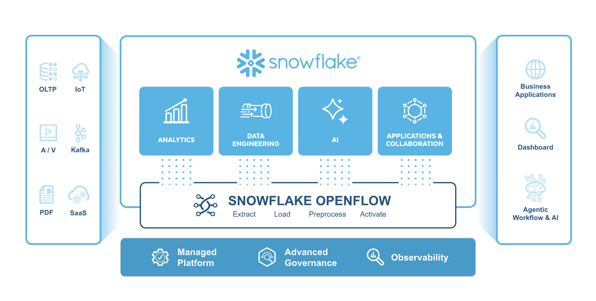
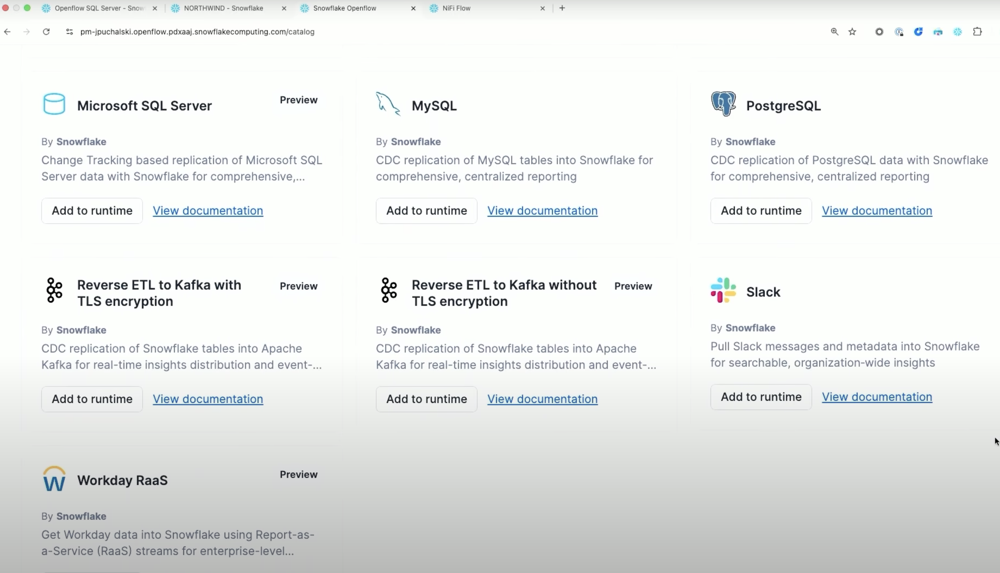
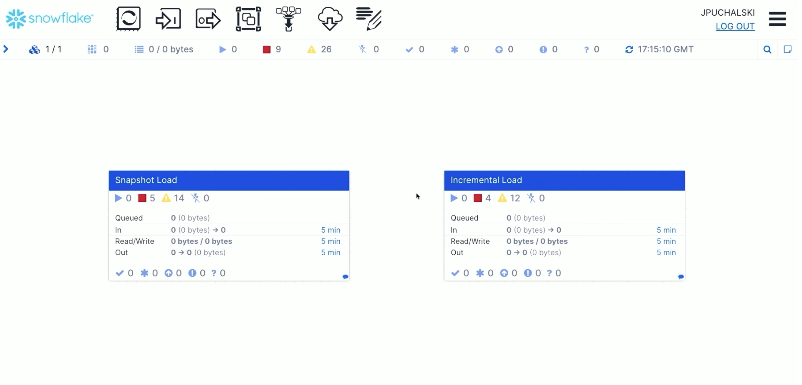

author: Vino Duraisamy, Jakub Puchalski
id: getting_started_with_openflow_for_cdc_on_sql_server
summary: Through this guide, you will learn how to move beyond slow, nightly batch jobs and stream data in real-time from an operational database like SQL Server directly into Snowflake.
categories: Getting-Started
environments: web
status: Published 
feedback link: https://github.com/Snowflake-Labs/sfguides/issues
tags: Getting Started, Data Engineering, SQL Server, Snowflake Openflow

# Getting Started with Snowflake Openflow for Change Data Capture from SQL Server
<!-- ------------------------ -->

# Overview

Through this guide, you will learn how to move beyond slow, nightly batch jobs and stream data in real-time from an operational database like SQL Server directly into Snowflake. Using Openflow, a cloud-native data movement platform, you will build a continuous Change Data Capture (CDC) pipeline that unlocks immediate access to your business data for faster, more accurate analytics.

## What You Will Learn

By the end of this guide, you will learn to work with:

* Snowflake Openflow to configure and launch a SQL Server data connector.

* Create Openflow deployment, runtime and other Snowflake components required for the demo.

* Change Data Capture (CDC) on a source SQL Server database.

> [!NOTE]
> Please note that Openflow on SPCS is not available on Snowflake's free[trial account](https://signup.snowflake.com/). Please input credit card details to work through this quickstart or use your own Snowflake accounts.

## What is Snowflake Openflow?

Openflow is a cloud-native data movement platform built on Apache NiFi, designed specifically for scalable, real-time streaming and Change Data Capture (CDC) pipelines. It provides a unified experience for building and monitoring data integration workflows, complete with built-in observability and governance.



Openflow is engineered for high-speed, continuous ingestion of all data types—from structured database records to unstructured text, images, and sensor data—making it ideal for feeding near real-time data into modern cloud platforms for AI and analytics.

## What is Change Data Capture (CDC)?

Change Data Capture (CDC) is crucial for modern businesses because it solves the inherent problems of traditional data pipelines that lock valuable information in operational databases. By moving away from slow, overnight batch jobs, CDC addresses the urgent business demand for real-time data and immediate insights.* Data Staleness: Eliminates delays from nightly batches, providing up-to-the-minute data.

* Operational Load: Avoids heavy ETL queries that can slow down and impact database performance.

* Orchestration Complexity: Simplifies data pipelines, reducing the operational risks of managing complex ETL jobs.

* Limited Scalability: Easily scales with growing data volumes where traditional ETL struggles.

* Incremental Load Issues: Natively handles tracking changes, a complex task for batch processes.

* High Maintenance: Reduces the overhead and sprawl of maintaining numerous custom scripts.

## What You'll Build

By the end of this quickstart guide, you will learn how to build:- Enable Change Data Capture (CDC) on a source SQL Server database.- Use the Openflow platform to configure and launch a real-time data connector.- Stream live data from an OLTP database directly into Snowflake tables.* Query and analyze real-time data within Snowflake to generate immediate business insights.

## Prerequisites

A Snowflake account with Snowflake Openflow and Snowpark Container Services access.

> [!NOTE]
> Please note that Openflow on SPCS is not available on Snowflake's free[trial account](https://signup.snowflake.com/). Please input credit card details to work through this quickstart or use your own Snowflake accounts.

<!------------------>

# SQL Server Setup

To set the stage for our real-time data streaming demonstration, we first need a source database. We will use SQL Server as a transaction db for this use-case. This will serve as the live OLTP environment from which we will stream data changes into Snowflake.

## 1. Creating the AWS RDS SQL Server Instance

This is the primary, step-by-step guide from AWS for creating and connecting to a SQL Server instance on RDS. It covers everything from the initial setup in the AWS console to configuring the security groups.

* Official AWS Documentation:[Create and Connect to a Microsoft SQL Server Database with Amazon RDS](https://aws.amazon.com/getting-started/hands-on/create-microsoft-sql-db/)

This is a more general guide that provides context on all available settings when creating an RDS instance.

* AWS User Guide:[Creating an Amazon RDS DB instance](https://docs.aws.amazon.com/AmazonRDS/latest/UserGuide/USER_CreateDBInstance.html)

## 2. Connecting with SQL Server Management Studio (SSMS)

Once your RDS instance is running, this AWS document shows you exactly how to find your database endpoint and connect to it using the most common tool, SSMS.

* Official AWS Documentation:[Connecting to your DB instance with Microsoft SQL Server Management Studio](https://docs.aws.amazon.com/AmazonRDS/latest/UserGuide/USER_ConnectToMicrosoftSQLServerInstance.SSMS.html)

## 3. Getting and Loading the Northwind Database Script

The installation script `instawnd.sql` for the Northwind database is provided by Microsoft. The link below is to the official Microsoft SQL Server samples repository on GitHub, which is the most reliable place to get the script.

* Official Microsoft GitHub Repository:[Northwind and pubs sample databases for Microsoft SQL Server](https://github.com/microsoft/sql-server-samples/tree/master/samples/databases/northwind-pubs)

Once you download the `instawnd.sql` file from that repository, you can simply open it in SSMS (while connected to your RDS instance) and execute it to create and populate all the Northwind tables.

## Configure Change-tracking on Database

To configure change-tracking, execute the `console.sql` script from  [this repository](https://github.com/Snowflake-Labs/sf-samples/tree/main/samples/openflow-cdc-sqlserver-demo/sqlserver-setup) against the Northwind database.

* It enables Change Tracking for the entire Northwind database. This is configured to retain tracking information for two days and to automatically clean up old, expired tracking data.

* The script also enables tracking on each individual table that we need to monitor for changes. This includes tables like Orders, OrderDetails, Products, and Customers. For each table, it also activates an important option to track which specific columns were modified during an update, providing more granular detail for the data pipeline.

* Finally, the script executes an `UPDATE` statement to simulate a real-world transaction. It finds and modifies a set of recent orders related to a specific product, changing their order and shipping dates. Because Change Tracking is now active, this modification is immediately captured and will be picked up by the CDC streaming process.

In the next section, we will configure Snowflake Openflow connector and analyze real-time data from SQL Server to generate business insights

<!------------------>

# Configure Openflow

## Available Connectors

Openflow supports 19+ connectors including:* Cloud Storage: Google Drive, Box, SharePoint, Amazon S3, Azure Blob Storage

* Databases: MySQL, PostgreSQL, Oracle, SQL Server

* Messaging: Kafka, RabbitMQ

* SaaS Applications: Salesforce, ServiceNow, WorkdayFor a complete list with descriptions, see [Openflow connectors](https://docs.snowflake.com/en/user-guide/data-integration/openflow/connectors/about-openflow-connectors).

## Openflow Configuration

Before creating a deployment, you need to configure core Snowflake components including the `OPENFLOW_ADMIN` role and network rule.

* Download `setup_roles.sql` from [this repository](https://github.com/Snowflake-Labs/sf-samples/tree/main/samples/openflow-cdc-sqlserver-demo/snowflake-setup).

* Login to your Snowflake Account.

* In Snowsight, on the left panel, navigate to Projects → Worksheets.

* Click "+ Project" to create a new project

* Add SQL File: Click "..." (more options) → "Import SQL file"

* Select Downloaded Script: Choose the .sql file you downloaded (e.g., `setup_roles.sql`)

* Click the ▶ Run All button to execute the entire script to create all the roles needed for deployment

* This creates the admin role and grants it the necessary permissions to create and manage Openflow deployments.

* It also creates the required network rule for Openflow deployments to communicate with Snowflake services:For a detailed, step-by-step guide on these prerequisite configurations, please complete **Steps 2** of the following Snowflake Quickstart guide:[ Snowflake Configuration for Openflow](https://quickstarts.snowflake.com/guide/getting_started_with_Openflow_spcs/index.html?index=..%2F..index#1).

## Create Deployment

With the core Snowflake components configured, the next step is to create the Openflow deployment. This deployment provisions the necessary containerized environment within your Snowflake account where the Openflow service will execute.

## IMPORTANT: Verify User Role

Before proceeding, ensure your current active role in the Snowsight UI is set to `OPENFLOW_ADMIN`. You can verify and switch your role using the user context menu located in the top-left corner of the Snowsight interface. Failure to assume the correct role will result in permissions errors during the deployment creation process.First, login to Snowflake UI.

1) On the left pane, navigate to Data → Ingestion → Openflow

2) Openflow Interface: You'll see three tabs:

   - Overview - List of available connectors and documentation

   - Runtimes - Manage your runtime environments

   - Deployments - Create and manage Openflow deployment

3) Click on the Deployments tab. Click Create Deployment button

4) Enter Deployment Location as `Snowflake` and Name as `CDC_QS_DEPLOYMENT`

5) Complete the wizard

6) Look for your deployment with status ACTIVE to verify deployment status

## Create Runtime Role

Create a runtime role that will be used by your Openflow runtime. This role needs access to databases, schemas, and warehouses for data ingestion.

```sql
-- Create runtime role
USE ROLE ACCOUNTADMIN;
CREATE ROLE IF NOT EXISTS NORTHWIND_ROLE;

-- Create database for Openflow resources
CREATE DATABASE IF NOT EXISTS NORTHWIND_QS;

-- Create warehouse for data processing
CREATE WAREHOUSE IF NOT EXISTS NORTHWIND_WH
  WAREHOUSE_SIZE = MEDIUM
  AUTO_SUSPEND = 300
  AUTO_RESUME = TRUE;

-- Grant privileges to runtime role
GRANT USAGE ON DATABASE NORTHWIND_QS TO ROLE NORTHWIND_ROLE;
GRANT USAGE ON WAREHOUSE NORTHWIND_WH TO ROLE NORTHWIND_ROLE;

-- Grant runtime role to Openflow admin
GRANT ROLE NORTHWIND_ROLE TO ROLE OPENFLOW_ADMIN;
```

## Create External Access Integration

External Access Integrations allow your runtime to connect to external data sources. This quickstart creates one integration with network rules for SQL Server.\
```sql
CREATE OR REPLACE NETWORK RULE SQL_SERVER_NETWORK_RULE
  MODE = EGRESS
  TYPE = HOST_PORT
  VALUE_LIST = ('<your-rds-sql-server-endpoint>:1433');

CREATE OR REPLACE EXTERNAL ACCESS INTEGRATION EAI_SQL_SERVER_INTEGRATION
  ALLOWED_NETWORK_RULES = ('SQL_SERVER_NETWORK_RULE')
  ENABLED = TRUE;

GRANT USAGE ON INTEGRATION EAI_SQL_SERVER_INTEGRATION TO ROLE OPENFLOW_ADMIN;

-- Verify role and grants
SHOW ROLES LIKE 'SQL_SERVER_NETWORK_RULE';
SHOW GRANTS TO ROLE SQL_SERVER_NETWORK_RULE;

-- Verify integration
SHOW INTEGRATIONS LIKE 'EAI_SQL_SERVER_INTEGRATION';
DESC INTEGRATION EAI_SQL_SERVER_INTEGRATION;
```

## Create Runtime

Next step is to create a runtime associated with the previously created runtime role. A runtime is the execution environment for your Openflow connectors. Follow these steps to create your runtime:* Navigate to Data → Ingestion → Openflow → Runtimes tab

* Click the Create Runtime button in the top right, and select the following inputs:

  - Deployment Name: `CDC_QS_DEPLOYMENT`

  - Enter Runtime Name: `CDC_QS_RUNTIME`

  - Node Type: `M`, Min nodes: 1, Max nodes: 1

  - Select Runtime Role: Choose `SQL_SERVER_NETWORK_RULE` from the dropdown

  - Select External Access Integration: Choose `EAI_SQL_SERVER_INTEGRATION` from the dropdown

  - Select Compute Pool: Choose an existing compute pool from the list

* Complete the runtime creation

>[!NOTE]
>Runtime creation typically takes 3-5 minutes. The status will progress from CREATING → ACTIVEOnce your runtime is active, you can access the Openflow canvas to add and configure connectors. We will add and configure connectors in the next section.

<!------------------>

# SQL Server Connector 

## Configure and Launch the SQL Server CDC Connector

This section details the final step of launching the Openflow connector.



* Navigate to the Openflow Overview page. On the Openflow connectors page, find the SQL Server connector and select Add to runtime.

* In the Select runtime dialog, select `CDC_QS_RUNTIME` from the available runtimes drop-down list. Select Add.

* Authenticate to the deployment with your Snowflake account credentials and select `allow` when prompted to allow the runtime application to access your Snowflake account. The connector installation process takes a few minutes to complete.

* Authenticate to the runtime with your Snowflake account credentials.The Openflow canvas appears with the connector process group added to it.

* Double click on the process group. You will notice it has two other process groups nested under it. Snapshot load, Incremental load.

* Double click on the Incremental load to see the DAG of processors in the process group.



## Configure the connector

You can configure the connector to replicate a set of tables in real-time.

* Right-click on the `Incremental Load` process group and select Parameters. 

* Select ‘SQL Server Ingestion Parameters' and update the parameters such as destination table, account name, JDBC URL, JDBC driver and other credentials to authenticate.

* Populate all the required parameter values as described in [Snowflake Openflow Documentation](https://docs.snowflake.com/en/user-guide/data-integration/openflow/connectors/sql-server/setup#flow-parameters).

>[!NOTE]
>The connector does not replicate any data until any tables to be replicated are explicitly added to its ingestion configuration.

## Run the flow

- Right-click on the plane and select Enable all Controller Services.

- Right-click on the `sqlserver-connector` and select Start. The connector starts the data ingestion.

## Exploratory Analysis of Ingested Data

Once the initial data replication from SQL Server to the `NORTHWIND_QS` database in Snowflake is complete, you can perform an exploratory analysis to validate the ingested data.

1) Download Analysis Notebook: Download the `northwind.ipynb` Jupyter Notebook from this [git repository](https://github.com/Snowflake-Labs/sf-samples/blob/main/samples/openflow-cdc-sqlserver-demo/snowflake-setup/NORTHWIND.ipynb).

2) Execute in Snowflake UI: Upload and open the `northwind.ipynb` notebook within the Snowflake UI's notebook environment.

3) Run Analysis Cells: Execute all cells in the notebook sequentially to perform the data analysis. **Do not execute the final cell**, as it is reserved for the live data validation step.Completing this analysis confirms that the initial data load was successful and prepares the environment for the next phase, where we will generate live transactions in SQL Server to verify that the changes are tracked and replicated into Snowflake in real time.

## Live Data Simulation and Real-Time Verification

This final procedure validates the end-to-end CDC pipeline by simulating new transactional data in the source SQL Server and observing its immediate replication and availability in Snowflake.

## Simulate Live Transactions in SQL Server

To generate changes for the CDC process to capture, you will execute pre-defined SQL scripts from [this repository](https://github.com/Snowflake-Labs/sf-samples/tree/main/samples/openflow-cdc-sqlserver-demo/sqlserver-setup) against the source Northwind database.

* Connect to Source Database: Establish a connection to your SQL Server instance using a suitable SQL client (e.g., SSMS).

* Execute Scripts: Run the following scripts from the project repository to introduce new data:

  - live_orders.sql: Executes a series of INSERT statements into the OrderDetails table, simulating new incoming sales orders.

  - waffles.sql: Simulates a product catalog update by adding a new item to the Products table and also inserts associated sales orders for that new product.

## Verify Real-Time Replication in Snowflake

After the simulation scripts have been executed in SQL Server, the changes will be captured and streamed by Openflow. You can verify their arrival in Snowflake nearly instantly.

1) Navigate to Snowflake UI**:** Return to the `northwind.ipynb` notebook that you previously ran within the Snowflake UI.

2) Execute Final Cell: Locate and run the **last cell** of the notebook.

3) Confirm Results: The output of this cell will query the target tables and display the new transaction records (the new orders and the "waffles" product) that were just generated in SQL Server, confirming the successful real-time replication of data.

<!------------------>

# Conclusion and Resources

You've successfully built a real-time Change Data Capture (CDC) pipeline to stream data from SQL Server to Snowflake using Openflow. This modern approach to data integration eliminates the delays of traditional batch jobs, enabling immediate data analysis and faster business decisions.

## What You Learned

* How to set up a source database for Change Data Capture.* How to configure Snowflake Openflow by creating deployments, runtimes, and the necessary roles and integrations.* How to launch and configure a SQL Server CDC connector to stream data.- How to validate a real-time pipeline by simulating live transactions and observing the immediate replication in Snowflake.

## Related Resources

* Openflow for SPCS Quickstart: [Getting Started with Openflow in Snowpark Container Services](https://quickstarts.snowflake.com/guide/getting_started_with_Openflow_spcs/index.html?index=..%2F..index#5)

* Unstructured Data Pipelines: [Getting Started with Openflow for Unstructured Data](https://quickstarts.snowflake.com/guide/getting_started_with_Openflow_unstructured_data_pipeline/index.html?index=..%2F..index#1)

* Official Connector Documentation:[About the SQL Server Connector](https://docs.snowflake.com/en/user-guide/data-integration/openflow/connectors/sql-server/about) and [SQL Server Connector Setup](https://docs.snowflake.com/en/user-guide/data-integration/openflow/connectors/sql-server/setup)

* Demo Video: [OLTP Database CDC Streaming With Snowflake Openflow](https://www.youtube.com/watch?v=B33ocnvjKKs)

<!------------------>