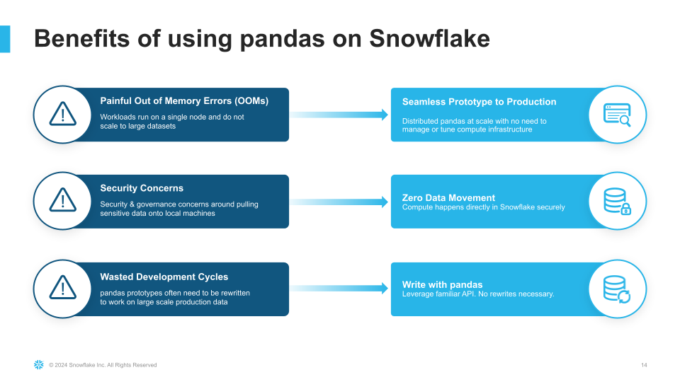
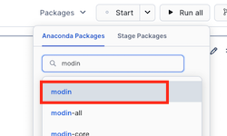

author: caleb-baechtold, doris-lee
id: getting_started_with_pandas_on_snowflake
language: en
summary: Through this quickstart guide, you will learn how to use pandas on Snowflake.
categories: Getting-Started
environments: web
status: Published 
feedback link: https://github.com/Snowflake-Labs/sfguides/issues
tags: Getting Started, Data Science, Data Engineering, Machine Learning, Snowpark

# Getting Started with pandas on Snowflake
<!-- ------------------------ -->
## Overview 

Through this quickstart guide, you will explore how to get started with [pandas on Snowflake](https://docs.snowflake.com/en/developer-guide/snowpark/python/snowpark-pandas) for scalable data processing, analysis, and transformation using familiar pandas API and semantics.

### What is pandas on Snowflake?

pandas on Snowflake lets you run your pandas code in a distributed manner scalably and securely directly on your data in Snowflake. Just by changing the import statement and a few lines of code, you can get the same pandas-native experience you know and love with the scalability and security benefits of Snowflake. With pandas on Snowflake this API, you can work with much larger datasets and avoid the time and expense of porting your pandas pipelines to other big data frameworks or provisioning large and expensive machines. It runs workloads natively in Snowflake through transpilation to SQL, enabling it to take advantage of parallelization and the data governance and security benefits of Snowflake. 

### Why use pandas on Snowflake?
pandas is the go-to data processing library for millions worldwide, including countless Snowflake users. However, pandas was never built to handle data at the scale organizations are operating today. Running pandas code requires transferring and loading all of the data into a single in-memory process. It becomes unwieldy on moderate-to-large data sets and breaks down completely on data sets that grow beyond what a single node can handle. With pandas on Snowflake, you can run the same pandas code, but with all the pandas processing pushed down to run in a distributed fashion in Snowflake. Your data never leaves Snowflake, and your pandas workflows can process much more efficiently using the Snowflake elastic engine. This brings the power of Snowflake to pandas developers everywhere.



pandas on Snowflake is delivered through the Snowpark pandas API, which you will learn how to use as part of this quickstart. This quickstart will focus on getting started with Snowpark pandas API, and enable you to perform common pandas operations on large volumes of data using the power of Snowflake.

### What you will learn 
- How to install and configure the Snowpark pandas library
- How to use Snowpark pandas to transform and analyze large datasets using the power of Snowflake

### Prerequisites
We will be using [Snowflake Notebooks](https://docs.snowflake.com/user-guide/ui-snowsight/notebooks) as part of this tutorial. You will need:
- A Snowflake account with [Anaconda Packages enabled by ORGADMIN](https://docs.snowflake.com/en/developer-guide/udf/python/udf-python-packages.html#using-third-party-packages-from-anaconda). If you do not have a Snowflake account, you can register for a [free trial account](https://signup.snowflake.com/?utm_cta=quickstarts_).
- A Snowflake account login with a role that has the ability to create database, schema, tables, stages, user-defined functions, and stored procedures. If not, you will need to register for a free trial or use a different role.

### What You’ll Build 
- A notebook leveraging pandas on Snowflake:
    - to load and clean up data
    - to perform common pandas operations and transformations at scale
    - to visualize data 

<!-- ------------------------ -->
## Set up the Snowflake environment
Duration: 2

1. Download the Git repo [here](https://github.com/Snowflake-Labs/sfguide-getting-started-with-snowpark-pandas).
2. Install the [Snowflake Public Data (Free)](https://app.snowflake.com/marketplace/listing/GZTSZ290BV255/snowflake-public-data-products-snowflake-public-data-free?search=snowflake%20public%20data%20) dataset. 
3. Run the following SQL commands in a SQL worksheet to create the [warehouse](https://docs.snowflake.com/en/sql-reference/sql/create-warehouse.html), [database](https://docs.snowflake.com/en/sql-reference/sql/create-database.html) and [schema](https://docs.snowflake.com/en/sql-reference/sql/create-schema.html).

```SQL
USE ROLE ACCOUNTADMIN;

-- Roles
SET MY_USER = CURRENT_USER();
CREATE OR REPLACE ROLE PANDAS_ROLE;
GRANT ROLE PANDAS_ROLE TO ROLE SYSADMIN;
GRANT ROLE PANDAS_ROLE TO USER IDENTIFIER($MY_USER);

GRANT IMPORTED PRIVILEGES ON DATABASE SNOWFLAKE TO ROLE PANDAS_ROLE;

-- Databases
CREATE OR REPLACE DATABASE PANDAS_DB;
GRANT OWNERSHIP ON DATABASE PANDAS_DB TO ROLE PANDAS_ROLE;

-- Warehouses
CREATE OR REPLACE WAREHOUSE PANDAS_WH WAREHOUSE_SIZE = XSMALL, AUTO_SUSPEND = 300, AUTO_RESUME= TRUE;
GRANT OWNERSHIP ON WAREHOUSE PANDAS_WH TO ROLE PANDAS_ROLE;


-- ----------------------------------------------------------------------------
-- Step #3: Create the database level objects
-- ----------------------------------------------------------------------------
USE ROLE PANDAS_ROLE;
USE WAREHOUSE PANDAS_WH;
USE DATABASE PANDAS_DB;

-- Schemas
CREATE OR REPLACE SCHEMA PUBLIC;

-- Create a table from the secure shared view
CREATE OR REPLACE TABLE STOCK_PRICE_TIMESERIES AS SELECT * FROM SNOWFLAKE_PUBLIC_DATA_FREE.PUBLIC_DATA_FREE.STOCK_PRICE_TIMESERIES;
```

These can also be found in the **setup.sql** file.

<!-- ------------------------ -->
## Create Snowflake Notebook
Duration: 10

### Navigate To Snowflake Notebooks

1. Navigate to the Notebooks section by clicking **Projects** and then **Notebooks**  
  
2. Click on the **down arrow* next to **+ Notebook**  
  
3. Select **Import .ipynb file**.
  

### Import .ipynb File
1. Download this [ipynb file](https://github.com/Snowflake-Labs/sfguide-getting-started-with-pandas-on-snowflake/blob/main/notebooks/0_start_here.ipynb) to your machine.
2. Navigate to where you have downloaded the ipynb file and select **0_start_here.ipynb** and click **Open**  
3. Give the notebook a name.
4. Select the database `PANDAS_DB` and schema `PUBLIC` to store the notebook
5. Select the warehouse `PANDAS_WH` for the notebook to run on. 

<!-- ------------------------ -->
## Get started with pandas on Snowflake
Duration: 20

Once you have created a notebook based on the [ipynb file](https://github.com/Snowflake-Labs/sfguide-getting-started-with-pandas-on-snowflake/blob/main/notebooks/0_start_here.ipynb)

### Add Required Python Libraries

pandas on Snowflake is available as part of the Snowpark Python package (version 1.17 and above). 
Snowpark Python comes pre-installed with the Snowflake Notebooks environment. 

Additionally, you will need to add the `modin` package in the `Packages` dropdown.

1. In the Notebook click on **Packages**  
2. Search for **modin** and select **modin** in the list  
  

### Run code in Notebook
Within this notebook, we will import the Snowpark pandas API, connect to Snowflake, and perform common pandas operations on a financial time series dataset.

<!-- ------------------------ -->
## Conclusion and Resources
Congratulations, you have successfully completed this quickstart! Through this quickstart, we were able to showcase how pandas on Snowflake allows pandas developers to easily get started processing and analyzing data at tremendous scale using familiar programming constructs and APIs.

### What you learned
- How to install and configure the Snowpark pandas library
- How to use pandas on Snowflake to transform and analyze large datasets using the power of Snowflake

### Related Resources

For more information, check out the resources below:

- [Source Code on GitHub](https://github.com/Snowflake-Labs/sfguide-getting-started-with-snowpark-pandas)
- [Documentation: pandas on Snowflake Developer Guide](https://docs.snowflake.com/developer-guide/snowpark/python/pandas-on-snowflake)
- [Quickstart: Data Engineering Pipeline with pandas on Snowflake](https://quickstarts.snowflake.com/guide/data_engineering_pipelines_with_snowpark_pandas/)
<!-- ------------------------ -->
