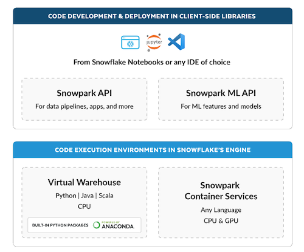
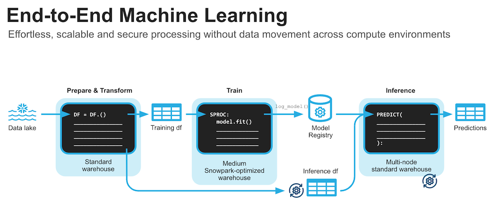

author: Mats Stellwall
id: getting_started_with_snowpark_python_scikit
language: en
summary: Getting Started with Snowpark for Python with Scikit-learn
categories: Getting-Started
environments: web
status: Published 
feedback link: https://github.com/Snowflake-Labs/sfguides/issues
tags: Getting Started, Data Science, Data Engineering

# Getting Started with Snowpark for Python with Scikit-learn
<!-- ------------------------ -->
## Overview 
Duration: 5

By completing this guide, you will be able to go from raw data to build a machine learning model that can help to predict house prices.

Here is a summary of what you will be able to learn in each step by following this quickstart:

- **Setup Environment**: Use write_pandas and tables to ingest raw data from local file system into Snowflake
- **Data Engineering**: Leverage Snowpark for Python DataFrames to perform data transformations such as group by, aggregate, pivot, and join to prep the data for downstream applications.
- **Machine Learning using scikit learn**: Prepare data and run ML Training in Snowflake using scikit-learn and log the model to Snowflake Model Registry.

In case you are new to some of the technologies mentioned above, here’s a quick summary with links to documentation.

### What is Snowpark?

The Snowpark API provides an intuitive library for querying and processing data at scale in Snowflake. Using a library for any of three languages, you can build applications that process data in Snowflake without moving data to the system where your application code runs, and process at scale as part of the elastic and serverless Snowflake engine.

Snowflake currently provides Snowpark libraries for three languages: Java, Python, and Scala.



Learn more about [Snowpark](https://www.snowflake.com/snowpark/).

### What is scikit-learn?

It is one of the most popular [open source](https://scikit-learn.org/) machine learning libraries for Python that also happens to be pre-installed and available for developers to use in Snowpark for Python via [Snowflake Anaconda](https://snowpark-python-packages.streamlit.app/) channel. This means that you can use it in Snowpark for Python User-Defined Functions and Stored Procedures without having to manually install it and manage all of its dependencies.

### What You’ll Learn

* How to ingest data in Snowflake
* How to do data explorations and understanding with Pandas and visualization
* How to encode the data for algorithms to use
* How to normalize the data
* How to training models with Scikit-Learn and Snowpark (including using Snowpark Optimized warehouse)
* How to evaluate models for accuracy
* How to deploy models on Snowflake

### Prerequisites

- A Snowflake account with [Anaconda Packages enabled by ORGADMIN](https://docs.snowflake.com/en/developer-guide/udf/python/udf-python-packages.html#using-third-party-packages-from-anaconda). If you do not have a Snowflake account, you can register for a [free trial account](https://signup.snowflake.com/?utm_cta=quickstarts_).
- You will need to accept acknowledge the Snowflake Third Party Terms by following Anaconda link in previous step.
- A Snowflake account login with ACCOUNTADMIN role. If you have this role in your environment, you may choose to use it. If not, you will need to 1) Register for a free trial, 2) Use a different role that has the ability to create database, schema, tables, stages, and stored procedures OR 3) Use an existing database and schema in which you are able to create the mentioned objects.

<!-- ------------------------ -->
## Clone GitHub Repository

Duration: 8

This section covers cloning of the GitHub repository and creating a Python 3.10 environment.

1) Clone [GitHub repository](https://github.com/Snowflake-Labs/sfguide-snowpark-scikit-learn)

2) Download the miniconda installer from [https://conda.io/miniconda.html](https://conda.io/miniconda.html). *(OR, you may use any other Python environment with Python 3.10)*.

3) Open `environment.yml` and paste in the following config:

```yaml
name: snowpark_scikit_learn
channels:
  - https://repo.anaconda.com/pkgs/snowflake/
  - nodefaults
dependencies:
  - python=3.10
  - pip
  - snowflake-snowpark-python==1.23.0
  - snowflake-ml-python==1.6.4
  - snowflake==1.0.0
  - ipykernel
  - matplotlib
  - seaborn
```

4) From the root folder, create conda environment by running below command.

> aside positive
> IMPORTANT:
> - If you are using a machine wth Apple M1 chip, follow [these instructons](https://docs.snowflake.com/en/developer-guide/snowpark/python/setup) to create the virtual environment and install Snowpark Python instead of what's described below.

```python
conda env create -f environment.yml
conda activate snowpark_scikit_learn
```

5) Download and install [VS Code](https://code.visualstudio.com/) or you could use juypter notebook or any other IDE of your choice

6) Update [config.py](https://github.com/Snowflake-Labs/sfguide-snowpark-scikit-learn/blob/main/config.py) with your Snowflake account details and credentials.

> aside negative
> Note: For the account parameter, specify your [account identifier](https://docs.snowflake.com/en/user-guide/admin-account-identifier.html) and do not include the snowflakecomputing.com domain name. Snowflake automatically appends this when creating the connection.*

---

### Troubleshooting `pyarrow` related issues

- If you have `pyarrow` library already installed, uninstall it before installing Snowpark.
- If you do not have `pyarrow` installed, you do not need to install it yourself; installing Snowpark automatically installs the appropriate version.
- Do not reinstall a different version of `pyarrow` after installing Snowpark.

<!-- ------------------------ -->
## Data Ingest

Duration: 10

The Notebook linked below covers the following data ingestion tasks.

1) Download data file to be used in the lab
2) Read downloaded data as pandas dataframe
3) Connect to Snowflake using session object
4) Create database, schema and warehouse
5) Load pandas dataframe object into Snowflake table

### Data Ingest Notebook in Jupyter or Visual Studio Code

To get started, follow these steps:

1) In a terminal window, browse to this folder and run `jupyter notebook` at the command line. (You may also use other tools and IDEs such Visual Studio Code.)

2) Open and run through the cells in [1_snowpark_housing_data_ingest.ipynb](https://github.com/Snowflake-Labs/sfguide-snowpark-scikit-learn/blob/main/1_snowpark_housing_data_ingest.ipynb)

> aside positive
> IMPORTANT: Make sure in the Jupyter notebook the (Python) kernel is set to ***snowpark_scikit_learn***-- which is the name of the environment created in **Clone GitHub Repository** step.

<!-- ------------------------ -->

## Data Exploration

Duration: 20

The Notebook linked below covers the following data exploration tasks.

1) Establish secure connection from Snowpark Python to Snowflake
2) Compare Snowpark dataframe to Pandas dataframe
3) Use describe function to understand data
4) Build some visualisation using seaborn and pyplot

### Data Exploration Notebook in Jupyter or Visual Studio Code

To get started, follow these steps:

1) If not done already, in a terminal window, browse to this folder and run `jupyter notebook` at the command line. (You may also use other tools and IDEs such Visual Studio Code.)

2) Open and run through the cells in [2_data_exploration_transformation.ipynb](https://github.com/Snowflake-Labs/sfguide-snowpark-scikit-learn/blob/main/2_data_exploration_transformation.ipynb)

> aside positive
> IMPORTANT: Make sure in the Jupyter notebook the (Python) kernel is set to ***snowpark_scikit_learn***-- which is the name of the environment created in **Clone GitHub Repository** step.

<!-- ------------------------ -->

## Machine Learning using Scikit learn

Duration: 30

> aside negative
> PREREQUISITE: Successful completion of previous steps

The Notebook linked below covers the following machine learning tasks.

1) Establish secure connection from Snowpark Python to Snowflake
2) Get features and target from Snowflake table into Snowpark DataFrame
3) Create Snowflake stage for the [Python Stored Procedure](https://docs.snowflake.com/en/sql-reference/stored-procedures-python) code
4) Prepare features using scikit learn for model training
5) Create a [Python Stored Procedure](https://docs.snowflake.com/en/sql-reference/stored-procedures-python) to deploy model training code on Snowflake
6) Optinally use Snowpark optimised warehouse for model training
7) Log the model to [Snowflake Model Registry](https://docs.snowflake.com/en/developer-guide/snowflake-ml/model-registry/overview) and use it for inference on new data points

---



---

### Machine Learning Notebook in Jupyter or Visual Studio Code

To get started, follow these steps:

1) If not done already, in a terminal window, browse to this folder and run `jupyter notebook` at the command line. (You may also use other tools and IDEs such Visual Studio Code.)

2) Open and run through the [3_snowpark_end_to_end_ml.ipynb](https://github.com/Snowflake-Labs/sfguide-snowpark-scikit-learn/blob/main/3_snowpark_end_to_end_ml.ipynb)

> aside positive
> IMPORTANT: Make sure in the Jupyter notebook the (Python) kernel is set to ***snowpark_scikit_learn*** -- which is the name of the environment created in **Clone GitHub Repository** step.


<!-- ------------------------ -->

## Conclusion And Resources

Duration: 5

Congratulations! You've successfully completed the lab using Snowpark for Python and scikit-learn.

### What You Learned

  - How to ingest data in Snowflake
    
  - How to do data explorations and understanding with Pandas and visualization
    
  - How to encode the data for algorithms to use
    
  - How to normalize the data
    
  - How to training models with Scikit-Learn and Snowpark (including using Snowpark Optimized warehouse)
    
  - How to evaluate models for accuracy
    
  - How to deploy models on Snowflake and do inferencing

### Related Resources

- [Full demo on Snowflake Demo Hub](https://developers.snowflake.com/demos/predict-home-prices-using-machine-learning/)
- [Source Code on GitHub](https://github.com/Snowflake-Labs/sfguide-snowpark-scikit-learn)
- [Advanced: Snowpark for Python Data Engineering Guide](https://quickstarts.snowflake.com/guide/data_engineering_pipelines_with_snowpark_python/index.html)
- [Advanced: Snowpark for Python Machine Learning Guide](https://quickstarts.snowflake.com/guide/getting_started_snowpark_machine_learning/index.html)
- [Snowpark for Python Demos](https://github.com/Snowflake-Labs/snowpark-python-demos/blob/main/README.md)
- [Snowpark for Python Developer Guide](https://docs.snowflake.com/en/developer-guide/snowpark/python/index.html)
- [Streamlit Docs](https://docs.streamlit.io/)
- [Download Reference Architecture](https://www.snowflake.com/content/dam/snowflake-site/developers/2024/03/Industry-Solutions-Use-Predict-Home-Prices-using-ML.pdf)
- [Read the Blog](https://medium.com/snowflake/building-ml-workflows-with-scikit-learn-and-snowflake-e879234edb0d)
- [Watch the Demo](https://youtu.be/zbKLOw66LQk?list=TLGGlDtv7VvSbXUyNDA5MjAyNQ)

