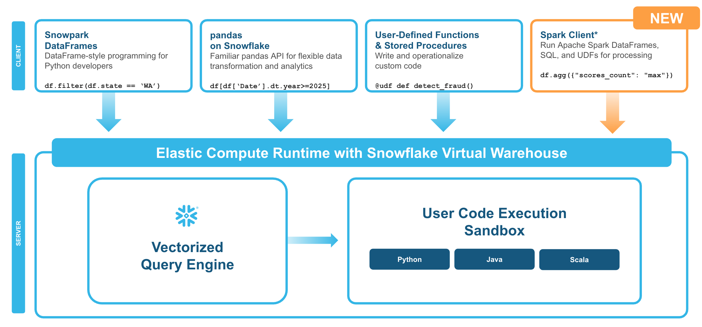

author: Vino Duraisamy, Kala Govindarajan
id: getting_started_with_snowpark_connect_for_apache_spark
categories: snowflake-site:taxonomy/solution-center/certification/quickstart, snowflake-site:taxonomy/product/data-engineering, snowflake-site:taxonomy/snowflake-feature/snowpark
language: en
summary: This quickstart guide shows you how to get started with Snowpark Connect for Apache Spark™ categories: Getting-Started
environments: web
status: Published
feedback link: https://github.com/Snowflake-Labs/sfguides/issues

# Getting Started with Snowpark Connect for Apache Spark
<!-- ------------------------ -->
Duration:5

## Overview

Through this quickstart, you will learn how to get started with [Snowpark Connect for Apache Spark™](https://www.snowflake.com/en/blog/snowpark-connect-apache-spark-preview/). Using Snowpark Connect for Apache Spark, you can run Spark workloads directly on Snowflake.

### What You’ll Learn

By the end of this quickstart, you will learn how to:

* Connect to the Snowpark Connect server
* Execute simple PySpark code
* Create nested table structures in PySpark and write to Snowflake

### What is Snowpark?

Snowpark is the set of libraries and code execution environments that run Python and other programming languages next to your data in Snowflake. Snowpark can be used to build data pipelines, ML models, apps, and other data processing tasks.

### What is Snowpark Connect for Apache Spark™?

With Snowpark Connect for Apache Spark, you can connect your existing Spark workloads directly to Snowflake and run them on the Snowflake compute engine. Snowpark Connect for Spark supports using the Spark DataFrame API on Snowflake. All workloads run on Snowflake warehouse. As a result, you can run your PySpark dataframe code with all the benefits of the Snowflake engine.

In Apache Spark™ version 3.4, the Apache Spark community introduced Spark Connect. Its decoupled client-server architecture separates the user’s code from the Spark cluster where the work is done. This new architecture makes it possible for Snowflake to power Spark jobs.

### What You'll Build

* Run simple PySpark code examples from Snowflake

* Create a Spark UDF(User Defined Function), register it and invoke it directly from a Snowflake Notebook

* Create a Snowflake Python Function and invole it with SQL passthrough from Spark

### Prerequisites

* A Snowflake account. If you do not have a Snowflake account, you can register for a [free trial account](https://signup.snowflake.com/).

<!-- ------------------------ -->
## Run PySpark Code

Duration:10

During this step you will learn how to run PySpark code on Snowflake to:

* Connect to the Snowpark Connect server
* Create nested table structures in PySpark and write to Snowflake

Sign up for a [Snowflake Free Trial](https://signup.snowflake.com/) account and login to Snowflake home page. 

Download the `ipynb` from [this git repository](https://github.com/Snowflake-Labs/sf-samples/blob/main/samples/snowpark_connect/snowparkconnect_demo.ipynb).

### Import the Notebook with PySpark code into Snowflake

* In the Snowsight UI, navigate to `Projects` and click on `Notebooks`.
* On the top right, click on the down arrow next to `+ Notebook` and select `Import ipynb file`.
* Select the `snowparkconnect_demo.ipynb` you had downloaded earlier.
* Select notebook location as `snowflake_learning_db` and `public` schema.
* Select `run on warehouse` option, select `query warehouse` as `compute_wh` and `create`.

Now you have successfully imported the notebook that contains PySpark code.

### Install snowpark-connect Package and run the code

Next up, select the packages drop down at the top right of the notebook. Look for `snowpark-connect` package and install it using the package picker.

After the installation is complete, start or restart the notebook session.

Follow along and run each of the cells in the [Notebook](https://github.com/Snowflake-Labs/sf-samples/blob/main/samples/snowpark_connect/snowparkconnect_demo.ipynb).

<!-- ------------------------ -->
## Conclusion And Resources

Duration:2

Congratulations, you have successfully completed this quickstart! 

### What You Learned

* Connect to the Snowpark Connect server
* Execute simple PySpark code
* Create nested table structures in PySpark and write to Snowflake

### Related Resources

* [Snowpark Connect](https://docs.snowflake.com/en/developer-guide/snowpark-connect/snowpark-connect-overview)   
* [Source code on GitHub](https://github.com/Snowflake-Labs/sf-samples/blob/main/samples/snowpark_connect/snowparkconnect_demo.ipynb)  
