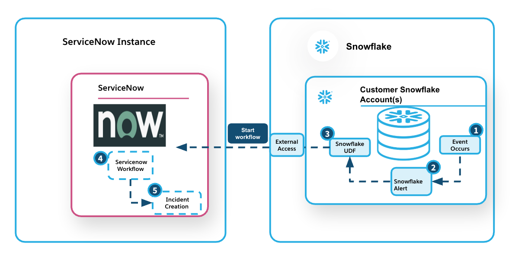
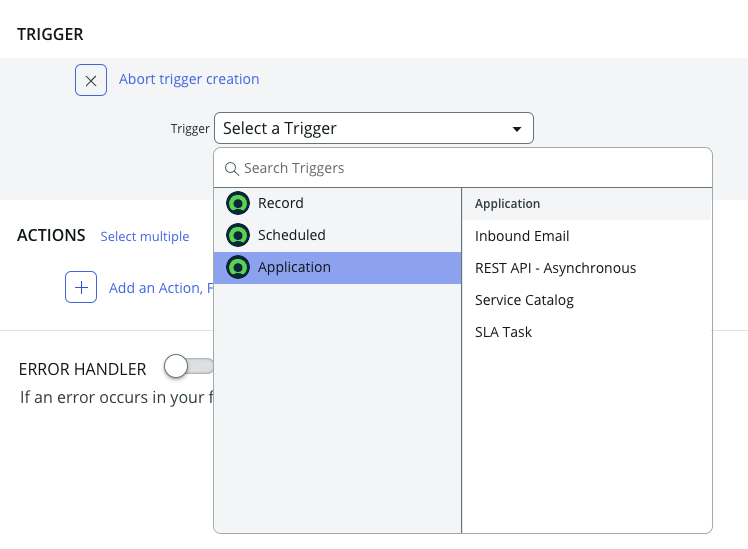
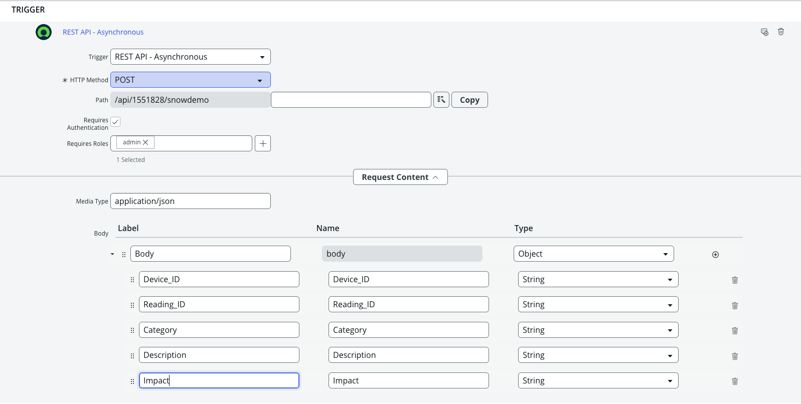
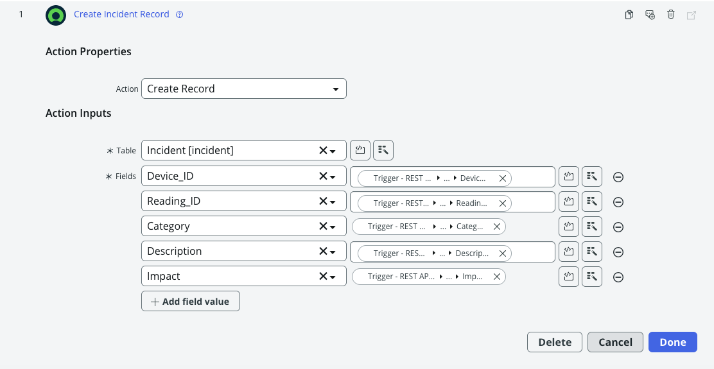

author: 
id: insights-to-action-with-snowflake-and-servicenow
language: en
summary: insights-to-action-with-snowflake-and-servicenow
categories: Getting-Started
environments: web
status: Published 
feedback link: https://github.com/Snowflake-Labs/sfguides/issues
tags: Getting Started, Data Science, Data Engineering 

# Insights to Action With Snowflake and ServiceNow
<!-- ------------------------ -->
## Overview 
Duration: 2

ServiceNow Workflows automate business processes by defining a series of tasks, approvals, and conditions within the platform. They help streamline IT service management (ITSM), HR, customer service, and other enterprise functions by reducing manual effort and enforcing consistency. Workflows can be triggered manually or automatically based on certain events such as insights generated in  your data and AI platform.

In this guide you will learn how to automatically trigger ServiceNow Workflow based on insights generated in Snowflake. 

Here is a high level pictorial representation of the architecture showing interaction between Snowflake and ServiceNow.



 

<!-- It is important to include on the first page of your guide the following sections: Prerequisites, What you'll learn, What you'll need, and What you'll build. Remember, part of the purpose of a Snowflake Guide is that the reader will have **built** something by the end of the tutorial; this means that actual code needs to be included (not just pseudo-code).
The rest of this Snowflake Guide explains the steps of writing your own guide.  -->

### Prerequisites

Familiarity with SQL and REST API

### What You’ll Learn 

- How to create a ServiceNow workflow with a REST inbound trigger 
- How to securely connect to the ServiceNow Instance from Snowflake
- How to use Snowflake alerts to flag an event
- How to start the ServiceNow workflow from Snowflake   


### What You’ll Need 

- A [Snowflake](https://signup.snowflake.com/?utm_cta=quickstarts_) Account 
- A [ServiceNow](https://developer.servicenow.com/dev.do) Personal Developer Instance. 
- To create a REST API trigger, you’ll need to enable the Integration Hub Enterprise Pack Plugin as outlined in this [link](https://developer.servicenow.com/dev.do#!/learn/learning-plans/washingtondc/servicenow_application_developer/app_store_learnv2_rest_washingtondc_exercise_activate_integrationhub)

### What You’ll Build 

A solution to automatically trigger workflows in ServiceNow based on insights generated in Snowflake. The solution supports a **push model**, eliminating the need for continuous polling. On the ServiceNow side, you can use the data from Snowflake to perform pre-checks and enable intelligent routing of requests.  

### How can you use the solution  

Some of the use cases where this solution can drive real business value across departments:

**Human Resources (HR)**
- Scenario: Onboarding Readiness Check
- Insight in Snowflake: A scheduled Snowflake job finds that access provisioning is incomplete for new hires starting next week.
- Trigger: Starts a ServiceNow onboarding workflow to notify HR, IT, and facilities.
- Benefit: Prevents first-day delays and ensures smooth onboarding.

**IT Operations / Infrastructure**
- Scenario: Predictive Maintenance for Devices
- Insight in Snowflake: IoT sensor data analysis predicts a cooling system will likely fail within 3 days.
- Trigger: Creates a maintenance request in ServiceNow and assigns to the facilities team.
- Benefit: Enables proactive repairs, reduces downtime and costs.

**Supply Chain / Inventory**
- Scenario: Inventory Shortage Alert
- Insight in Snowflake: Real-time data shows a critical product is below the safety stock threshold.
- Trigger: Triggers a ServiceNow procurement workflow to reorder supplies.
- Benefit: Avoids stockouts and maintains continuity in operations.

## Create ServiceNow Workflow   
Duration: 5

In this quickstart, we will implement **Use Case 2: IT Operations / Infrastructure**.

IoT sensor data from manufacturing devices is ingested into Snowflake for real-time monitoring. When specific thresholds are breached, a record is inserted into the **device_signals** table, indicating a potential issue. This event then triggers a ServiceNow workflow that creates an incident, which is subsequently assigned to the on-call field agent.

Let’s begin by defining a workflow in ServiceNow to respond to the incoming trigger.


1. Navigate to your ServiceNow Personal Developer Instance -> All -> Workflow Studio -> Homepage 

2. Select New -> Flow. Define a name for the flow "snowdemo". Leave the rest as default. 


3. Choose a trigger for the flow. Go to Application -> REST API - Asynchronous 



Set the HTTP Method to "POST" 

Check the box "Requires Authentication" to ensure that only authenticated users can trigger the workflow. 

In the Request Content Body, create the following variables:

Device_ID - This will be the ID for the device from the plant.
Reading_ID - This will be the ID for the reading that triggered the event
Description - This will be a brief description of the event that occured 
Category - This will be the category of the error eg. 'Hardware', 'Software' etc  
Impact - The likely impact of the event such as '1-High', '2-Medium' etc 

You may optionally add headers or roles for the REST request, but we’ll skip that for this tutorial.

Click "Done". 

Your trigger definition should now look like this:


Now that the trigger is configured, the next step is to define the action for the workflow — creating an incident record.

Select Action → Create Record → Table: incident

In this example, we’ve added custom fields to the incident table to capture IoT-specific data like Device_ID and Reading_ID.
You can add new fields to a ServiceNow table using this guide:
[Add New Field](https://www.servicenow.com/docs/bundle/yokohama-platform-administration/page/administer/field-administration/task/t_CreatingNewFields.html#:~:text=Define%20a%20task%20relationship%20allowed,Use%20disjunctions%20in%20complex%20queries) 

Map the fields in the incident record to the input variables received in the inbound REST request.

Use the Data Pill Picker to set the values for each field:

Navigate to Data Pill Picker → Trigger → REST API - Asynchronous → Request Body → Field Name


Once you've mapped all fields, your action definition should resemble this:



Click Done. This completes your workflow definition in ServiceNow. 


## Create Connection to ServiceNow
Duration: 4

Now that the ServiceNow workflow is defined, the next step is to create a connection from Snowflake to your ServiceNow instance. To do this, we will leverage a few Snowflake primitives that enable secure, external API access:

**Snowflake Secret**:
Used to securely store authentication credentials for the ServiceNow instance (e.g., username and password).

**External Access Integration**:
Enables Snowflake to securely make external REST API calls to ServiceNow from within a stored procedure or UDF.


```sql
CREATE OR REPLACE  SECRET servicenowkey
   TYPE = PASSWORD
  USERNAME = 'admin'
  PASSWORD = 'Password for your servicenow user'
 COMMENT = 'secret for servicenow api access' ;

```
Next, you need to define a network rule that identifies the ServiceNow instance by hostname. This rule will be referenced in the external access integration to allow Snowflake to securely communicate with the specified ServiceNow endpoint.

```sql

  CREATE OR REPLACE NETWORK RULE servicenow_apis_network_rule
  MODE = EGRESS
  TYPE = HOST_PORT
  VALUE_LIST = ('InstanceID.service-now.com');


  CREATE OR REPLACE EXTERNAL ACCESS INTEGRATION servicenow_apis_access_integration
  ALLOWED_NETWORK_RULES = (servicenow_apis_network_rule)
  ALLOWED_AUTHENTICATION_SECRETS = (servicenowkey)
  ENABLED = true;

```

This completes the connection to ServiceNow.

We also need to create a table to store all the events on which alerts will be triggered. 
To build a sample events table for the use case, run the SQL statement below. This will create a **device_signals** table that simulates a manufacturing plant environment and stores entries whenever a trigger condition—such as "device temperature too high"—occurs.

```sql 
create database iot_demo; 

use database iot_demo; 

create or replace schema public; 

CREATE OR REPLACE TABLE device_signals (
    signal_id STRING PRIMARY KEY,
    device_id STRING REFERENCES devices(device_id),
    reading_id STRING REFERENCES device_readings(reading_id),
    signal_type STRING,
    category STRING,
    impact STRING,
    timestamp TIMESTAMP
);

```
We will also create a table to store all the workflow executions and the corresponding event details. 

``` sql 

CREATE OR REPLACE TABLE workflow_log (
    device_id STRING,
    reading_id STRING,
    signal_type STRING,
    category STRING,
    impact STRING,
    workflow_execution_id STRING,
    execution_time TIMESTAMP_TZ);
    
```

## Create Snowflake Alert
Duration: 4

So far, we have the workflow set up in ServiceNow and the device_signals table created in Snowflake. Next, we need to define an alert that will be triggered when a specified condition occurs. This alert will call a UDF that passes the event details and starts the corresponding workflow in ServiceNow.

The exact method for detecting an impending issue is beyond the scope of this quickstart. It could be based on business rules (e.g., temperature exceeding a certain threshold) or a predictive model built using Snowflake Cortex that evaluates multiple parameters to identify potential device failures.

Let’s begin by creating the UDF, as we’ll be referencing it in the alert definition.

```sql 

CREATE OR REPLACE FUNCTION servicenow_action(device_id STRING,reading_id STRING,signal_type STRING,
category STRING,impact STRING )
RETURNS String
LANGUAGE PYTHON
EXTERNAL_ACCESS_INTEGRATIONS = (servicenow_apis_access_integration)
SECRETS = ('cred' = servicenowkey)
RUNTIME_VERSION = 3.9
HANDLER = 'call_servicenow_flow'
PACKAGES = ('pandas', 'requests')
AS $$

import json
import requests
import _snowflake
from requests.auth import HTTPBasicAuth

session = requests.Session()


def call_servicenow_flow(device_id,reading_id,signal_type,category,impact):
    payload={}
# The full path for the REST API endpoint we created in Step 1 
    url = "https://InstanceID.service-now.com/api/1551828/snowdemo"

# Optional Headers for the API call if you have defined them in the REST API 
    headers = {
        "Accept": "application/json",
        "Content-Type": "application/json"
        }

# Payload for the POST request
    data = {
        "Device_ID"  : device_id,
        "Reading_ID": reading_id,
        "Description":signal_type,
        "Category":category,
        "Impact":impact
        }


    # Username and password from snowflake secret we defined earlier
    username_password_object = _snowflake.get_username_password('cred');
    basic = HTTPBasicAuth(username_password_object.username, username_password_object.password)


 
    response = session.post(url,headers=headers,json=data,auth=basic)

    if response.status_code == 202:
        json_result=response.json()
        executionId=json_result["result"]["executionId"]
        return executionId
    else:
        error_string="Rest call failed. Please check Servicenow endpoint"
        return (error_string)
$$

```

Now let’s define the alert. This is a Snowflake feature that can be automatically activated by new rows in a table, rather than relying on a set schedule. For every new row inserted or updated, you can define a condition—and if that condition is met, the alert is triggered. There’s no need to specify a schedule or continuously poll the table.

In our case, when an event with a potential **'1-High'** impact is inserted into the **device_signals** table, the alert is fired. As part of its action, the alert starts the workflow in ServiceNow using the function we defined earlier.

``` sql

CREATE OR REPLACE ALERT device_alert
  IF( EXISTS(
    SELECT device_id,reading_id,signal_type,category,impact FROM device_signals where impact='1-High'))
  THEN
    insert into  workflow_log
    SELECT device_id,reading_id,signal_type,category,impact,servicenow_action(device_id,reading_id,
    signal_type,category,impact),current_timestamp()  FROM device_signals where impact ='1-High';

    ALTER TABLE device_signals SET CHANGE_TRACKING = TRUE;

 ```

This completes all the plumbing we need to put in place to trigger the workflow from snowflake.


## Execute the Workflow 
Duration: 2

The final step is to test our integration. Since we’ve defined the trigger condition as a **'1-High'** impact event being logged in the **device_signals** table, let’s insert a record and verify that the corresponding incident is automatically created in ServiceNow—without any additional user intervention. This should also insert a record into the **workflow_log** table, capturing the execution ID of the ServiceNow workflow.


```sql 
INSERT INTO device_signals (signal_id, device_id,reading_id, signal_type, category,impact, timestamp) VALUES
('SG1', 'D1056','R200',  'Device temperature fluctuating rapidly','Hardware','1-High',current_timestamp());

```
You can query the **workflow_log** table to find the new row with the recorded readings, along with the execution ID that represents the workflow run in ServiceNow.

Next, log in to ServiceNow and check the incident that was created:
Navigate to **Workflow Studio → Workflow → Executions**, select the latest execution, and review the corresponding incident record.

Voila! You now have an incident record created in ServiceNow—automatically triggered from Snowflake.


## Conclusion And Resources
Duration: 2

Congratulations—you’ve made it to the end!
In this quickstart, you learned how to automatically trigger a workflow in ServiceNow from Snowflake. Together, Snowflake and ServiceNow offer a powerful opportunity to streamline and enhance business operations by transforming raw data insights into actionable outcomes.


### What You Learned
- Create a workflow in ServiceNow to accept REST input. 
- Set up a connection from Snowflake to ServiceNow using external access.
- Trigger the workflow from Snowflake based on a specific event condition. 


### Kindly fill out the survey below for informational purposes only.

[Survey](https://forms.gle/Y6kGwymDCueoz9g88)

### Related Resources
- [ServiceNow Trigger](https://www.servicenow.com/docs/bundle/xanadu-integrate-applications/page/administer/integrationhub/concept/rest-trigger.html)
- [Snowflake External Access Integration](https://docs.snowflake.com/en/sql-reference/sql/create-external-access-integration)