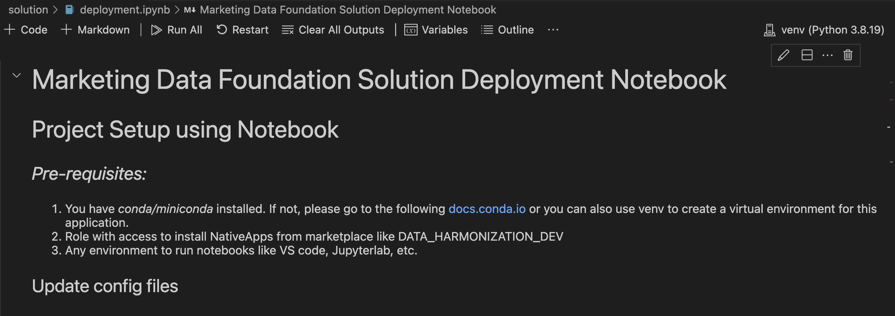
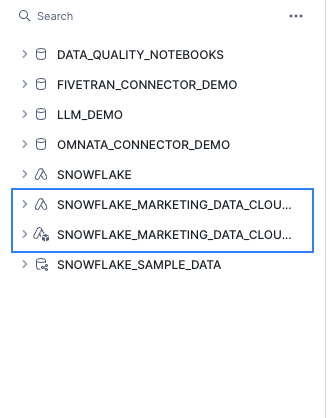
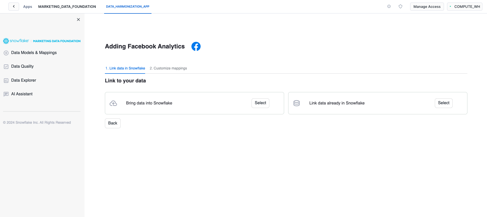
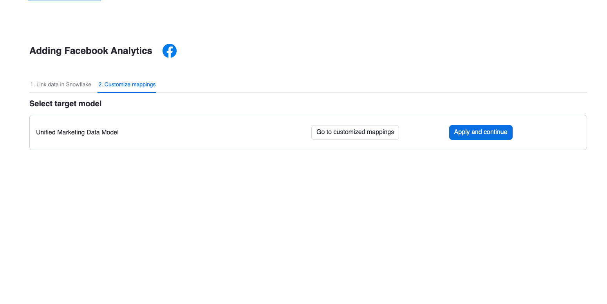
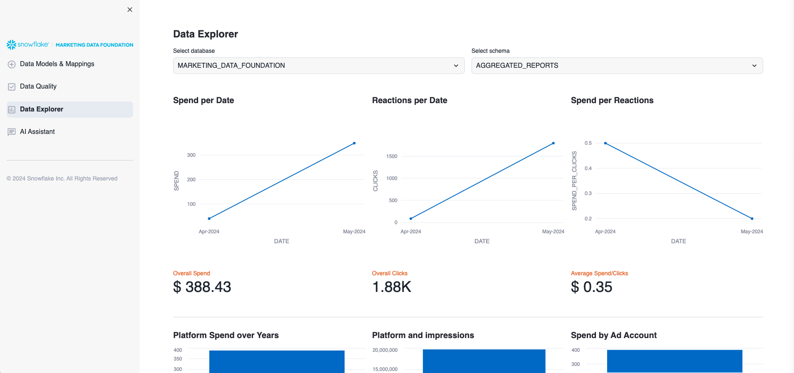
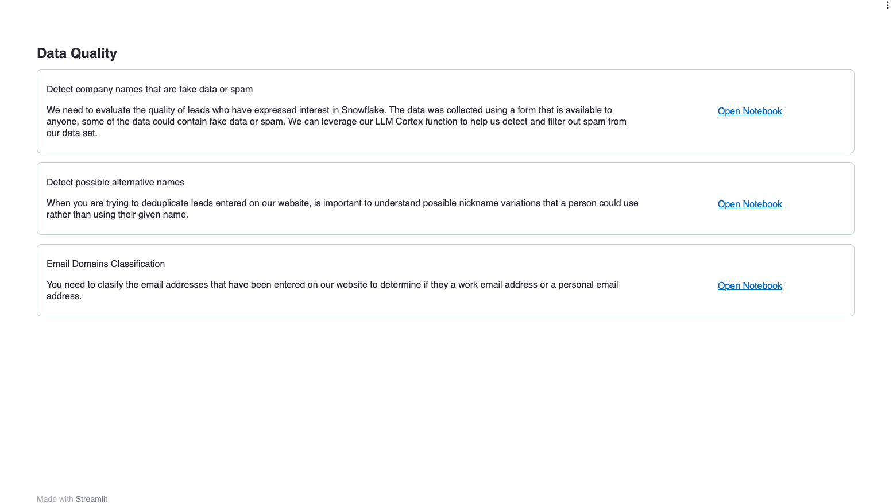
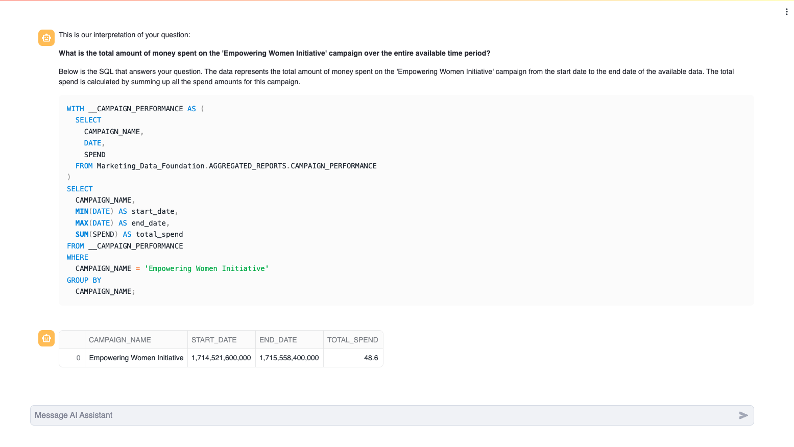

author: Manuel Figueroa
id: marketing_data_foundation_starter_v2
language: en
summary: Marketing Data Foundation V2
categories: Data-Engineering
environments: web
status: Hidden
feedback link: https://github.com/Snowflake-Labs/sfguides/issues
tags: Marketing, Data Engineering, Native Application

# Marketing Data Foundation Starter V2 Guide
<!-- ------------------------ -->
## Overview

Duration: 15

Customers looking to use Snowflake for marketing use cases initially face a significant challenge: it is difficult to import all relevant marketing data into Snowflake and structure it in a unified format that downstream applications can easily utilize to power data-driven marketing.
This starter solution tackles this challenge by offering an integrated application that unifies data sets from different Connectors and Marketing Data providers.

In this example, we are adding support for 
  - Fivetran / Facebook Ads
  - Omnata / LinkedIn Ads

This solution was inspired by how Snowflake runs its own end-to-end Marketing workflows entirely on top of the Snowflake AI Data Cloud for Marketing.


### Problem Space

In the fast-evolving marketing landscape, the emphasis on data-driven strategies has become more pronounced than ever. A significant trend is the increase in Martech investments, with 63% of Chief Marketing Officers (CMOs) planning to increase their spending within the next 12 months. Such investments are crucial for enhancing customer engagement, refining marketing strategies, and driving sales through advanced data analysis.
The high ROI that businesses achieve from data-driven personalization also highlights its importance. Reports indicate that enterprises see returns of 5 to 8 times on their marketing budgets, which demonstrates the value of personalized marketing in boosting conversion rates, enhancing customer loyalty, and increasing revenue.

Additionally, the industry is shifting towards first-party data ownership, a move propelled by the deprecation of third-party cookies. This shift is essential for maintaining direct customer relationships and adapting to changing privacy norms. The promise of generative AI and the understanding that an effective AI strategy requires a robust data strategy have spurred efforts to centralize marketing data within Snowflake. Organizations aim to organize data into standard schemas that Large Language Models (LLMs) can understand, employing these models in innovative ways to personalize content and predict customer behavior.
Two types of first-party data are pivotal in these efforts: Customer 360 Data and Campaign Intelligence. The former strives to provide a holistic view of the customer by integrating and managing comprehensive data. In contrast, Campaign Intelligence focuses on data related to marketing campaigns, aiming to optimize performance and strategy. These elements are fundamental to successful data-driven marketing, underscoring the need for sophisticated data management and analytics capabilities.

### Solution Space

#### Context

As described in the diagram below, this solution aims to support the two Marketing Execution use cases: Planning & Activation, and Measurement.


More specifically, this solution covers Data Ingestion, Semantic Unification, and base Analytics for the Campaign Intelligence data.


### Solution Details

The solution consists of the following components:

  - Native Application: The code needed to build and deploy this solution as a Native App. You will deploy this app in your own Snowflake account.

<!-- ------------------------ -->

### The App Architecture

This solution consists of a native application that provides a framework to easily unify marketing data sources and then leverage LLM functions to explore that data and get valuable business intelligence information from the data that was ingested.


<!-- ------------------------ -->


### What You'll Build 
- Marketing Data Foundation Solution Native application


### What You'll Learn
- The working mechanics of a native application.
- How to build and push a native app related to Marketing Campaign Intelligence data.
- How to use open source AI model for handle your marketing data.

### Prerequisites

- A [GitHub](https://github.com/) Account 
- [VSCode](https://code.visualstudio.com/download) Installed
- [Snow CLI](https://docs.snowflake.com/en/developer-guide/snowflake-cli-v2/installation/installation) Installed 
- [Python](https://www.python.org/downloads/) Installed
- Install [Snow CLI](https://docs.snowflake.com/en/developer-guide/snowflake-cli-v2/installation/installation)

> ⚠️ **This application requires Streamlit Custom Components** Request this to be enabled in your account and in the application package.

<!-- ------------------------ -->

## Setup

### Clone GitHub repository
Duration: 2

Clone the git repo to your local

```console
git clone https://github.com/Snowflake-Labs/sfguide-marketing-data-foundation-solution
```

### Create a connection

```console
snow connection add
```

Refer to the screenshot below for more info.

```shell
Name for this connection: marketing_demo_conn
Snowflake account name: ******
Snowflake username: <YOUR USERNAME>
Snowflake password [optional]:
Role for the connection [optional]: ACCOUNTADMIN
Warehouse for the connection [optional]: COMPUTE_WH
Database for the connection [optional]: snowflake
Schema for the connection [optional]: account_usage
Connection host [optional]:
Connection port [optional]:
Snowflake region [optional]: us-west-1
Authentication method [optional]:
Path to private key file [optional]:
Wrote new connection marketing_demo_conn to /Users/******/Library/Application Support/snowflake/config.toml
```


To review the new created connection use:
```console
snow connection list
```

Refer to the screenshot below:
```shell
+--------------------------------------------------------------------------------------------------------------------------------------------------------------------------------------------------------------+
| connection_name     | parameters                                                                                                                                                                             |
|---------------------+----------------------------------------------------------------------------------------------------------------------------------------------------------------------------------------|
| marketing_demo_conn | {'account': '******', 'user': '******', 'password': '****', 'region': 'us-west-1', 'database': 'snowflake', 'schema': 'account_usage', 'warehouse': 'COMPUTE_WH', 'role':      |
|                     | 'ACCOUNTADMIN'}                                                                                                                                                                        |
+--------------------------------------------------------------------------------------------------------------------------------------------------------------------------------------------------------------+
```

## Deploy the Native application

Duration: 2

We prepared a deployment Jupyter notebook that executes all the steps required to configure this solution in your account.

First, lets export the connection name to the default connection

```console
export SNOWFLAKE_DEFAULT_CONNECTION_NAME=marketing_demo_conn
```


### Execute the deployment notebook

Duration: 5

Once the Snowflake connection is set as default, you can proceed to execute the Jupyter notebook that deploys the application in your Snowflake account.

For this you can execute it using VSCode or Jupyter in your command line. We recommend you use VSCode.

#### To use VSCode:

You will need to create a Python virtual environment to install dependencies and be able to successfully execute the deployment notebook.

If you already install Python, then proceed with the virtual environment creation. Follow this [guide](https://packaging.python.org/en/latest/guides/installing-using-pip-and-virtual-environments/#create-and-use-virtual-environments) to get more information about how to create a Python virtual environment.

Install the python dependencies in your virtual environment:

```shell
pip install -r requirements.txt

```

Open the project with VSCode and select the ***deployment.ipynb*** file from the File explorer.

Then, select the virtual environment you created as the execution kernel for this notebook.




Then you can click on the ***Run All*** button to execute all the code cells described in this notebook, or you can execute each cell manually.

After the execution of this notebook you will see some new assets created in your Snowflake account.



The application and the application package should be listed in your databases list.

## Open the Native App

Duration: 2

### Open the new native application

In the ***Data Products/ Apps*** section, you will see the recently created Marketing Data Foundation native application:


## How to use the application
After you deploy this native app in your account, navigate to
the Data Products / Apps section in Snowsight and open the  
**Marketing Data Foundation** application.


### 1. Select the Data provider
 
 To execute the solution open the Data Models & Mappings section in the application's sidebar menu:

 

 You will see the list of supported Data source providers. For this version only Facebook and LinkedIn are supported.

 

Select any of those options to continue with the solution. Sample data are provided for both options so it is not a requirement to have Fivetran or Omnata installed and configured.

The provided sample data emulates the structure of the raw data generated by both connectors.

For this solution, only the combinations of Fivetran/Facebook and Linked/Omnata are supported.


### 2. Configure the connection

After you select any of the Data providers options you will continue to the Connection configuration.

These steps will provide instructions on how to bring the data to Snowflake or connect it with data already in Snowflake.



Since we are going to use the sample data, you can continue to the ***Link data already in Snowflake*** option.

Depending on the platform selected in the previous step, please select either of these options

Facebook:
 - DATABASE: ```FIVETRAN_CONNECTOR_DEMO``` SCHEMA: ```FACEBOOK_RAW``` 

LinkedIn:
 - DATABASE: ```OMNATA_CONNECTOR_DEMO``` SCHEMA: ```LINKEDIN_RAW```

When you click on the connect option, the application will verify you have access to the sample data  and will show you the list of tables in the selected schema.


### 3. Explore and Apply Mappings

This application applies a set of predefined mappings to generate a unified marketing data model that can be used for business intelligence over the data that was ingested.

You can explore or apply the mappings using the options provided in this screen:



The mappings are shown using a custom component that highlights the columns used from the source data and the target column in the unified data model:


### 4. Visualizations

After you apply the mappings the application will generate several schemas inside the application's database. 
The unified data model will be used to generate some basic visualizations that provide insights about the ingested data:



The unified data model is stored in the Database ```Marketing Data Foundation``` and the Schema ```AGGREGATED_REPORTS```.

### 5. AI Functions

The application also provides AI Functions that can be explored:

#### Data Quality
Provides access to a set of predefined Snowflake Notebooks with some sample Customer 360 cases.



#### AI Assistant Bot

Under the AI Assistant option you will find a Chatbot that allows you to ask questions related to either Data Engineering using your ingested data as input.





## Restart the Solution
If you connect both Data providers and want to start the solution again, you can execute this clean-up script in an SQL Worksheet to delete the Unified Data Model tables and clean up the connected sources.

Replace ***<USERNAME>*** with the actual value of your application.

```SQL
DROP TABLE IF EXISTS MARKETING_DATA_FOUNDATION_<USERNAME>.AGGREGATED_REPORTS.ACCOUNT_REPORT_MODEL;
DROP TABLE IF EXISTS MARKETING_DATA_FOUNDATION_<USERNAME>.AGGREGATED_REPORTS.AD_GROUP_REPORT_MODEL;
DROP TABLE IF EXISTS MARKETING_DATA_FOUNDATION_<USERNAME>.AGGREGATED_REPORTS.CAMPAIGN_PERFORMANCE;
DROP TABLE IF EXISTS MARKETING_DATA_FOUNDATION_<USERNAME>.AGGREGATED_REPORTS.CAMPAIGN_REPORT_MODEL;
DROP TABLE IF EXISTS MARKETING_DATA_FOUNDATION_<USERNAME>.AGGREGATED_REPORTS.PLATFORM_REPORT_MODEL;

DROP TABLE IF EXISTS MARKETING_DATA_FOUNDATION_<USERNAME>.STANDARDIZE_MODEL.FACEBOOK_DIM_ACCOUNT;
DROP TABLE IF EXISTS MARKETING_DATA_FOUNDATION_<USERNAME>.STANDARDIZE_MODEL.FACEBOOK_DIM_AD_GROUP;
DROP TABLE IF EXISTS MARKETING_DATA_FOUNDATION_<USERNAME>.STANDARDIZE_MODEL.FACEBOOK_DIM_CAMPAIGN;
DROP TABLE IF EXISTS MARKETING_DATA_FOUNDATION_<USERNAME>.STANDARDIZE_MODEL.FACEBOOK_METRICS;
DROP TABLE IF EXISTS MARKETING_DATA_FOUNDATION_<USERNAME>.STANDARDIZE_MODEL.LINKEDIN_DIM_ACCOUNT;
DROP TABLE IF EXISTS MARKETING_DATA_FOUNDATION_<USERNAME>.STANDARDIZE_MODEL.LINKEDIN_DIM_AD_GROUP;
DROP TABLE IF EXISTS MARKETING_DATA_FOUNDATION_<USERNAME>.STANDARDIZE_MODEL.LINKEDIN_DIM_CAMPAIGN;
DROP TABLE IF EXISTS MARKETING_DATA_FOUNDATION_<USERNAME>.STANDARDIZE_MODEL.LINKEDIN_METRICS;

DROP TABLE IF EXISTS MARKETING_DATA_FOUNDATION_<USERNAME>.CAMPAIGN_INTELLIGENCE_COMBINED.DIM_ACCOUNT;
DROP TABLE IF EXISTS MARKETING_DATA_FOUNDATION_<USERNAME>.CAMPAIGN_INTELLIGENCE_COMBINED.DIM_AD_GROUP;
DROP TABLE IF EXISTS MARKETING_DATA_FOUNDATION_<USERNAME>.CAMPAIGN_INTELLIGENCE_COMBINED.DIM_CAMPAIGN;
DROP TABLE IF EXISTS MARKETING_DATA_FOUNDATION_<USERNAME>.CAMPAIGN_INTELLIGENCE_COMBINED.METRICS;
TRUNCATE TABLE MARKETING_DATA_FOUNDATION_<USERNAME>.USER_SETTINGS.EXISTING_SOURCES;
```

## Conclusion and Resources
### Conclusion
Duration: 1

Congratulations! You have successfully learned how to easily build an end-to-end Native Application and load sample data.
 
You will see your application listed in your account:


### What You Learned

* How to host and build a basic native app for Marketing Campaign Intelligence data.
* Generate a set of views that aggregate data from Marketing providers like LinkedIn and Facebook.
* Generate quick summaries and Charts using that data to create an integrated dashboard using Streamlit.


### Resources

Want to learn more about the tools and technologies used by your app? Check out the following resources:

* [Source Code on GitHub](https://github.com/Snowflake-Labs/sfguide-marketing-data-foundation-solution)
* [Snowpark Python Developer Guide](https://docs.snowflake.com/en/developer-guide/snowpark/python/index)
* [Snowpark Guide for Data Engineers](https://www.snowflake.com/resource/the-data-engineers-guide-to-python-for-snowflake/)
