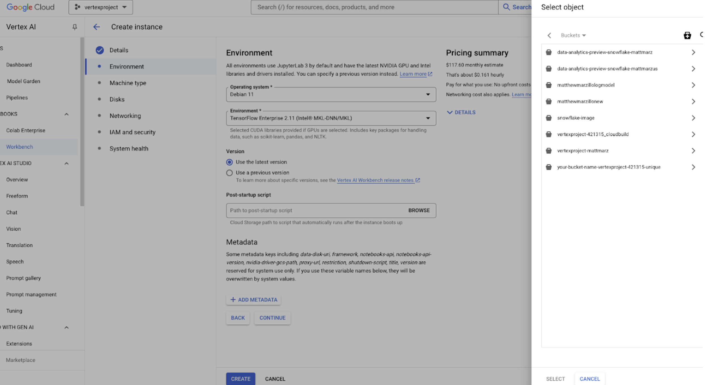
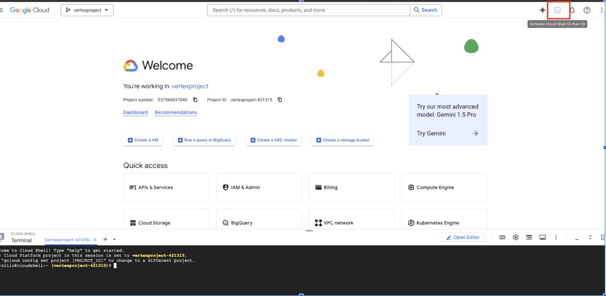
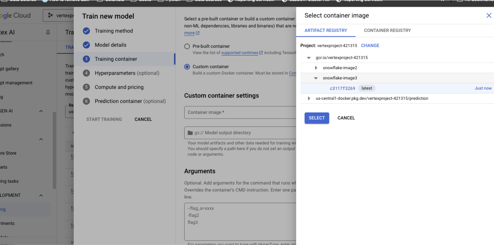
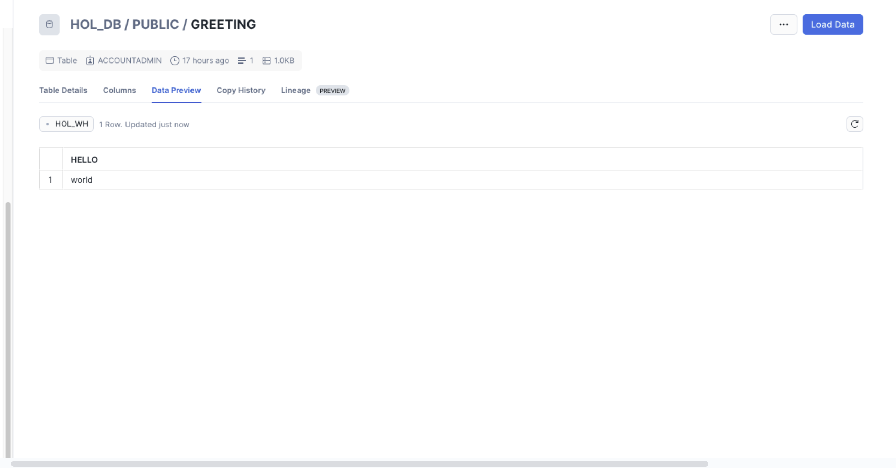

author: marzillo-snow
id: setting_up_snowflake_environments_in_vertex_ai
categories: snowflake-site:taxonomy/solution-center/certification/quickstart, snowflake-site:taxonomy/product/ai, snowflake-site:taxonomy/product/applications-and-collaboration
language: en
summary: This is a quickstart for Setting up Snowflake Environments in Vertex AI
environments: web
status: Published 
feedback link: https://github.com/Snowflake-Labs/sfguides/issues

# Setting up Snowflake Environments in Vertex AI
<!-- ------------------------ -->
## Overview 
Duration: 15

Snowflake and Google Cloud empower countless customers to seamlessly run AI and machine learning (AI/ML) workloads, including cutting-edge Generative AI. With several proven architectural patterns, integrating Snowflake with Google services like Vertex AI has never been easier. Whether you're diving into traditional AI/ML or  Generative AI, we have quickstart guides to get you up and running fast ([AI/ML quickstart](https://quickstarts.snowflake.com/guide/getting_started_with_snowpark_for_machine_learning_on_vertexai/index.html?index=..%2F..index#0) and [Snowflake + VertexAI for Generative AI quickstart](https://quickstarts.snowflake.com/guide/customer_insights_analyzer_using_vertex_ai_and_snowflake/index.html?index=..%2F..index#0)).

The Snowflake + Vertex AI Generative AI quickstarts are designed to be quick, practical, and simple to follow. But we also know that setting up Vertex AI to fully leverage Snowflake's capabilities can be a bit tricky at first. That's why we’re here to help you configure your Vertex AI environment step-by-step—making it easy to connect with Snowflake. In this guide, we’ll walk you through everything, from configuring scripts to pushing container images to Google Container Registry (GCR).


### Use Case
As this quickstart is targeted at getting environments there are no specific industry use cases, but rather "Hello World" examples to verify that the configuration scripts and containers are working appropriately. 

### Prerequisites
- Familiarity with [Snowflake](https://quickstarts.snowflake.com/guide/getting_started_with_snowflake/index.html#0) and a Snowflake account
- Familiarity with [GCP](https://cloud.google.com/free) and a GCP account.

### What You'll Learn
- How to set up a Snowflake environment in Vertex AI with configuration scripts.
- How to set up a Snowflake environment in Vertex AI with Google Container Registry.

### What You’ll Need 
- A free [Snowflake Account](https://signup.snowflake.com/?utm_cta=quickstarts_)
- [GCP Account](https://cloud.google.com/free) with access to Vertex AI
- For the sake of the lab it is best if both platforms have access to the public internet and are not in a virtual network
- Basic familiarity with terminal commands and working with containers


### What You’ll Build 
- A Snowflake specific environment in Vertex AI using configuration scripts
- A Snowflake specific environment in Vertex AI using Containers

<!-- ------------------------ -->
## Configuration Script
Duration: 15

To use a startup script in Vertex AI that installs the current versions of the Snowflake and Snowpark Python packages, you can take advantage of custom training jobs or notebooks in Vertex AI. The below shows how use the startup script with a notebook in Vertex AI

### Create a Startup Script
The startup script will install the required Python packages via pip as soon as the Vertex AI instance starts.
Here's an example startup script:

```
#!/bin/bash

# Update the system package index
sudo apt-get update

# Install pip if it's not installed
sudo apt-get install -y python3-pip

# Install the current versions of Snowflake and Snowpark Python packages
pip3 install --upgrade snowflake-connector-python snowflake-snowpark-python
```

Save this script as install_snowflake.sh locally.

### Make the Script Executable
Make sure the script has the correct permissions to be executed. If you’re developing locally or in a development environment before uploading to Vertex AI, you can use:

```
chmod +x install_snowflake.sh
```

### Upload the Script to Google Cloud Storage (GCS)
Vertex AI can reference a startup script stored in GCS. You will first need to upload the script to a GCS bucket.

```
gsutil cp install_snowflake.sh gs://your-bucket-name/install_snowflake.sh
```

### Use a Vertex AI Notebook
You can specify the startup script to run during the notebook instance's initialization.
- Go to Vertex AI Workbench in the Google Cloud Console.
- Click on Create New Notebook or use an existing one.

In the Customization section, under Startup Script, specify the path to your script stored in GCS:


```
gs://your-bucket-name/install_snowflake.sh
```

Once the notebook starts, the script will run and install the packages.


You should see the current versions of both packages installed and are ready to use Snowflake and Snowpark packages from Vertex AI!

### Verify Installation
Once the startup script runs, you can verify the installation of the packages by running:

```
pip show snowflake-connector-python
pip show snowflake-snowpark-python
```


<!-- ------------------------ -->
## Google Container Registry (GCR).
Duration: 15

Users can build the docker image locally then push the image to GCR however using the Google terminal offers a more robust method for building and pushing the image.

Start by opening the terminal on your Google cloud account.



### Create and save the Dockerfile
A Dockerfile is a text file that contains a list of instructions on how to build a Docker image. Let’s create the Dockerfile step by step:
Create a new directory to store your Dockerfile and any related project files:

```
mkdir vertex-ai-snowflake
cd vertex-ai-snowflake
```

Inside the vertex-ai-snowflake directory, create a new file named Dockerfile. 

```
nano Dockerfile
```

Paste the below code into your Dockerfile. You are welcome to edit/update this file but for new users this will work to create a Snowflake image in Google.

```
# Use an official Python runtime as a base image
FROM python:3.9-slim

# Set the working directory in the container
WORKDIR /app

# Install system dependencies
RUN apt-get update && apt-get install -y \
    libssl-dev \
    libffi-dev \
    libpq-dev \
    build-essential \
    && rm -rf /var/lib/apt/lists/*

# Upgrade pip to the latest version
RUN pip install --upgrade pip

# Install Python packages required for your app
RUN pip install google-cloud-storage \
                cryptography \
                snowflake-snowpark-python

# Copy your application code into the container
COPY . /app

# Set the default command to run your Python script (replace 'your_script.py' with your actual script)
CMD ["python", "your_script.py"]
```

If using nano, save the file by pressing CTRL + O, then ENTER, and finally CTRL + X.


### Create and Save the Python Script
Similar to creating the Dockerfile, create a sample python script that will run inside the image container. In practice you will have a different script that can:
- Prepare data in Snowflake
- Access data from Snowflake and train models in Vertex AI
- Deploy models to Snowflake

This script does something much more simple, it creates a GREETING “hello world” table in Snowflake.

You will have to update the below parameters with your Snowflake information
- Account
- User
- Role
- Warehouse
- Database
- Schema
- gcs_bucket_name (more on this later)

```
nano your_script.py
```

```
from google.cloud import storage
from cryptography.hazmat.primitives import serialization
from cryptography.hazmat.backends import default_backend
from snowflake.snowpark import Session
import os

# Function to download the private key from GCS
def download_private_key_from_gcs(bucket_name, key_file_name, local_temp_file):
    # Initialize the GCS client
    storage_client = storage.Client()

    # Get the bucket object
    bucket = storage_client.bucket(bucket_name)

    # Get the blob object (file in GCS)
    blob = bucket.blob(key_file_name)

    # Download the file to the local temporary path
    blob.download_to_filename(local_temp_file)
    print(f"Downloaded {key_file_name} from bucket {bucket_name} to {local_temp_file}")

# Define your GCS bucket name and the file name of the key
gcs_bucket_name = ""
gcs_key_file_name = "rsa_key_pkcs8.pem"

# Define a temporary location to store the private key locally
local_private_key_file = "/tmp/rsa_key_pkcs8.pem"

# Download the private key from GCS to a local temporary file
download_private_key_from_gcs(gcs_bucket_name, gcs_key_file_name, local_private_key_file)

# Load the private key in PKCS#8 format using the cryptography library
with open(local_private_key_file, "rb") as key_file:  # Open in binary mode
    private_key = serialization.load_pem_private_key(
        key_file.read(),
        password=None,  # If your key is encrypted with a passphrase, pass it here
        backend=default_backend()
    )
# Define your connection parameters
connection_parameters = {
    "account": "",
    "user": "",
    "private_key": private_key,
    "role": "",
    "warehouse": "",
    "database": "",
    "schema": ""
}

# Create a Snowpark session
session = Session.builder.configs(connection_parameters).create()

# Create a table named 'greeting' with a single column 'hello' (VARCHAR)
session.sql("CREATE OR REPLACE TABLE greeting (hello STRING)").collect()

# Insert one row into the table
session.sql("INSERT INTO greeting VALUES ('world')").collect()

# Query the table to verify the row was inserted
result = session.sql("SELECT * FROM greeting").collect()

# Print the result
for row in result:
    print(f"{row['HELLO']}")

# Close the session
session.close()
```

You will notice that we are using a private key to access Snowflake, it should only take 5 minutes to establish that key and move it to google storage. Here’s how:

### Creating a Private Key to Access Snowflake

Generate a private key: Open a terminal on your local machine and run the following command:

```
openssl genrsa -out rsa_key.pem 2048
```

This creates a 2048-bit RSA private key and stores it in rsa_key.pem on your local machine.
Extract the public key: To extract the public key from the private key, run the following command:

```
openssl rsa -in rsa_key.pem -pubout -out rsa_key.pub
```

This command extracts the public key and saves it in the rsa_key.pub file.
Convert the private key to PKCS#8 format (required by Snowflake):

```
openssl pkcs8 -topk8 -inform PEM -outform PEM -in rsa_key.pem -out rsa_key_pkcs8.pem -nocrypt
```

You now have a rsa_key_pkcs8.pem file, which is the private key you'll use to authenticate to Snowflake.

And now that you have the key created you have to upload it to Snowflake:

Log in to Snowflake using your regular credentials (username and password) via the web interface - Snowsight.

Assign the public key to your Snowflake user:
Run the following SQL query to associate your public key with your Snowflake user account:

```sql
ALTER USER <your_username> SET rsa_public_key='<paste contents of rsa_key.pub here>';
```

*Ensure the public key is a single line without newlines or extra spaces.
Now upload the rsa_key_pkcs8.pem file to Google Storage in a bucket that your Vertex AI workspace has access to!

### Build and Push the Docker image 
Go back to the terminal you have open in the Google Cloud and make sure that you’re in the folder with Dockerfile and your_script.py. Chances are you already in the folder, but if not cd into like below.

```
cd /path/to/vertex-ai-snowflake
```

Build and push the Docker image, this should take a minute or two:

```
gcloud builds submit --tag gcr.io/your-project-id/snowflake-snowpark-image
```

Replace your-image-name with the name you want for your Docker image (e.g., snowflake-snowpark-image).

### Create a Vertex AI custom job using the container image
1. Go to the Google Cloud Console.
2. Navigate to Vertex AI > Training > Custom Jobs.
3. Click Create.
4. Under Container Image, find the image we just built and pushed in the Artifact Registry like below.

5. Configure the job parameters (e.g., machine type, environment variables, etc.).
6. Submit the job.

### Test and verify the setup

The job will run for several minutes once it successfully completes, head to your Snowflake account and verify you have a new table in the Database and Schema you specified and you’re all done!



<!-- ------------------------ -->
## Conclusion and Resources
Duration: 5

With these two methods customers are now equipped to use Snowflake from Vertex AI. The configuration script is a great way to set up a workbook for interactive work quickly while building the container image is a great way to create robust workloads. Any questions, please reach out to your Google and Snowflake account teams and ask them how to best use Snowflake and Google Cloud Services together!

### What You Learned
- How to set up a Snowflake environment in Vertex AI with configuration scripts.
- How to set up a Snowflake environment in Vertex AI with Google Container Registry.

### Resources
There are some great resources for using Snowflake and GCP.

- [Snowflake and Vertex AI](https://quickstarts.snowflake.com/guide/getting_started_with_snowpark_for_machine_learning_on_vertexai/index.html?index=..%2F..index#0)

- [Snowflake and GCP for Generative AI](https://quickstarts.snowflake.com/guide/customer_insights_analyzer_using_vertex_ai_and_snowflake/index.html?index=..%2F..index#0)

- [Snowflake on Google Cloud Storage](https://docs.snowflake.com/en/user-guide/data-load-gcs-config)
