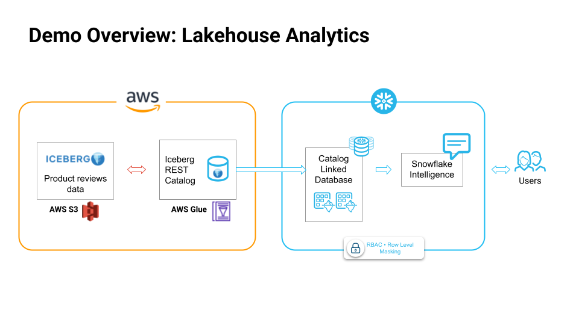
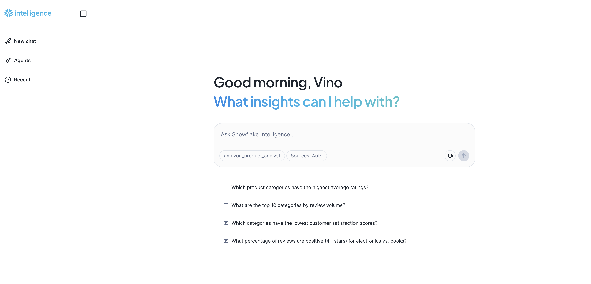

author: Vino Duraisamy
id: modern_lakehouse_analytics_on_snowflake
categories: snowflake-site:taxonomy/solution-center/certification/quickstart, snowflake-site:taxonomy/solution-center/certification/certified-solution, snowflake-site:taxonomy/solution-center/includes/architecture, snowflake-site:taxonomy/product/analytics
language: en
summary: This quickstart guide shows you how to get started Lakehouse analytics use cases on Snowflake
environments: web
status: Published
feedback link: https://github.com/Snowflake-Labs/sfguides/issues

# Intro to Lakehouse Analytics on Snowflake
<!-- ------------------------ -->
Duration:5

## Overview

Through this quickstart, you will learn how to [get started with Lakehouse Analytics on Snowflake](https://www.snowflake.com/en/product/use-cases/lakehouse-analytics/).

### What You’ll Learn

By the end of this quickstart, you will learn how to:

* Connect to your remote Iceberg REST catalog from Snowflake
* Create a catalog linked database to work with your Iceberg table
* Build an open lakehouse on Snowflake
* Run analytics on your lakehouse

### How to Build an [Open Lakehouse on Snowflake](https://www.snowflake.com/en/product/use-cases/lakehouse-analytics/)

Using Snowflake's fully managed, unified query engine that supports open table formats, you can run advanced analytics such as forecasting, anomaly detection, sentiment analysis and time series analysis, on complex data types like VARIANT and geospatial — across all your data sources, wherever they reside.

### What is a Catalog Linked Database?

A [catalog-linked database](https://docs.snowflake.com/en/user-guide/tables-iceberg-catalog-linked-database) is a Snowflake database connected to an external Iceberg REST catalog. Snowflake automatically syncs with the external catalog to detect namespaces and Iceberg tables, and registers the remote tables to the catalog-linked database.

### What You'll Build



* Create a catalog linked database on Snowflake

* Read from the iceberg tables

* Run analytics & exploration on the data 

* Leverage RBAC on Iceberg tables using Snowflake Horizon Catalog

* Build Snowflake Intelligence experience to talk to your data lakehouse in natural language

### Prerequisites

* A Snowflake account. If you do not have a Snowflake account, you can register for a [free trial account](https://signup.snowflake.com/).

<!-- ------------------------ -->
## Run Lakehouse Analtytics

Duration:15

During this step you will learn how to run analytics on your lakehouse. 

Sign up for a [Snowflake Free Trial](https://signup.snowflake.com/) account. Please select AWS as your cloud provider and Enterprise edition for Snowflake. Login to Snowflake home page.

The product reviews data is in AWS S3 bucket in Apache Iceberg table format, and is managed by AWS Glue catalog. Feel free to work with your own datasets from S3 and Glue catalog for this demo.

Follow the documentation to create an [external volume](https://docs.snowflake.com/en/user-guide/tables-iceberg-configure-external-volume-s3) and [catalog intergration](https://docs.snowflake.com/user-guide/tables-iceberg-configure-catalog-integration-rest-glue)

Download the `ipynb` from [this git repository](https://github.com/Snowflake-Labs/sf-samples/tree/main/samples/lakehouse_analytics).

### Import the Notebook into Snowflake

* In the Snowsight UI, navigate to `Projects` and click on `Notebooks`.
* On the top right, click on the down arrow next to `+ Notebook` and select `Import ipynb file`.
* Select the `lakehouse_analytics_demo.ipynb` you had downloaded earlier.
* Select notebook location as `snowflake_learning_db` and `public` schema.
* Select `run on warehouse` option, select `query warehouse` as `compute_wh` and `create`.

Now you have successfully imported the notebook that contains the code.

Before creating a catalog linked database that connects to an AWS Glue catalog, you need to create an external volume on your iceberg tables in S3.

```SQL
CREATE OR REPLACE EXTERNAL VOLUME exvol_vino
   STORAGE_LOCATIONS =
      (
         (
            NAME = 'my-s3-us-west-2'
            STORAGE_PROVIDER = 'S3'
            STORAGE_BASE_URL = 's3://amazon-product-reviews-dataset/'
            STORAGE_AWS_ROLE_ARN = ''
            STORAGE_AWS_EXTERNAL_ID = 'iceberg_table_external_id'
         )
      )
      ALLOW_WRITES = TRUE;
```

Secondly, create a catalog integration for AWS Glue catalog using Iceberg REST catalog.

```SQL
CREATE OR REPLACE CATALOG INTEGRATION glue_rest_cat_int
  CATALOG_SOURCE = ICEBERG_REST
  TABLE_FORMAT = ICEBERG
  CATALOG_NAMESPACE = 'product_reviews_db'
  REST_CONFIG = (
    CATALOG_URI = 'https://glue.us-west-2.amazonaws.com/iceberg'
    CATALOG_API_TYPE = AWS_GLUE
    CATALOG_NAME = '849350360261'
  )
  REST_AUTHENTICATION = (
    TYPE = SIGV4
    SIGV4_IAM_ROLE = ''
    SIGV4_SIGNING_REGION = 'us-west-2'
  )
  ENABLED = TRUE;
```

And finally, create a catalog linked database to connect to the iceberg tables in the Glue catalog.

```SQL
CREATE DATABASE cld_vino_prod
  LINKED_CATALOG = (
    CATALOG = 'glue_rest_cat_int',
    NAMESPACE_MODE = FLATTEN_NESTED_NAMESPACE,
    NAMESPACE_FLATTEN_DELIMITER = '-'
    SYNC_INTERVAL_SECONDS = 60
  )
  EXTERNAL_VOLUME = 'exvol_vino';
```

Notice that auto_discovery is turned on by default and sync_interval is set to 60 seconds which means the tables are automatically refreshed every 60 seconds.

Note: An existing limitation of catalog linked databases is that, any Snowflake object in a catalog linked databases needs to be referenced in double quotes.

Once the iceberg tables are synced in the catalog linked database, you can run analytical queries on the tables. For example, you can analyze product satisfaction levels by category using this query.

```SQL
WITH category_satisfaction AS (
  SELECT 
    p."categories",
    COUNT(r."reviewerID") as "total_reviews",
    AVG(CAST(r."overall" AS FLOAT)) as "avg_rating",
    COUNT(CASE WHEN CAST(r."overall" AS FLOAT) >= 4.0 THEN 1 END) as "positive_reviews",
    ROUND(
      (COUNT(CASE WHEN CAST(r."overall" AS FLOAT) >= 4.0 THEN 1 END) * 100.0) / 
      COUNT(r."reviewerID"), 2
    ) as "satisfaction_percentage"
  FROM "product_reviews_100k" r
  JOIN "product_description_2k" p ON r."asin" = p."asin"
  WHERE p."categories" IS NOT NULL 
    AND p."categories" != ''
    AND r."overall" IS NOT NULL
  GROUP BY p."categories"
  HAVING COUNT(r."reviewerID") >= 10  -- Only categories with sufficient reviews
)
SELECT 
  "categories",
  "total_reviews",
  ROUND("avg_rating", 2) as "avg_rating",
  "satisfaction_percentage",
  CASE 
    WHEN "satisfaction_percentage" >= 80 THEN 'Excellent'
    WHEN "satisfaction_percentage" >= 70 THEN 'Good'
    WHEN "satisfaction_percentage" >= 60 THEN 'Fair'
    ELSE 'Needs Improvement'
  END as "satisfaction_level"
FROM category_satisfaction
ORDER BY "avg_rating" DESC, "total_reviews" DESC;
```

Your data stays in-place within your storage - no migration or movements required., and you can leverage the power of Snowflake’s high performance query engine for analytics.

Additionally, if you have Delta tables, we offer Delta Direct that enables you to query these tables in-place without data movement by translating the JSON Metadata into Iceberg metadata.

You can also follow along and run each of the cells in the [Notebook](https://github.com/Snowflake-Labs/sf-samples/blob/main/samples/lakehouse_analytics/LAKEHOUSE_ANALYTICS_DEMO.ipynb).

<!-- ------------------------ -->
## RBAC Setup

Duration:5

In this section, you will learn how to use Snowflake Horizon to create fine-grained access controls to secure and manage your iceberg tables. It's important to ensure only the right users and teams have access to the right data.

You can create a row access policy to define a specific access control, and attach it to a particular role. This way we can ensure only users with certain roles can access the sensitive data.

Note: Row Access Policy is an enterprise feature available in enterprise edition of Snowflake Free Trial account. 

Run the cell `Role Based Access Control: Row Access Policy` cell in the [Notebook](https://github.com/Snowflake-Labs/sf-samples/blob/main/samples/lakehouse_analytics/LAKEHOUSE_ANALYTICS_DEMO.ipynb) to create the row access policy.

<!-- ------------------------ -->
## Snowflake Intelligence (Optional)

Duration:10

In this section, you will learn how to use Snowflake Intelligence to talk to your lakehouse data in natural language.

Run the last cell in the [notebook](https://github.com/Snowflake-Labs/sf-samples/blob/main/samples/lakehouse_analytics/LAKEHOUSE_ANALYTICS_DEMO.ipynb) titled `Setup Snowflake Intelligence`.

Download the [product_review_analysis.yaml](https://github.com/Snowflake-Labs/sf-samples/blob/main/samples/lakehouse_analytics/PRODUCT_REVIEW_ANALYSIS.yaml) file and upload it to your stage.

### What is Snowflake Intelligence?

Snowflake Intelligence is an agentic AI solution, enabling business users to directly and securely interact with their organization's structured and unstructured data using natural language. Snowflake Intelligence provides:

* Natural language interaction: Engage with data like a trusted colleague to securely access and analyze both structured and unstructured data to uncover trends and understand the "why" behind the "what."
* Actionable intelligence: Go beyond just insights by configuring agents to perform tasks based on findings, such as sending notifications, updating records in other systems, or triggering workflows.
* Enterprise-grade security and governance: Honors existing access controls and governance, unifies information from Snowflake and third-party applications for a holistic view, and provides transparency on how answers are derived and data lineage.

Snowflake Intelligence is powered by Cortex Analyst and Cortex Search under the hood, and uses Snowflake Agent.

### Cortex Analyst

This tool enables the agent to query structured data in Snowflake by generating SQL. It relies on semantic views, which are mappings between business concepts (e.g., "product name," "sales") and the underlying tables and columns in your Snowflake account. This abstraction helps the LLM understand how to query your data effectively, even if your tables have complex or arbitrary naming conventions.

In this example, we only use Cortex Analyst to power the Snowflake Intelligence experience since this is a structured dataset.

In Snowsight, on the left hand navigation menu, select AI & ML » Cortex Analyst
On the top right, click on Create new model down arrow and select Upload your YAML file
Upload product_review_analysis.yaml | Select database, schema, and stage
On the top right, click on Save

### Create Agent
An agent is an intelligent entity within Snowflake Intelligence that acts on behalf of the user. Agents are configured with specific tools and orchestration logic to answer questions and perform tasks on top of your data.

Note that you can create multiple agents for various use cases and/or business teams in your organization.

In Snowsight, on the left hand navigation menu, select AI & ML » Agents
On the top right, click on Create agent
Schema: SNOWFLAKE_INTELLIGENCE.AGENTS
Select Create this agent for Snowflake Intelligence
Agent object name: Amazon Product Analyst
Display name: Amazon Product Analyst
Select the newly created agent and click on Edit on the top right corner and make the following updates.

### Add Tools To Agent
Tools are the capabilities an agent can use to accomplish a task. Think of them as the agent's skillset and note that you can add one or more of each of the following tools.

* Tools: Cortex Analyst
* Click on + Add
* Name: Amazon Product Analyst
* Add: Semantic model file » product_review_analysis.yaml

Open Snowflake Intelligence and make sure you're signed into the right account. If you're not sure, click on your name in the bottom left » Sign out and sign back in. Also note that your role should be set to SNOWFLAKE_INTELLIGENCE_ADMIN



<!-- ------------------------ -->
## Conclusion And Resources

Duration:2

Congratulations, you have successfully completed this quickstart! 

### What You Learned

* Created a Catalog linked database in Snowflake to directly query and analyze the data from our lakehouse, without moving the data at all
* Used Snowflake’s high performance query engine to run analytics on our lakehouse
* Created robust access control policies to ensure data security and governance is in place, thanks to Snowflake Horizon

### Related Resources

* [Catalog Linked Databases in Snowflake](https://docs.snowflake.com/en/user-guide/tables-iceberg-catalog-linked-database) 
* [Lakehouse Analytics on Snowflake](https://www.snowflake.com/en/product/use-cases/lakehouse-analytics/)  
* [Source code on GitHub](https://github.com/Snowflake-Labs/sf-samples/tree/main/samples/lakehouse_analytics)  
* [Getting Started with Snowflake Intelligence](https://quickstarts.snowflake.com/guide/getting-started-with-snowflake-intelligence/index.html?index=..%2F..index#0)
* [Download Reference Architecture](https://quickstarts.snowflake.com/guide/modern_lakehouse_analytics_on_snowflake/img/a2adb3f9c152831d.png)
* [Access Notebook](https://github.com/Snowflake-Labs/sf-samples/blob/main/samples/lakehouse_analytics/LAKEHOUSE_ANALYTICS_DEMO.ipynb)
* 
